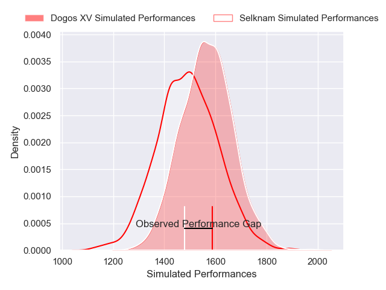
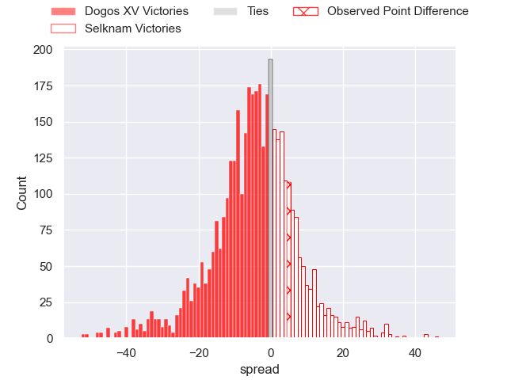
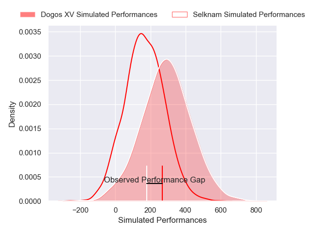
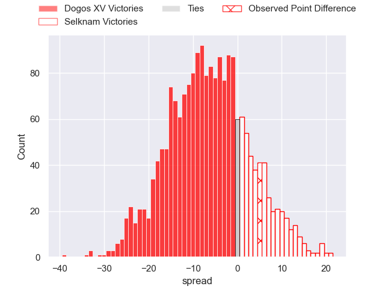
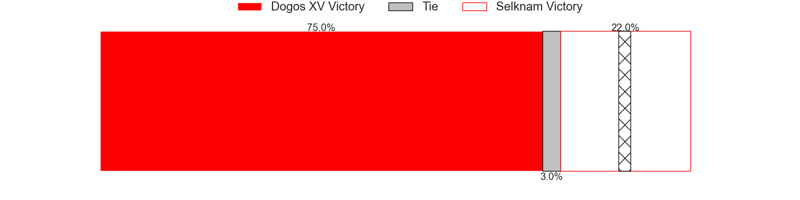

---  
layout: page  
title: Dogos XV at Selknam; 40-45  
date: 2025-03-01 18:00:00 -0500  
categories: "Super Rugby Americas 2025" match review  
---
# Dogos XV at Selknam; 40-45

# Club Level Predictions

The first set of predictions treats a club as the smallest object, as the club develops its members, organizes a gameplan, and deploys its players as needed for each match. This club model has a prediction of 0.398, which translates to predicting Dogos XV to win by 3.8.

Our Over/Under is 60.5 - and combined with the spread above, we have a predicted scoreline of 32 to 29

Each club has a rating and a rating deviation (similar to a Glicko rating), and expected performances can be generated. This allows for simulated matches and spreads like the ones below.
## Projected Performances - Club Model

## Projected Spreads - Club Model

## Projected Results - Club Model

# Player Level Predictions

Treating teams instead as an entity made up of the currently active players, I have ratings for each player in an altogether different system. These can be combined to form team ratings once teamsheets are announced, weighting starters a bit higher than the reserves. After the match is played, players can be weighted by their minutes on the field, allowing for an accurate measure of the team's composition. With these compiled team ratings, we can make predictions, measure inaccuracy, and update the individual player ratings.
## Prediction without Player Minutes: Dogos XV by 5.6

Dogos XV by 8.2 on a neutral pitch

## Projected Performances - Player Model

## Projected Spreads - Player Model

## Projected Results - Player Model

|   Away Minutes | Away Player               |   Away Percentile |   Number |   Home Percentile | Home Player                 |   Home Minutes |
|---------------:|:--------------------------|------------------:|---------:|------------------:|:----------------------------|---------------:|
|             20 | Boris Wenger              |             85.68 |        1 |             82.64 | Javier Carrasco             |             28 |
|             15 | Leonel Oviedo             |             76.38 |        2 |             34    | Raimundo Martinez Amar      |             52 |
|             20 | Pedro Delgado             |             63.92 |        3 |             54.08 | Baltazar Gurruchaga         |             22 |
|             16 | Lautaro Simes             |             82.38 |        4 |             77.76 | Santiago Pedrero Poduje     |              0 |
|             54 | Federico Albrisi          |             48.92 |        5 |              0.57 | Agustin Toth                |             13 |
|             60 | Felipe Villagran          |             75.23 |        6 |             41.53 | Martin Sigren               |             20 |
|             68 | Valentin Cabral           |             73.84 |        7 |             93.3  | Alfonso Escobar Alvarez     |             65 |
|             54 | Gennaro Fissore           |             29.48 |        8 |             80.41 | Joaquin Milesi              |             80 |
|             80 | Agustin Moyano            |             82.02 |        9 |              3.6  | Marcelo Torrealba           |             70 |
|             80 | Julian Ignacio Hernandez  |             70.33 |       10 |             65.15 | Juan Cruz Reyes             |             80 |
|             80 | Lautaro Cipriani          |             49.21 |       11 |             74.01 | Nicolas Saab                |             12 |
|             64 | Felipe Mallia             |             69.77 |       12 |             50.77 | Matias Garafulic            |             28 |
|             73 | Agustin Segura            |             85.39 |       13 |             71.3  | Clemente Saavedra Cartajena |             10 |
|             80 | Bautista Lescano          |             28.58 |       14 |             66.98 | Frederico Kennedy           |             64 |
|             22 | Mateo Soler               |             76.15 |       15 |             57.52 | Tomas Salas Walther         |             16 |
|             80 | Juan Baronio              |            nan    |       16 |             53.01 | Felipe Mendez               |             26 |
|             80 | Mateo Sanchez             |            nan    |       17 |            nan    | Bruno Saez                  |             57 |
|             80 | Conrado Iglesias Quintana |            nan    |       18 |            nan    | Salvador Lues Soto          |             60 |
|             80 | Santiago Pulella          |            nan    |       19 |            nan    | Nahuel Debiassi             |             80 |
|             80 | Aitor Bildosola           |             66.76 |       20 |            nan    | Norman Aguayo               |             60 |
|             80 | Octavio Filippa           |             85.28 |       21 |            nan    | Ignacio Arias               |             80 |
|             52 | Juan Lovell               |            nan    |       22 |            nan    | Andres Kuzmanic             |             80 |
|             55 | Lorenzo Colidio           |             69.74 |       23 |             52.56 | Inaki Gurruchaga Suarez     |             26 |

