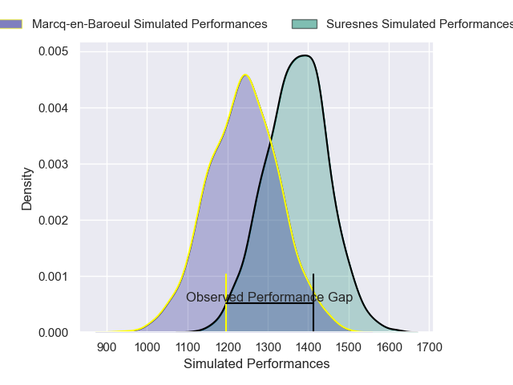
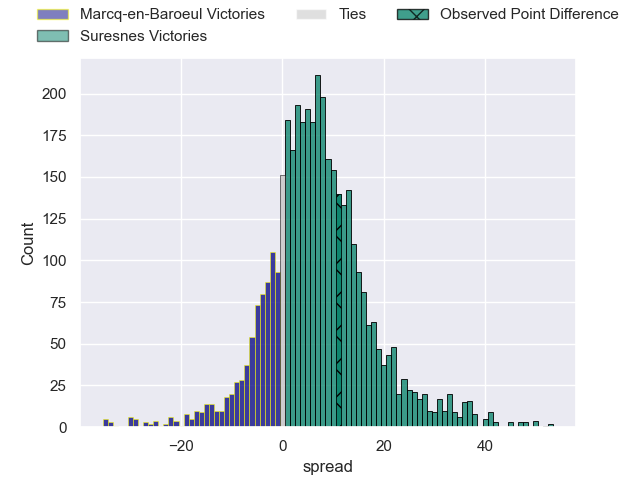
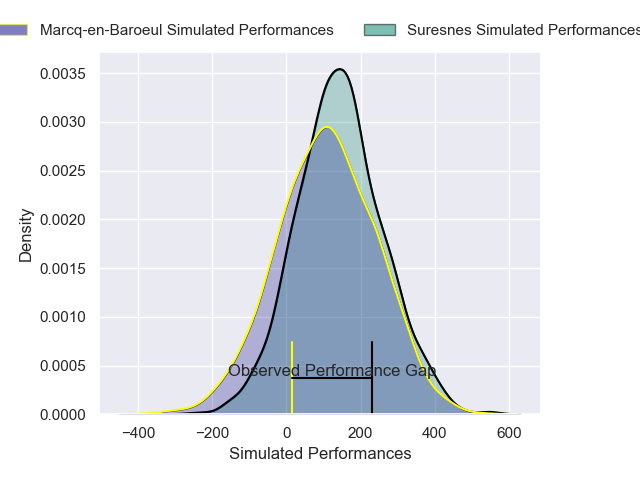
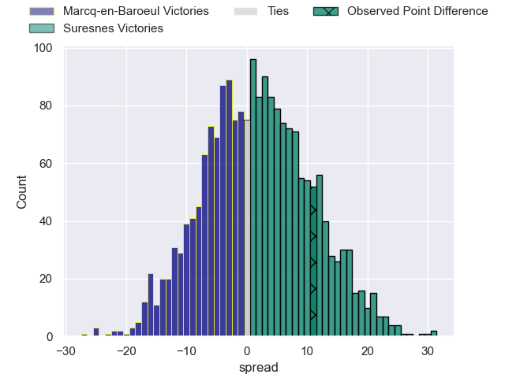
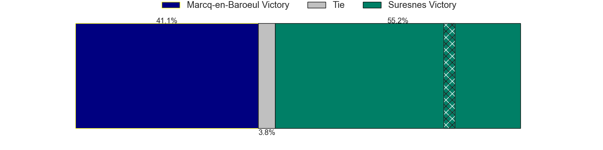

---  
layout: page  
title: Marcq-en-Baroeul at Suresnes; 24-35  
date: 2025-03-01 18:00:00 -0500  
categories: "Nationale 24/25" match review  
---
# Marcq-en-Baroeul at Suresnes; 24-35

# Club Level Predictions

The first set of predictions treats a club as the smallest object, as the club develops its members, organizes a gameplan, and deploys its players as needed for each match. This club model has a prediction of 0.673, which translates to predicting Suresnes to win by 6.5.

Our Over/Under is 41.5 - and combined with the spread above, we have a predicted scoreline of 17 to 24

Each club has a rating and a rating deviation (similar to a Glicko rating), and expected performances can be generated. This allows for simulated matches and spreads like the ones below.
## Projected Performances - Club Model

## Projected Spreads - Club Model

## Projected Results - Club Model

# Player Level Predictions

Treating teams instead as an entity made up of the currently active players, I have ratings for each player in an altogether different system. These can be combined to form team ratings once teamsheets are announced, weighting starters a bit higher than the reserves. After the match is played, players can be weighted by their minutes on the field, allowing for an accurate measure of the team's composition. With these compiled team ratings, we can make predictions, measure inaccuracy, and update the individual player ratings.
## Prediction without Player Minutes: Suresnes by 4.4

Suresnes by 0.9 on a neutral pitch

## Projected Performances - Player Model

## Projected Spreads - Player Model

## Projected Results - Player Model

|   Away Minutes | Away Player              |   Away Percentile |   Number |   Home Percentile | Home Player             |   Home Minutes |
|---------------:|:-------------------------|------------------:|---------:|------------------:|:------------------------|---------------:|
|           30   | Bruno Vliegen            |             17.04 |        1 |             74.96 | Thibaud Sebire          |             67 |
|           80   | Joseph Reynaud           |             38.69 |        2 |             17.76 | Jean-Étienne Lesueur    |             80 |
|           80   | Victor-Fy Balas Burel    |             50.64 |        3 |             33.68 | Leandro Mario Assi      |             56 |
|           80   | Antoine Delaporte        |             64.09 |        4 |             69.09 | Damien Bozic            |             68 |
|           20   | Jean-Baptiste Rende      |             62.58 |        5 |             84.35 | Nikita Bekov            |             44 |
|           68   | Cedric Yonkeu            |             53.72 |        6 |             49.91 | Corentin Rougier        |             23 |
|           57   | Arthur Bruges            |             64.71 |        7 |             31.38 | Simon Veyrac            |             28 |
|           28   | Otilo Kafotamaki         |              7.63 |        8 |             78.56 | Lakisipone Lee          |              8 |
|           12   | Dylan Nocete             |             74.66 |        9 |              8.9  | Thomas Lacroix          |             23 |
|           28   | Paul Decavel             |             52.49 |       10 |             67.22 | Jean Chezeau            |             12 |
|            3   | Mathias Ortiz            |             69.66 |       11 |             93.89 | Faraj Fartass           |             12 |
|           77   | Louis Decavel            |             51.79 |       12 |             80.29 | Victor Barnier          |             36 |
|           80   | Hugo Detre               |              6.44 |       13 |             38.61 | Gauthier Wolf           |             20 |
|           80   | Dany Antunes             |              7.03 |       14 |             75.49 | Petero Tuwai            |             80 |
|           28   | Patrick Fleming Dewhirst |             47.7  |       15 |              3.21 | Goulwen Gueho           |             80 |
|           50   | Eli Serra-Miglietti      |             46.56 |       16 |             72.25 | Wian Vosloo             |             80 |
|           80   | Maxime Danton            |             74.43 |       17 |              8.42 | Yohan Fournier          |             24 |
|           52   | Joachim Beaumont         |             49.72 |       18 |             25.73 | Sacha Yahi              |             60 |
|           80   | Lewys Jones              |             58.64 |       19 |             68.08 | Elias Coulibaly         |             52 |
|           80   | Santiago Iglesias Valdez |             28.14 |       20 |             23.92 | Nail Audoire            |             80 |
|           72   | Lucio Anconetani         |             44.39 |       21 |             42.98 | Germain de Borda        |             80 |
|           28.5 | Geoffrey Cazanave        |             66.61 |       22 |             72.7  | Gauthier Brute de Remur |             68 |
|           80   | Mark Erasmus             |             53.63 |       23 |             42.95 | Tanguy Lacoste          |             80 |

