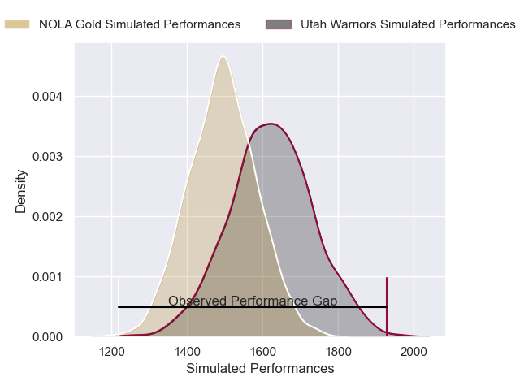
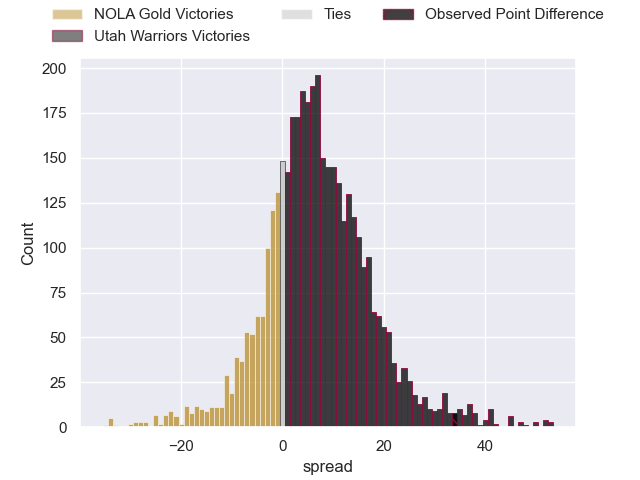
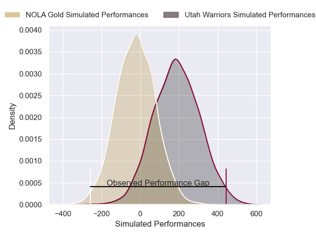
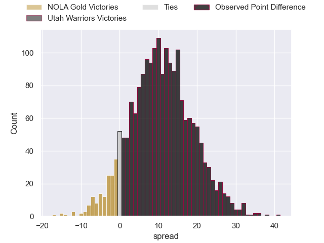

---  
layout: page  
title: NOLA Gold at Utah Warriors; 21-55  
date: 2025-03-01 18:00:00 -0500  
categories: "Major League Rugby 2025" match review  
---
# NOLA Gold at Utah Warriors; 21-55

# Club Level Predictions

The first set of predictions treats a club as the smallest object, as the club develops its members, organizes a gameplan, and deploys its players as needed for each match. This club model has a prediction of 0.675, which translates to predicting Utah Warriors to win by 6.6.

Our Over/Under is 54.5 - and combined with the spread above, we have a predicted scoreline of 24 to 31

Each club has a rating and a rating deviation (similar to a Glicko rating), and expected performances can be generated. This allows for simulated matches and spreads like the ones below.
## Projected Performances - Club Model

## Projected Spreads - Club Model

## Projected Results - Club Model

# Player Level Predictions

Treating teams instead as an entity made up of the currently active players, I have ratings for each player in an altogether different system. These can be combined to form team ratings once teamsheets are announced, weighting starters a bit higher than the reserves. After the match is played, players can be weighted by their minutes on the field, allowing for an accurate measure of the team's composition. With these compiled team ratings, we can make predictions, measure inaccuracy, and update the individual player ratings.
## Prediction without Player Minutes: Utah Warriors by 12.8

Utah Warriors by 9.6 on a neutral pitch

## Projected Performances - Player Model

## Projected Spreads - Player Model

## Projected Results - Player Model

|   Away Minutes | Away Player          |   Away Percentile |   Number |   Home Percentile | Home Player     |   Home Minutes |
|---------------:|:---------------------|------------------:|---------:|------------------:|:----------------|---------------:|
|           24   | Matthew Harmon       |             23.18 |        1 |             29.34 | Aki Seiuli      |           80   |
|           80   | Alex Lopeti          |             11.11 |        2 |             84.58 | Liam Coltman    |           40   |
|           60   | Paul Mullen          |             12.32 |        3 |             59.4  | Tonga Kofe      |           48   |
|            0   | Chase Jones          |             47.04 |        4 |             23.52 | Matthew Jensen  |           12.5 |
|           22   | Will Waguespack      |             54.21 |        5 |             88.53 | Gavin Thornbury |           20   |
|            0   | Kelian Galletier     |             81.48 |        6 |             56.48 | Frank Lochore   |           80   |
|           34   | Jonah Mau'u          |             45.11 |        7 |             39.76 | Kalisi Moli     |           15   |
|           34   | Tupou Ma'afu-Afungia |             37.75 |        8 |             89.36 | Dylan Nel       |           80   |
|           32   | Ruben de Haas        |             55.34 |        9 |             63.45 | Logan Crowley   |           12.5 |
|           25   | Luke Carty           |             20.63 |       10 |             23.37 | D'Angelo Leuila |           80   |
|            0   | Ed Fidow             |             71    |       11 |             83.24 | Joseph Mano     |           52   |
|           34   | JP Du Plessis        |              0.8  |       12 |             81.52 | Spencer Jones   |           36   |
|           56   | Isaac Te Tamaki      |              2.9  |       13 |             30.97 | Kyle Brown      |           55   |
|           60   | Nikolai Foliaki      |              1.69 |       14 |             78.06 | Nic Benn        |           80   |
|           67   | Cooper Coats         |              8.37 |       15 |             87.96 | Jordan Trainor  |           13   |
|           17   | Moni Tonga'uiha      |              6.02 |       16 |             34.36 | Angus McLellan  |           80   |
|           24   | Bart Vermeulen       |            nan    |       17 |             27.58 | Joel Hodgson    |           32   |
|           58   | Malcolm May          |             58.22 |       18 |              4.3  | Paul Lasike     |           80   |
|           80   | Damian Stevens       |              4.31 |       19 |             67.39 | Bailey Wilson   |           80   |
|           38.5 | Isaac Salmon         |             66.61 |       20 |            nan    | Tuvere Vugakoto |           15   |
|           58   | Reece Botha          |             79.58 |       21 |             84.12 | Emerson Prior   |           44   |
|           80   | Abe Turpen           |            nan    |       22 |            nan    | Tyler Wong      |           80   |
|          nan   | nan                  |            nan    |       23 |             81.72 | Zion Going      |           22   |

