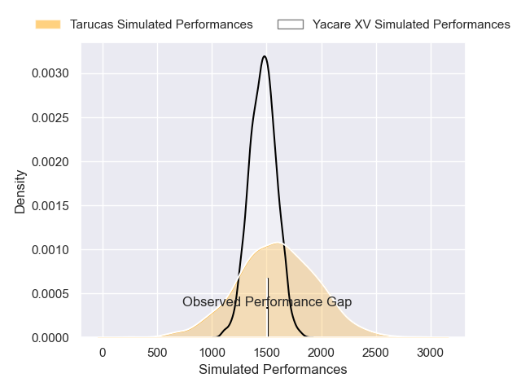
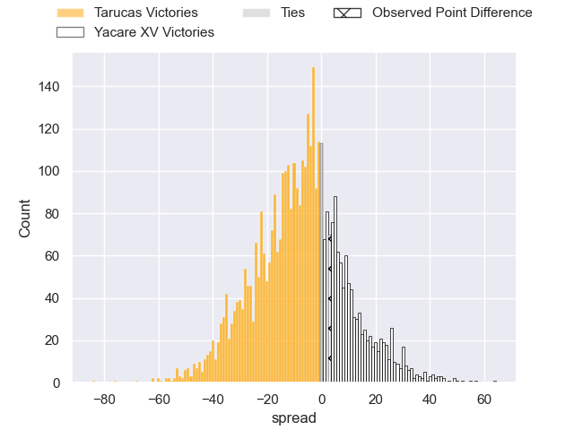
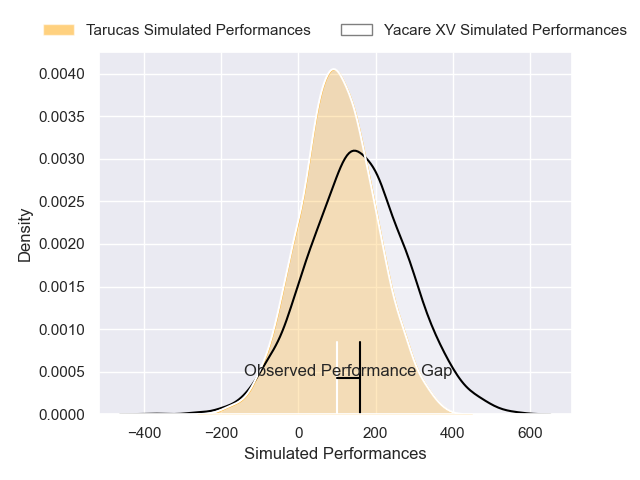
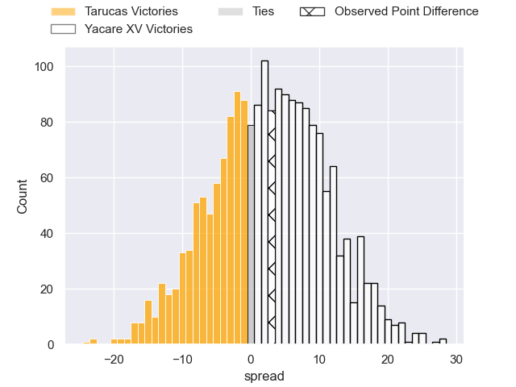
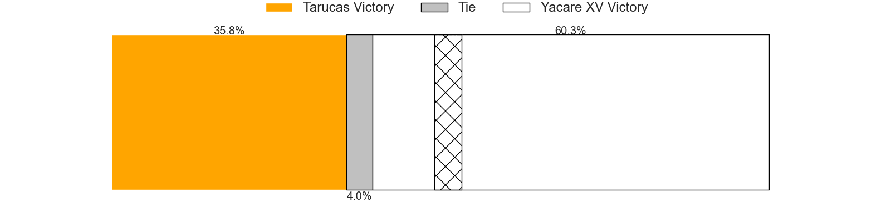

---  
layout: page  
title: Tarucas at Yacare XV; 27-30  
date: 2025-03-01 18:00:00 -0500  
categories: "Super Rugby Americas 2025" match review  
---
# Tarucas at Yacare XV; 27-30

# Club Level Predictions

The first set of predictions treats a club as the smallest object, as the club develops its members, organizes a gameplan, and deploys its players as needed for each match. This club model has a prediction of 0.372, which translates to predicting Tarucas to win by 7.0.

Our Over/Under is 61.5 - and combined with the spread above, we have a predicted scoreline of 34 to 27

Each club has a rating and a rating deviation (similar to a Glicko rating), and expected performances can be generated. This allows for simulated matches and spreads like the ones below.
## Projected Performances - Club Model

## Projected Spreads - Club Model

## Projected Results - Club Model

# Player Level Predictions

Treating teams instead as an entity made up of the currently active players, I have ratings for each player in an altogether different system. These can be combined to form team ratings once teamsheets are announced, weighting starters a bit higher than the reserves. After the match is played, players can be weighted by their minutes on the field, allowing for an accurate measure of the team's composition. With these compiled team ratings, we can make predictions, measure inaccuracy, and update the individual player ratings.
## Prediction without Player Minutes: Tarucas by 0.7

Tarucas by 3.0 on a neutral pitch

## Projected Performances - Player Model

## Projected Spreads - Player Model

## Projected Results - Player Model

|   Away Minutes | Away Player             |   Away Percentile |   Number |   Home Percentile | Home Player                 |   Home Minutes |
|---------------:|:------------------------|------------------:|---------:|------------------:|:----------------------------|---------------:|
|           80   | Julian Martin           |             52.69 |        1 |             75.08 | Mariano Muntaner            |             58 |
|           80   | Juan Manuel Vivas       |             67.73 |        2 |             15.97 | Axel Zapata                 |             55 |
|           15.5 | Francisco Moreno        |             79.07 |        3 |             17.1  | Rolando Portillo            |             68 |
|           15.5 | Mariano Perondi         |             52.39 |        4 |             14.6  | Mariano Garcete Elli        |             80 |
|           51   | Luciano Asevedo         |             48    |        5 |             99.14 | Lucas Sommer                |             68 |
|           12   | Facundo Javier Cardozo  |             69.63 |        6 |              6.94 | Ariel Nunez Lesme           |             62 |
|           21   | Facundo Garcia Hamilton |             68.79 |        7 |              5.34 | Felipe Puertas              |             64 |
|           51   | Joaquin Aguilar         |             42.59 |        8 |             91.02 | Santiago Ruiz               |             25 |
|           25   | Simon Benitez Cruz      |             84.99 |        9 |             14.83 | Juan Cruz Strada            |             25 |
|           25   | Ignacio Cerrutti        |             49.89 |       10 |             92.42 | Joaquin Lamas               |             80 |
|           16   | Tomas Vanni             |             24.34 |       11 |              7.38 | Juan Gonzalez               |             80 |
|           16   | Tomas Medina            |             73.8  |       12 |             11.14 | Sebastian Urbieta Liegard   |             35 |
|           29   | Bautista Estofan        |             58.73 |       13 |             26.51 | Ramiro Amarilla             |             80 |
|           80   | Baltazar Garcia         |             16.5  |       14 |             13.31 | Julian Quetglas             |             13 |
|           41   | Stefano Ferro           |             51.84 |       15 |             49.18 | Valentino Dicapua           |             80 |
|           22   | Agustin Iglesias        |            nan    |       16 |             44.39 | Arturo Lopez                |             80 |
|           56   | Nicolas Macome          |            nan    |       17 |            nan    | Jordi Chavez                |             80 |
|           16   | Agustin Sarelli         |             45.45 |       18 |             51.95 | Enzo Egea Bordon            |             80 |
|           55   | José Gianotti           |            nan    |       19 |             26.55 | Daniel Cabral               |             47 |
|           67   | Alvaro Garcia Iandolino |             76.34 |       20 |              7.31 | Ramiro Nicolas Parada       |             62 |
|           62   | Benjamin Garrido        |            nan    |       21 |            nan    | Gonzalo Bareiro Ochipinti   |             67 |
|           29   | Diego Fortuny           |              2.35 |       22 |            nan    | Juan-Jose Heisecke Schauman |             18 |
|           55   | Estanislao Pregot       |            nan    |       23 |            nan    | Facundo Paiva               |             80 |

