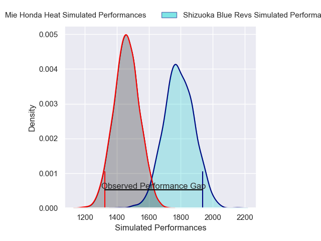
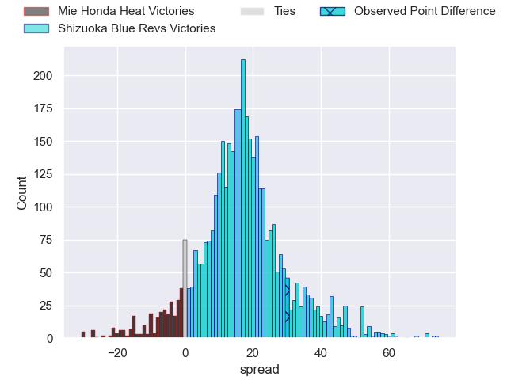
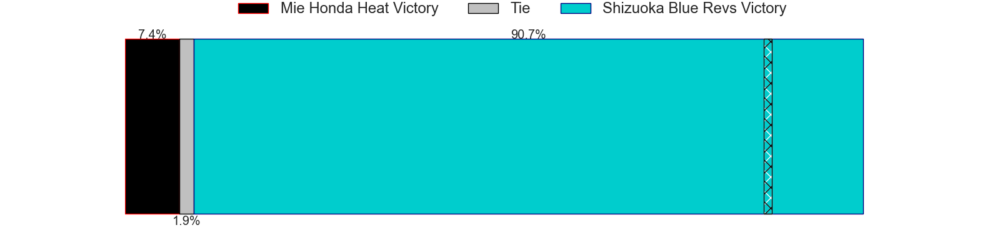
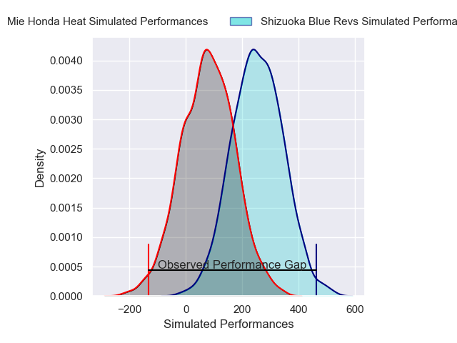
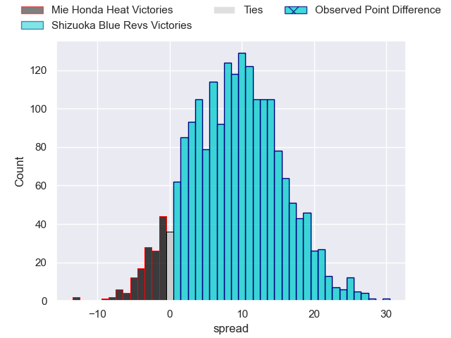
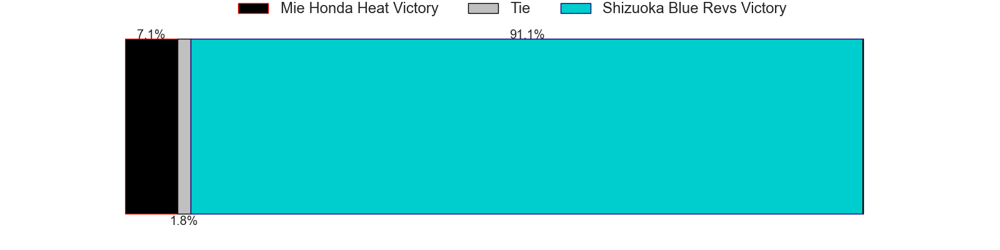

---  
layout: page  
title: Mie Honda Heat at Shizuoka Blue Revs; 14-44  
date: 2025-03-02 18:00:00 -0500  
categories: "Japan Rugby League One 24/25" match review  
---
# Mie Honda Heat at Shizuoka Blue Revs; 14-44

# Club Level Predictions

The first set of predictions treats a club as the smallest object, as the club develops its members, organizes a gameplan, and deploys its players as needed for each match. This club model has a prediction of 0.858, which translates to predicting Shizuoka Blue Revs to win by 16.1.

Our Over/Under is 69.5 - and combined with the spread above, we have a predicted scoreline of 27 to 43

Each club has a rating and a rating deviation (similar to a Glicko rating), and expected performances can be generated. This allows for simulated matches and spreads like the ones below.
## Projected Performances - Club Model

## Projected Spreads - Club Model

## Projected Results - Club Model

# Player Level Predictions

Treating teams instead as an entity made up of the currently active players, I have ratings for each player in an altogether different system. These can be combined to form team ratings once teamsheets are announced, weighting starters a bit higher than the reserves. After the match is played, players can be weighted by their minutes on the field, allowing for an accurate measure of the team's composition. With these compiled team ratings, we can make predictions, measure inaccuracy, and update the individual player ratings.
## Prediction without Player Minutes: Shizuoka Blue Revs by 9.7

Shizuoka Blue Revs by 5.4 on a neutral pitch

## Projected Performances - Player Model

## Projected Spreads - Player Model

## Projected Results - Player Model

|   Away Minutes | Away Player            |   Away Percentile |   Number |   Home Percentile | Home Player             |   Home Minutes |
|---------------:|:-----------------------|------------------:|---------:|------------------:|:------------------------|---------------:|
|             62 | Tatsuhiko Tsurukawa    |              2    |        1 |             14.4  | Kazuhiro Kawata         |             25 |
|             61 | Koki Hida              |             38.86 |        2 |             98.32 | Takeshi Hino            |             25 |
|             80 | Feinga Kihe Lotu Fakai |              2.56 |        3 |             58.08 | Bunkei Kaku             |             65 |
|             55 | Ryoma Nishimura        |             88.22 |        4 |             97.64 | Yuya Odo                |             65 |
|             15 | Janko Swanepoel        |             79.45 |        5 |             94.82 | Murray Douglas          |             25 |
|             80 | Franco Mostert         |             92.18 |        6 |             32.87 | Vueti Tupou             |              0 |
|             80 | Ryo Furuta             |              2.79 |        7 |             96.37 | Kwagga Smith            |             80 |
|              6 | Pablo Matera           |             99.18 |        8 |             59.59 | Malgene Ilaua           |             80 |
|             18 | Azuma Doei             |             57.36 |        9 |             73.12 | Shuntaro Kitamura       |             80 |
|             19 | Hayata Nakao           |             78.63 |       10 |             13.28 | Sam Greene              |             80 |
|             62 | Tevita Li              |             95.28 |       11 |             20.91 | Hironori Yatomi         |              0 |
|             55 | Fraser Quirk           |              3.98 |       12 |             85.29 | Viliami Tahitu'a        |             55 |
|             19 | Kyogo Okano            |             39.63 |       13 |             30.95 | Sylvian Mahuza          |              0 |
|             80 | Larry Steven Sulunga   |             65.03 |       14 |             81.04 | Valynce Te Whare-Crosby |             18 |
|             15 | Gwangtee Oh            |             16.43 |       15 |             93.79 | Charles Piutau          |             40 |

