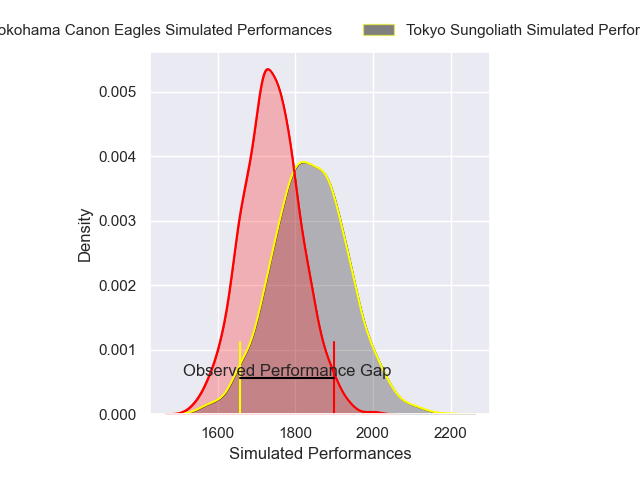
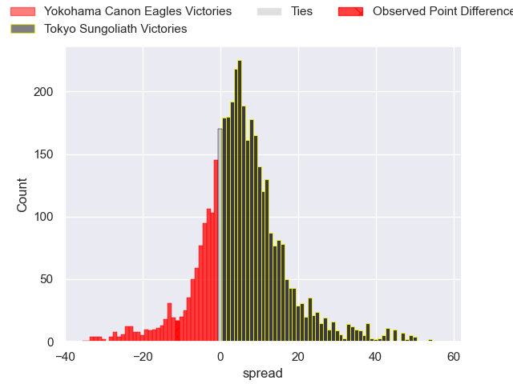
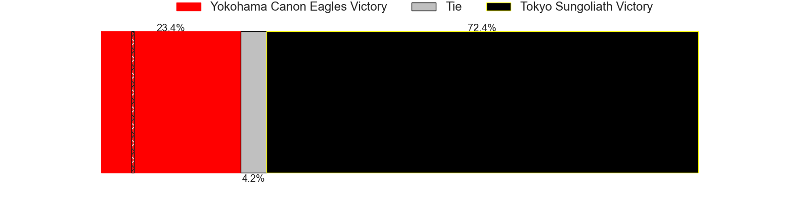
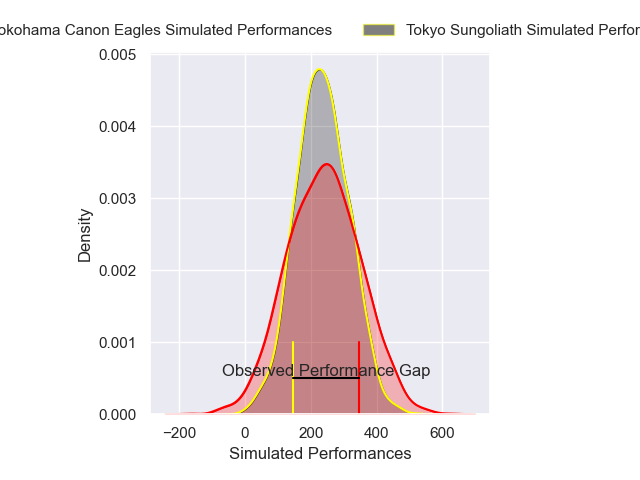
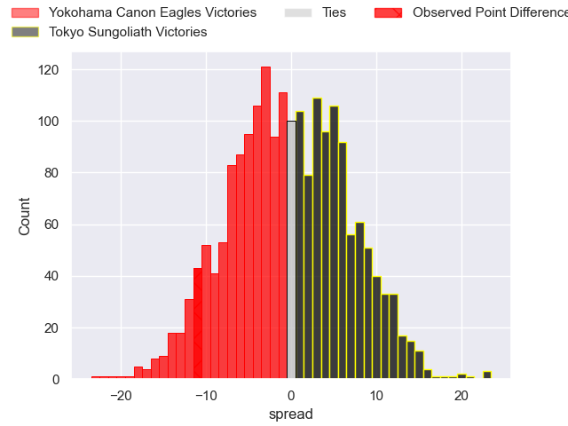
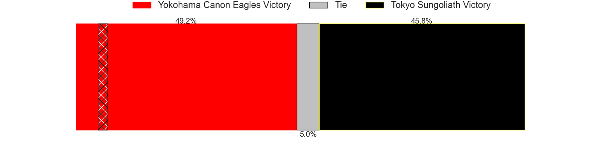

---  
layout: page  
title: Yokohama Canon Eagles at Tokyo Sungoliath; 33-22  
date: 2025-03-02 18:00:00 -0500  
categories: "Japan Rugby League One 24/25" match review  
---
# Yokohama Canon Eagles at Tokyo Sungoliath; 33-22

# Club Level Predictions

The first set of predictions treats a club as the smallest object, as the club develops its members, organizes a gameplan, and deploys its players as needed for each match. This club model has a prediction of 0.639, which translates to predicting Tokyo Sungoliath to win by 5.1.

Our Over/Under is 73.5 - and combined with the spread above, we have a predicted scoreline of 34 to 39

Each club has a rating and a rating deviation (similar to a Glicko rating), and expected performances can be generated. This allows for simulated matches and spreads like the ones below.
## Projected Performances - Club Model

## Projected Spreads - Club Model

## Projected Results - Club Model

# Player Level Predictions

Treating teams instead as an entity made up of the currently active players, I have ratings for each player in an altogether different system. These can be combined to form team ratings once teamsheets are announced, weighting starters a bit higher than the reserves. After the match is played, players can be weighted by their minutes on the field, allowing for an accurate measure of the team's composition. With these compiled team ratings, we can make predictions, measure inaccuracy, and update the individual player ratings.
## Prediction without Player Minutes: Yokohama Canon Eagles by 0.2

Yokohama Canon Eagles by 5.2 on a neutral pitch

## Projected Performances - Player Model

## Projected Spreads - Player Model

## Projected Results - Player Model

|   Away Minutes | Away Player      |   Away Percentile |   Number |   Home Percentile | Home Player     |   Home Minutes |
|---------------:|:-----------------|------------------:|---------:|------------------:|:----------------|---------------:|
|             61 | Takato Okabe     |             95.11 |        1 |             20.77 | Kenta Kobayashi |             27 |
|             80 | Shunta Nakamura  |             92.27 |        2 |             17.98 | Kienori Go      |             80 |
|             60 | Tatsuro Sugimoto |              5.13 |        3 |             10.91 | Kan Nakano      |             72 |
|             80 | Liaki Moli       |              7.63 |        4 |             16.32 | Trevor Hosea    |             40 |
|             46 | Matt Philip      |             32.92 |        5 |             91.89 | Sam Jeffries    |             40 |
|             80 | Billy Harmon     |             70.57 |        6 |             45.74 | Kanji Shimokawa |             19 |
|             12 | Masato Furukawa  |             40.02 |        7 |             98.78 | Sam Cane        |             68 |
|             80 | Amanaki Mafi     |             96.03 |        8 |             94.99 | Sean McMahon    |             80 |
|             80 | Faf de Klerk     |             94.42 |        9 |             47.82 | Yutaka Nagare   |             20 |
|             53 | Yu Tamura        |             79.79 |       10 |             44.21 | Mikiya Takamoto |              0 |
|             53 | Chihito Matsui   |             41.93 |       11 |             65.09 | Hideto Niguma   |             40 |
|             80 | Yusuke Kajimura  |             95.98 |       12 |             12.55 | Shogo Nakano    |              0 |
|             53 | Jesse Kriel      |             98.09 |       13 |             49.1  | Taiga Ozaki     |             30 |
|             60 | Kippei Ishida    |             47.31 |       14 |             87.42 | Seiya Ozaki     |             19 |
|             20 | Jumpei Ogura     |             95.49 |       15 |             13.73 | Ryosuke Kawase  |             64 |

