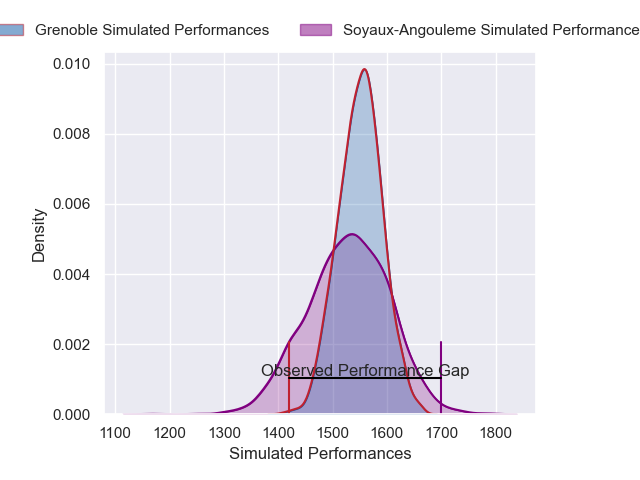
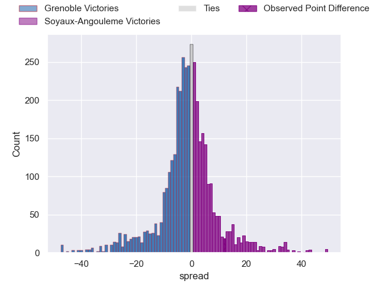
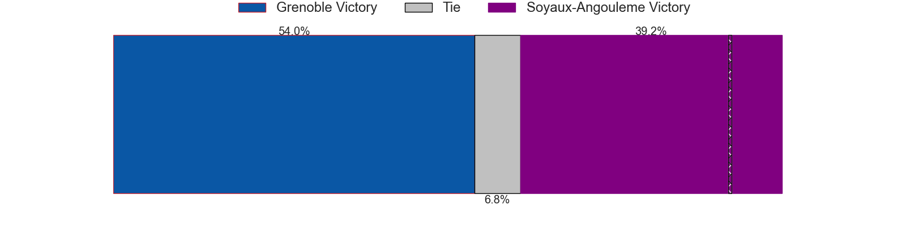
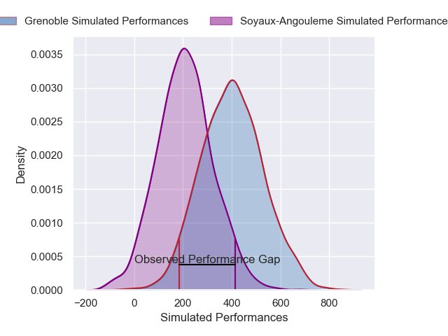
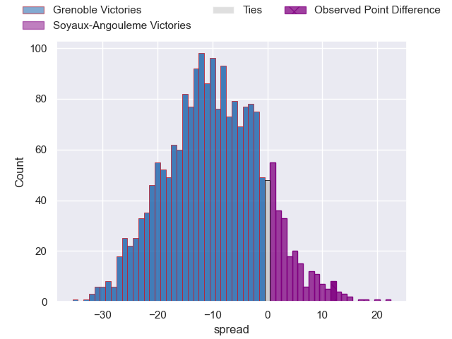
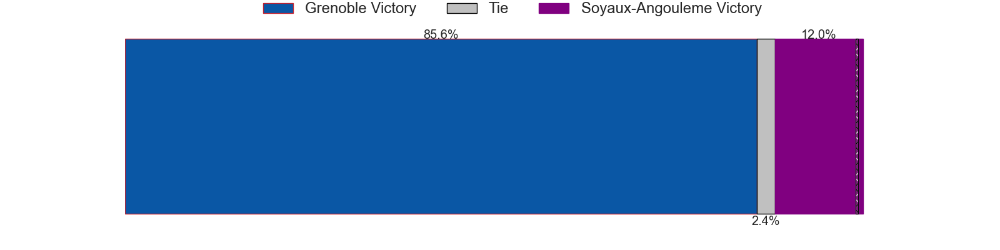

---  
layout: page  
title: Grenoble at Soyaux-Angouleme; 13-25  
date: 2025-03-06 18:00:00 -0500  
categories: "Pro D2 24/25" match review  
---
# Grenoble at Soyaux-Angouleme; 13-25

# Club Level Predictions

The first set of predictions treats a club as the smallest object, as the club develops its members, organizes a gameplan, and deploys its players as needed for each match. This club model has a prediction of 0.47, which translates to predicting Grenoble to win by 1.1.

Our Over/Under is 50.5 - and combined with the spread above, we have a predicted scoreline of 26 to 25

Each club has a rating and a rating deviation (similar to a Glicko rating), and expected performances can be generated. This allows for simulated matches and spreads like the ones below.
## Projected Performances - Club Model

## Projected Spreads - Club Model

## Projected Results - Club Model

# Player Level Predictions

Treating teams instead as an entity made up of the currently active players, I have ratings for each player in an altogether different system. These can be combined to form team ratings once teamsheets are announced, weighting starters a bit higher than the reserves. After the match is played, players can be weighted by their minutes on the field, allowing for an accurate measure of the team's composition. With these compiled team ratings, we can make predictions, measure inaccuracy, and update the individual player ratings.
## Prediction without Player Minutes: Grenoble by 5.3

Grenoble by 10.9 on a neutral pitch

## Projected Performances - Player Model

## Projected Spreads - Player Model

## Projected Results - Player Model

|   Away Minutes | Away Player        |   Away Percentile |   Number |   Home Percentile | Home Player        |   Home Minutes |
|---------------:|:-------------------|------------------:|---------:|------------------:|:-------------------|---------------:|
|             23 | Tommy Raynaud      |             87.54 |        1 |             97.8  | Sami Zouhair       |             26 |
|             40 | Sascha Mistrulli   |             30.92 |        2 |             91.6  | Rayne Barka        |             20 |
|             13 | Giorgi Pertaia     |             95.68 |        3 |             31.11 | Seydou Diakité     |             15 |
|              7 | Thomas Lainault    |             55.53 |        4 |             71.66 | Maxence Lemardelet |             57 |
|             65 | Cameron Holt       |             47.9  |        5 |             92.37 | Sikeli Nabou       |             16 |
|             67 | Jose Madeira       |             94    |        6 |             13.03 | Gautier Gibouin    |             80 |
|             13 | Victor Guillaumond |             78.54 |        7 |             63.36 | Hubert Texier      |             73 |
|             80 | Mathis Baret       |             20.25 |        8 |             41.54 | Samuel Nollet      |             80 |
|             80 | Barnabe Couilloud  |             40.31 |        9 |             81.33 | Manu Saubusse      |             80 |
|             37 | Max Clement        |             90.95 |       10 |             94.53 | Ben Botica         |             67 |
|             80 | Wilfried Hulleu    |             80.58 |       11 |             63.35 | Nathan Farissier   |             55 |
|             68 | Romain Trouilloud  |             67.87 |       12 |             93.37 | George Tilsley     |             26 |
|             40 | Yan Lestrade       |             88.35 |       13 |             70.98 | Mathis Lafon       |             80 |
|             80 | Kaminieli Rasaku   |             83.68 |       14 |              9.75 | Jonny May          |             46 |
|             55 | Julien Farnoux     |             97.13 |       15 |             69.67 | Jules Dubecq       |             54 |
|             25 | Zack Gauthier      |             90.8  |       16 |              4.32 | Arthur Proult      |             26 |
|             61 | Bautista Ezcurra   |             97.49 |       17 |            nan    | Mamoudou Meite     |             80 |
|             80 | Johannes Jonker    |             53.91 |       18 |             65.07 | Omar Dahir         |             19 |
|             20 | Geoffrey Cros      |             94.62 |       19 |             87.25 | Germain Burgaud    |             15 |
|             80 | Thomas Ployet      |             83.4  |       20 |            nan    | Léo Labarthe       |             12 |
|             80 | Eric Escande       |             91.97 |       21 |             66.78 | Paul Tailhades     |             61 |
|             55 | Cody Thomas        |             67.35 |       22 |             28.6  | Alexander Masibaka |             80 |
|             60 | Eli Eglaine        |             54.07 |       23 |              4.89 | Adrien Bau         |             80 |

