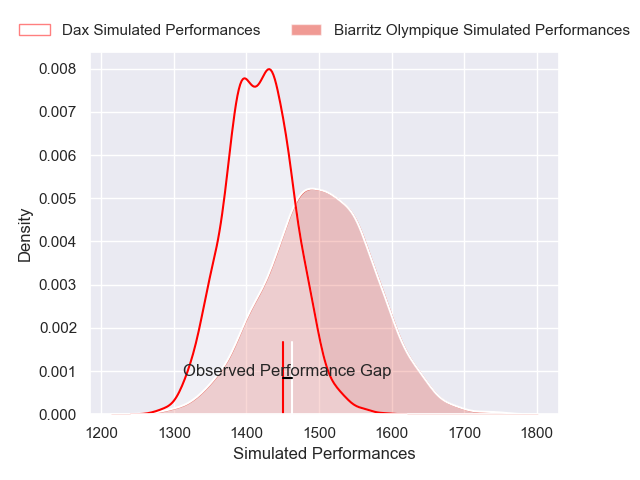
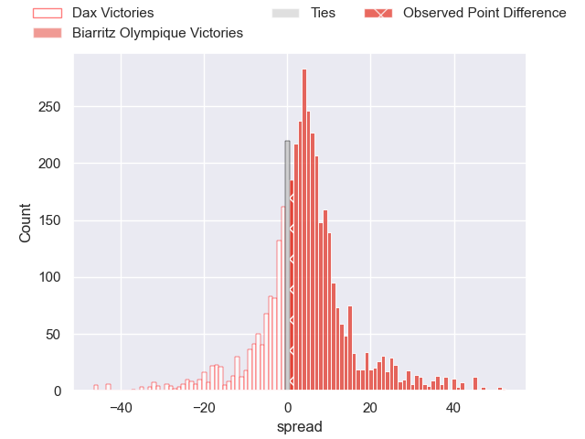
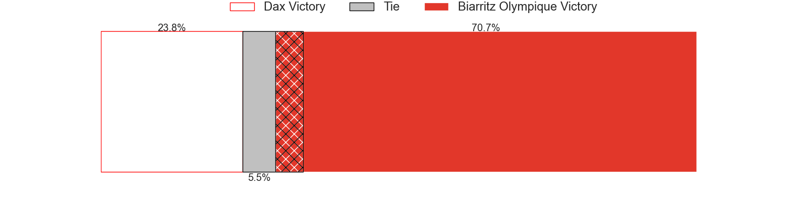
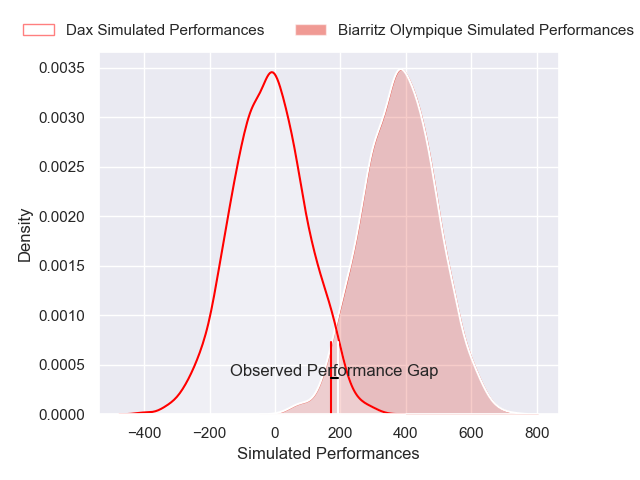
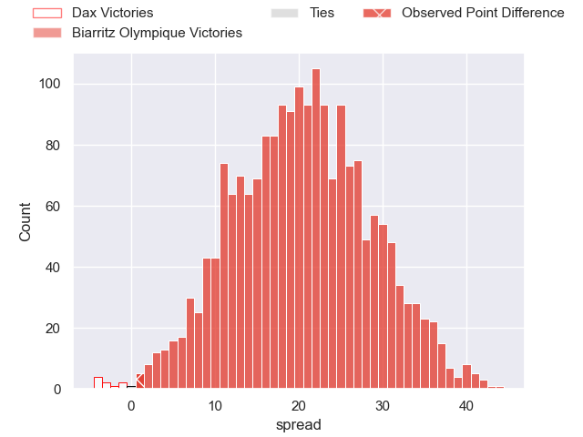
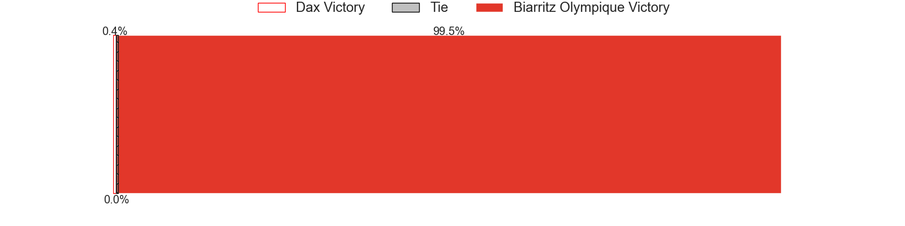

---  
layout: page  
title: Dax at Biarritz Olympique; 33-34  
date: 2025-03-07 18:00:00 -0500  
categories: "Pro D2 24/25" match review  
---
# Dax at Biarritz Olympique; 33-34

# Club Level Predictions

The first set of predictions treats a club as the smallest object, as the club develops its members, organizes a gameplan, and deploys its players as needed for each match. This club model has a prediction of 0.619, which translates to predicting Biarritz Olympique to win by 4.3.

Our Over/Under is 46.5 - and combined with the spread above, we have a predicted scoreline of 21 to 25

Each club has a rating and a rating deviation (similar to a Glicko rating), and expected performances can be generated. This allows for simulated matches and spreads like the ones below.
## Projected Performances - Club Model

## Projected Spreads - Club Model

## Projected Results - Club Model

# Player Level Predictions

Treating teams instead as an entity made up of the currently active players, I have ratings for each player in an altogether different system. These can be combined to form team ratings once teamsheets are announced, weighting starters a bit higher than the reserves. After the match is played, players can be weighted by their minutes on the field, allowing for an accurate measure of the team's composition. With these compiled team ratings, we can make predictions, measure inaccuracy, and update the individual player ratings.
## Prediction without Player Minutes: Biarritz Olympique by 18.1

Biarritz Olympique by 2.5 on a neutral pitch

## Projected Performances - Player Model

## Projected Spreads - Player Model

## Projected Results - Player Model

|   Away Minutes | Away Player           |   Away Percentile |   Number |   Home Percentile | Home Player         |   Home Minutes |
|---------------:|:----------------------|------------------:|---------:|------------------:|:--------------------|---------------:|
|             80 | David Lolohea         |             45.37 |        1 |             53.73 | Alexandre Plantier  |             32 |
|             61 | Iban Hiriart-Urruty   |             54.33 |        2 |              7.81 | Yohan Beheregaray   |             37 |
|             29 | Diogo Hasse Ferreira  |             11.44 |        3 |              0.81 | Zakaria El Fakir    |             13 |
|             25 | Étienne Loiret        |             53.1  |        4 |             21.67 | Ekain Imaz Agirre   |             80 |
|             80 | Jean-Baptiste Singer  |              8.16 |        5 |             11.73 | Piula Faasalele     |             60 |
|             60 | Jean-Baptiste Barrère |              7.11 |        6 |             12.72 | Thomas Hebert       |             80 |
|             20 | Paul Arnaud Ausset    |             75.49 |        7 |              2.34 | Jessy Jegerlehner   |             19 |
|             60 | Genesis Mamea Lemalu  |             60.94 |        8 |             22.49 | Nafi Ma'afu         |             21 |
|             80 | Sylvère Reteau        |             77.87 |        9 |             24.74 | Kerman Aurrekoetxea |             80 |
|             65 | Hugo Cerisier         |             68.14 |       10 |             17.93 | Thomas Dolhagaray   |             65 |
|             80 | Maxime Oltmann        |              2.67 |       11 |             89.7  | Mathieu Acebes      |             80 |
|             40 | Jale Vatubua          |              0.5  |       12 |             55.22 | Carlo Mignot        |             19 |
|             19 | Bastien Daguerre      |             40.26 |       13 |             10.04 | Tyler Morgan        |             40 |
|             19 | Théo Gatelier         |             70.93 |       14 |              1.56 | Zach Kibirige       |              6 |
|             30 | Théo Duprat           |             21.69 |       15 |             86.35 | Kylian Jaminet      |             80 |
|             25 | Arnaud Aletti         |             24.13 |       16 |             26.7  | Giorgi Dzmanashvili |             40 |
|             13 | Brice Ferrer          |             59.1  |       17 |             14.94 | Clement Martinez    |             50 |
|             15 | Nephi Leatigaga       |              2.52 |       18 |             49.43 | François Mur        |             80 |
|             15 | Louis Barrere         |             17.66 |       19 |            nan    | Anoa Laurent        |             80 |
|             80 | Louis Mary            |             72.97 |       20 |             23.92 | Levi Douglas        |             25 |
|             80 | Paul Ravier           |             75.96 |       21 |              1.22 | Aitor Hourcade      |             56 |
|             40 | Benjamin Puntous      |             14.46 |       22 |             40.51 | Edgar Retiere       |             21 |
|             40 | Romuald Séguy         |             23.21 |       23 |             32.33 | Yohan Tapie         |             60 |

