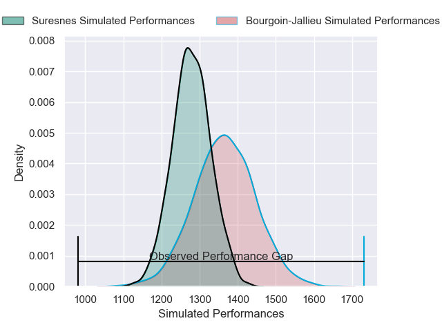
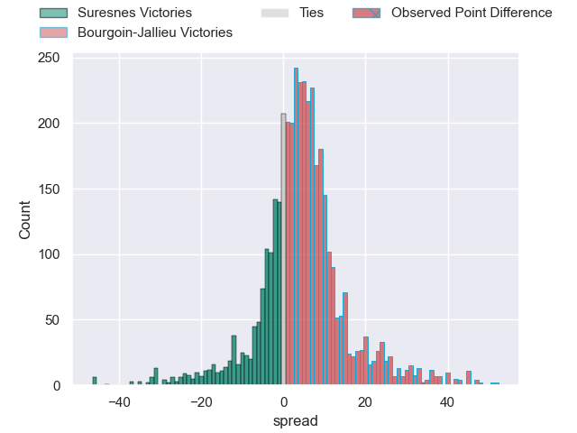
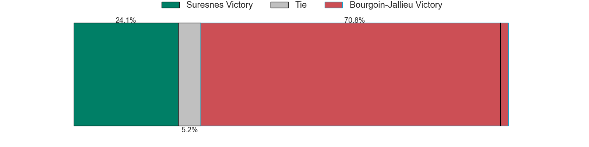
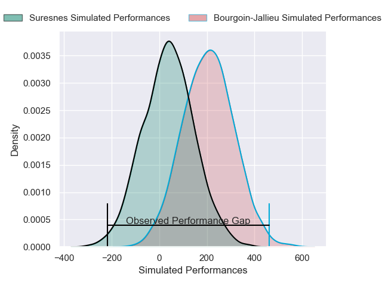
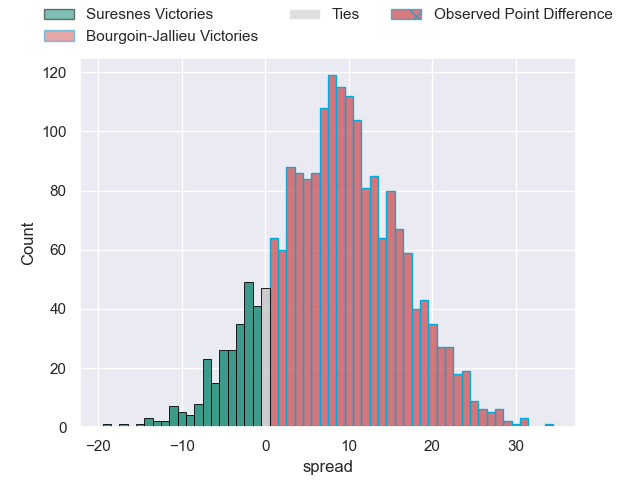
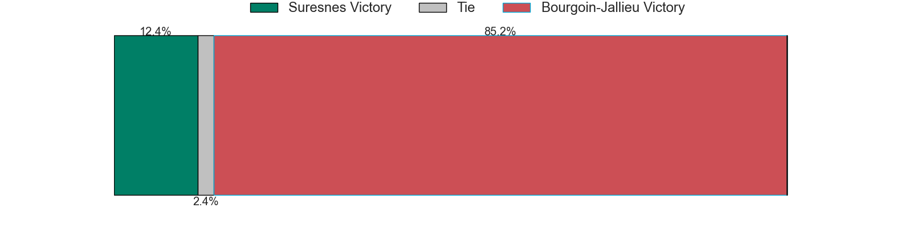

---  
layout: page  
title: Suresnes at Bourgoin-Jallieu; 24-58  
date: 2025-03-08 18:00:00 -0500  
categories: "Nationale 24/25" match review  
---
# Suresnes at Bourgoin-Jallieu; 24-58

# Club Level Predictions

The first set of predictions treats a club as the smallest object, as the club develops its members, organizes a gameplan, and deploys its players as needed for each match. This club model has a prediction of 0.62, which translates to predicting Bourgoin-Jallieu to win by 4.3.

Our Over/Under is 38.5 - and combined with the spread above, we have a predicted scoreline of 17 to 21

Each club has a rating and a rating deviation (similar to a Glicko rating), and expected performances can be generated. This allows for simulated matches and spreads like the ones below.
## Projected Performances - Club Model

## Projected Spreads - Club Model

## Projected Results - Club Model

# Player Level Predictions

Treating teams instead as an entity made up of the currently active players, I have ratings for each player in an altogether different system. These can be combined to form team ratings once teamsheets are announced, weighting starters a bit higher than the reserves. After the match is played, players can be weighted by their minutes on the field, allowing for an accurate measure of the team's composition. With these compiled team ratings, we can make predictions, measure inaccuracy, and update the individual player ratings.
## Prediction without Player Minutes: Bourgoin-Jallieu by 7.2

Suresnes by 6.1 on a neutral pitch

## Projected Performances - Player Model

## Projected Spreads - Player Model

## Projected Results - Player Model

|   Away Minutes | Away Player            |   Away Percentile |   Number |   Home Percentile | Home Player      |   Home Minutes |
|---------------:|:-----------------------|------------------:|---------:|------------------:|:-----------------|---------------:|
|           12.5 | Elias Coulibaly        |             67.72 |        1 |             35.28 | Romain Favaretto |           58   |
|           44   | Ismael Martin          |             15.68 |        2 |             18.72 | Julien Ratajczak |           67   |
|           80   | Leandro Mario Assi     |             26.38 |        3 |             11.41 | Keynan Knox      |           38.5 |
|           15   | Damien Bozic           |             64.17 |        4 |             36.49 | Thomas Adélaïde  |           22   |
|           80   | Nikita Bekov           |             80.02 |        5 |              0.75 | Léandre Cotte    |            0   |
|           18   | Corentin Rougier       |             45.51 |        6 |             65.43 | Kevin Rivoire    |           60   |
|           24   | Florian Desbordes      |             11.68 |        7 |             13.72 | Matteo Broeders  |           17   |
|            0   | Lakisipone Lee         |             80.45 |        8 |              8.55 | Sam Daly         |           56   |
|           34   | Thomas Lacroix         |              5.91 |        9 |             31.65 | Liam Rimet       |           24   |
|           25   | Jean Chezeau           |             65.55 |       10 |             11.55 | Nicolas Cachet   |           22   |
|           80   | Yohan Fournier         |              6.45 |       11 |             26.8  | Adrian Fugit     |           80   |
|           32   | Petero Tuwai           |             59.49 |       12 |              3.43 | Aviata Silago    |           80   |
|           13   | JJ Taulagi             |              1.11 |       13 |             27.68 | Tom Danovaro     |           80   |
|           55   | Alexis Clement         |              8.47 |       14 |             79.83 | Joe Ravouvou     |           30   |
|           36   | Goulwen Gueho          |              2.86 |       15 |              5.1  | Remi Bouet       |           32   |
|           52   | Guiterembi Vickos      |             25.16 |       16 |             18.26 | Theophile Cotte  |           27   |
|           80   | Yanis Trabelsi         |             18.53 |       17 |              1.13 | Lucas Dycke      |           34   |
|           12.5 | Jean-Baptiste Lachaise |             73.93 |       18 |              0.94 | Morgan Eames     |           34   |
|           80   | Germain de Borda       |             41.74 |       19 |            nan    | Louis Giamarchi  |           80   |
|           20   | Antoine Marty-Rybak    |            nan    |       20 |             14.27 | Pierre Mignot    |           15   |
|           48   | Wian Vosloo            |             68.86 |       21 |             32.88 | Maxime Castant   |           80   |
|           60   | Victor Barnier         |             77.68 |       22 |             44.5  | Dimitri Tchapnga |            0   |
|           58   | Gauthier Wolf          |             44.55 |       23 |             10.13 | Paul-Hugo Champ  |           80   |

