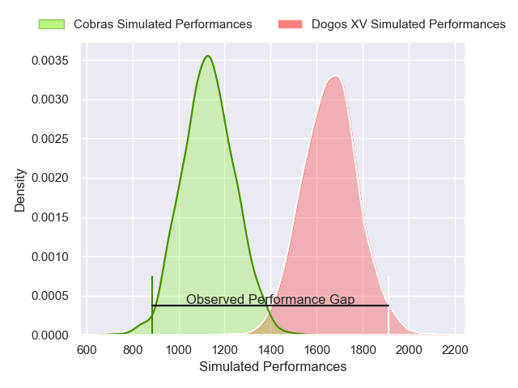
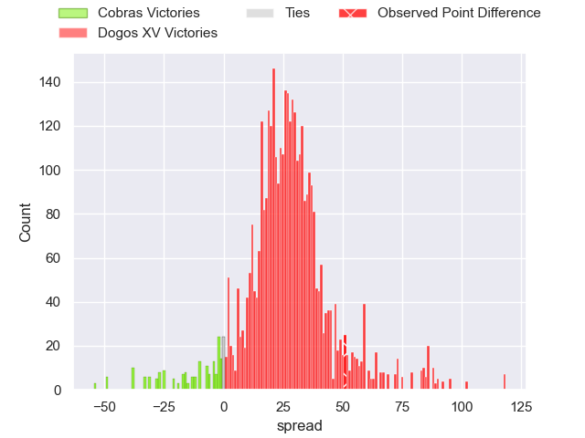
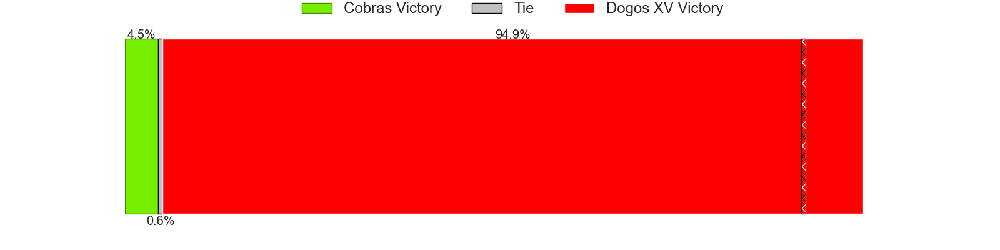
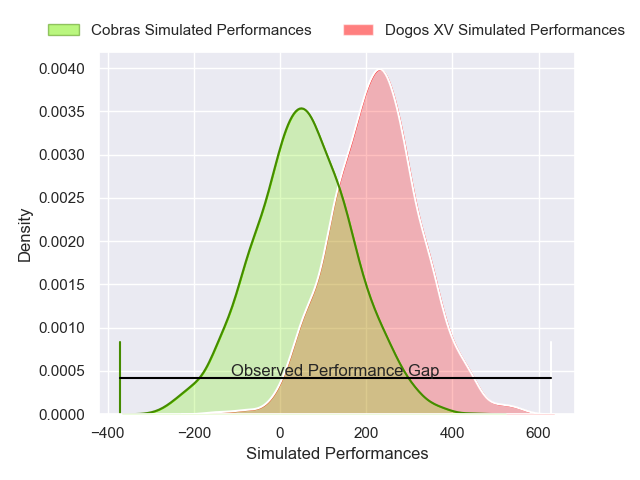
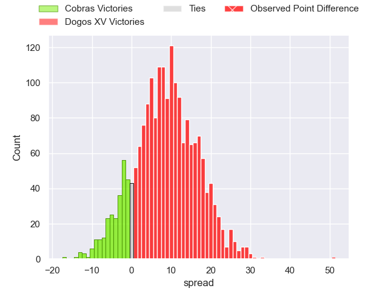

---  
layout: page  
title: Cobras at Dogos XV; 29-80  
date: 2025-03-08 18:00:00 -0500  
categories: "Super Rugby Americas 2025" match review  
---
# Cobras at Dogos XV; 29-80

# Club Level Predictions

The first set of predictions treats a club as the smallest object, as the club develops its members, organizes a gameplan, and deploys its players as needed for each match. This club model has a prediction of 0.945, which translates to predicting Dogos XV to win by 26.3.

Our Over/Under is 62.5 - and combined with the spread above, we have a predicted scoreline of 18 to 44

Each club has a rating and a rating deviation (similar to a Glicko rating), and expected performances can be generated. This allows for simulated matches and spreads like the ones below.
## Projected Performances - Club Model

## Projected Spreads - Club Model

## Projected Results - Club Model

# Player Level Predictions

Treating teams instead as an entity made up of the currently active players, I have ratings for each player in an altogether different system. These can be combined to form team ratings once teamsheets are announced, weighting starters a bit higher than the reserves. After the match is played, players can be weighted by their minutes on the field, allowing for an accurate measure of the team's composition. With these compiled team ratings, we can make predictions, measure inaccuracy, and update the individual player ratings.
## Prediction without Player Minutes: Dogos XV by 12.7

Dogos XV by 10.4 on a neutral pitch

## Projected Performances - Player Model

## Projected Spreads - Player Model

## Projected Results - Player Model

|   Away Minutes | Away Player               |   Away Percentile |   Number |   Home Percentile | Home Player               |   Home Minutes |
|---------------:|:--------------------------|------------------:|---------:|------------------:|:--------------------------|---------------:|
|           80   | Brendon Alves             |             22.33 |        1 |             90.29 | Santiago Pulella          |             15 |
|           80   | Endy Willian              |              8.94 |        2 |             77.23 | Leonel Oviedo             |             14 |
|           80   | Vicente Galvao            |             31.47 |        3 |             65.53 | Pedro Delgado             |             14 |
|            9   | Ben Donald                |             31.71 |        4 |             84.15 | Lautaro Simes             |             41 |
|           22   | Gabriel Paganini          |              1.41 |        5 |             65.48 | Federico Albrisi          |             80 |
|           31.5 | Manuel Todaro             |             69.42 |        6 |             66.73 | Aitor Bildosola           |             30 |
|           65   | Adrio Melo                |             53.66 |        7 |             78.5  | Valentin Cabral           |             30 |
|           27   | Rodolfo Martins           |             35.85 |        8 |             54.58 | Gennaro Fissore           |             80 |
|           57   | Lucas Ferrer Spago        |             19.83 |        9 |             90.09 | Agustin Moyano            |             80 |
|           80   | Augusto Guillamondegui    |             25.42 |       10 |             63.24 | Juan Baronio              |             80 |
|           65   | Andrei Santana            |             33.79 |       11 |             89.13 | Franco Rossetto           |             80 |
|           20   | Lorenzo Temer Massari     |             41.31 |       12 |             78.48 | Felipe Mallia             |             80 |
|           80   | Fernando Dario Luna       |             32.02 |       13 |             87.88 | Agustin Segura            |             17 |
|           27   | Nicolas Azevedo           |             40.33 |       14 |             81.03 | Mateo Soler               |             15 |
|           65   | Joao Amaral               |             62.04 |       15 |             33.47 | Mateo Sanchez             |             41 |
|           20   | Andre Arruda              |              7.33 |       16 |             65.29 | Nicolas Revol             |             22 |
|           71   | Robert Tenorio            |              8.29 |       17 |             86.49 | Octavio Filippa           |             23 |
|           58   | Cleber Dias               |              5.47 |       18 |            nan    | Juan Lovell               |             23 |
|           58   | Javier Angel Coronel      |             69.17 |       19 |             68.77 | Lorenzo Colidio           |             80 |
|            7   | Henrique Ribeiro Ferreira |             18.04 |       20 |             62.34 | Lautaro Cipriani          |             30 |
|           55   | Aquiles Schulter          |            nan    |       21 |            nan    | Ignacio Jose Gandini      |             15 |
|          nan   | nan                       |            nan    |       22 |            nan    | Conrado Iglesias Quintana |             37 |
|          nan   | nan                       |            nan    |       23 |             76.89 | Julian Ignacio Hernandez  |             25 |

