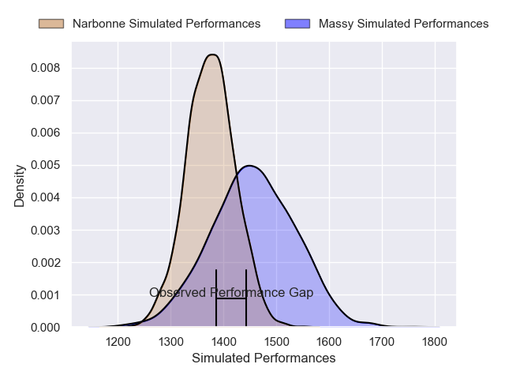
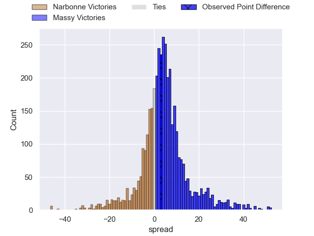
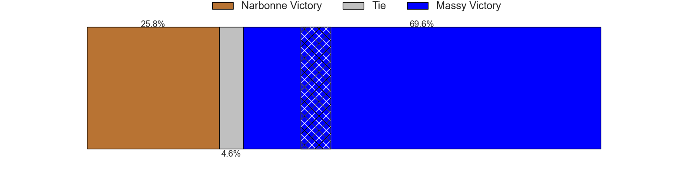
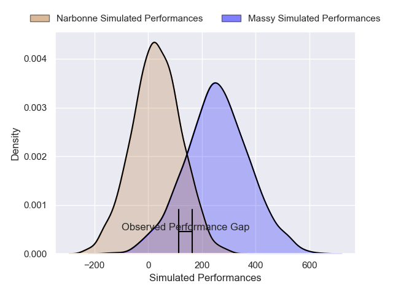
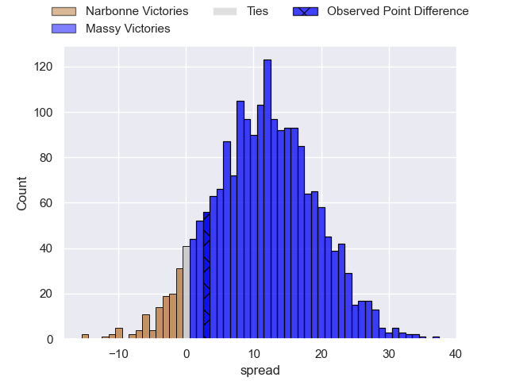
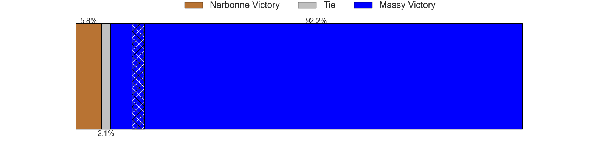

---  
layout: page  
title: Narbonne at Massy; 26-29  
date: 2025-03-08 18:00:00 -0500  
categories: "Nationale 24/25" match review  
---
# Narbonne at Massy; 26-29

# Club Level Predictions

The first set of predictions treats a club as the smallest object, as the club develops its members, organizes a gameplan, and deploys its players as needed for each match. This club model has a prediction of 0.608, which translates to predicting Massy to win by 3.9.

Our Over/Under is 41.5 - and combined with the spread above, we have a predicted scoreline of 19 to 23

Each club has a rating and a rating deviation (similar to a Glicko rating), and expected performances can be generated. This allows for simulated matches and spreads like the ones below.
## Projected Performances - Club Model

## Projected Spreads - Club Model

## Projected Results - Club Model

# Player Level Predictions

Treating teams instead as an entity made up of the currently active players, I have ratings for each player in an altogether different system. These can be combined to form team ratings once teamsheets are announced, weighting starters a bit higher than the reserves. After the match is played, players can be weighted by their minutes on the field, allowing for an accurate measure of the team's composition. With these compiled team ratings, we can make predictions, measure inaccuracy, and update the individual player ratings.
## Prediction without Player Minutes: Massy by 13.0

Massy by 6.7 on a neutral pitch

## Projected Performances - Player Model

## Projected Spreads - Player Model

## Projected Results - Player Model

|   Away Minutes | Away Player               |   Away Percentile |   Number |   Home Percentile | Home Player            |   Home Minutes |
|---------------:|:--------------------------|------------------:|---------:|------------------:|:-----------------------|---------------:|
|             21 | Benito Delacruz           |             44.48 |        1 |             38.72 | Siegfried Fisi'ihoi    |             80 |
|             28 | Mehdi Boundjema           |             83.36 |        2 |             91.34 | Pierre Trassoudaine    |             24 |
|              0 | Chris Talakai             |             18.18 |        3 |             75.24 | Tijde Visser           |             14 |
|             10 | Marius Antonescu          |             73.45 |        4 |             74.77 | Saba Pesvianidze       |             80 |
|             32 | Leva Fifita               |              1.78 |        5 |             73.26 | Andrei Mahu            |             25 |
|             50 | Arthur Christienne        |             58.37 |        6 |             47.8  | Tony Tissot            |             80 |
|              0 | Nicolas Mousties          |             35.17 |        7 |             64.27 | Simon Cowley           |             72 |
|             55 | Lopeti Timani             |             81.19 |        8 |             58.69 | Hilan Delbois Fontaine |             80 |
|              0 | Pablo Barbaste            |             79.27 |        9 |             68.12 | Julien Blanc           |             70 |
|             16 | Gilles Bosch              |             12.45 |       10 |             40.3  | Antonin Vidalenc       |             80 |
|             80 | Clément Clavières         |             84.54 |       11 |             85.46 | Alex Preira            |             80 |
|             80 | Parataiso Silafai-Lea'ana |             63.25 |       12 |             78.31 | Luca Mignot            |              5 |
|             41 | Pierre-Hugo Ducom         |             13.15 |       13 |             26.61 | Tom Cusson             |             55 |
|             39 | Baptiste Tsague           |             51.61 |       14 |             11.13 | Giorgi Gogoladze       |             80 |
|             80 | Boris Goutard             |              0.6  |       15 |             21.89 | Alexandre Borie        |             48 |
|             48 | Adam Moulahya             |            nan    |       16 |              0.65 | Fernandez Correa       |             80 |
|             52 | Gregory Fichten           |             19.97 |       17 |             67.91 | Adrien Sonzogni        |             80 |
|             30 | Jérémy Boyadjis           |             73.7  |       18 |             41.23 | Nolan Pienaar          |             28 |
|             28 | Darrell Dyer              |             91.74 |       19 |             41.07 | Hugo Boutin            |             23 |
|             25 | Thibault Clauzade         |             61.46 |       20 |            nan    | Noa Rolnin             |             23 |
|             40 | Erwan Nicolas             |             59.58 |       21 |             44.43 | Lucas Rubio            |             80 |
|             30 | Théo Mias                 |             30.62 |       22 |              5.06 | Gonzalo Lopez Bontempo |              8 |
|             30 | Thibault Santoro          |             47.79 |       23 |             45.72 | Alfred Mouandjo        |             16 |

