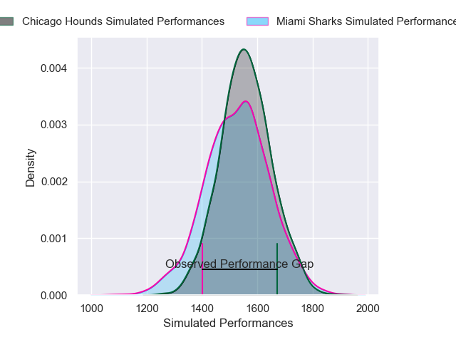
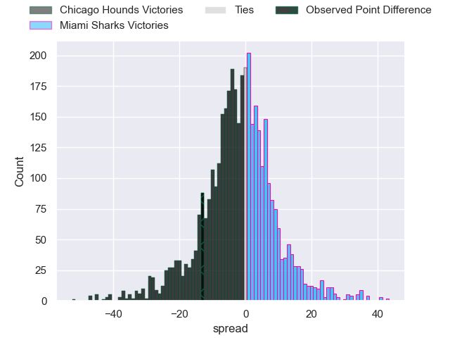
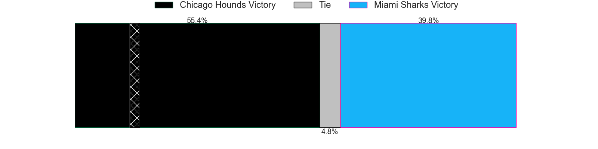
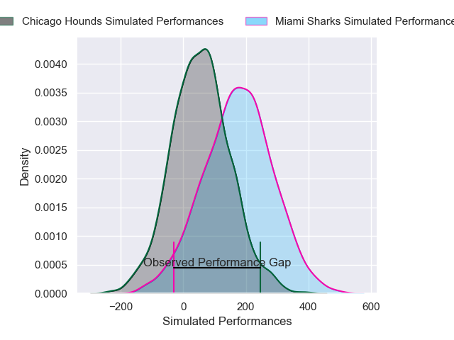
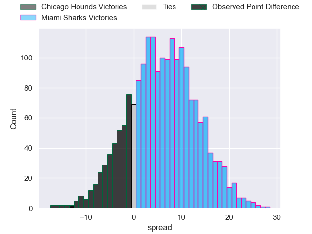
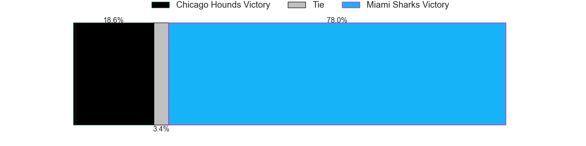

---  
layout: page  
title: Chicago Hounds at Miami Sharks; 31-18  
date: 2025-03-08 18:00:00 -0500  
categories: "Major League Rugby 2025" match review  
---
# Chicago Hounds at Miami Sharks; 31-18

# Club Level Predictions

The first set of predictions treats a club as the smallest object, as the club develops its members, organizes a gameplan, and deploys its players as needed for each match. This club model has a prediction of 0.458, which translates to predicting Chicago Hounds to win by 1.5.

Our Over/Under is 61.5 - and combined with the spread above, we have a predicted scoreline of 32 to 30

Each club has a rating and a rating deviation (similar to a Glicko rating), and expected performances can be generated. This allows for simulated matches and spreads like the ones below.
## Projected Performances - Club Model

## Projected Spreads - Club Model

## Projected Results - Club Model

# Player Level Predictions

Treating teams instead as an entity made up of the currently active players, I have ratings for each player in an altogether different system. These can be combined to form team ratings once teamsheets are announced, weighting starters a bit higher than the reserves. After the match is played, players can be weighted by their minutes on the field, allowing for an accurate measure of the team's composition. With these compiled team ratings, we can make predictions, measure inaccuracy, and update the individual player ratings.
## Prediction without Player Minutes: Miami Sharks by 6.9

Miami Sharks by 4.5 on a neutral pitch

## Projected Performances - Player Model

## Projected Spreads - Player Model

## Projected Results - Player Model

|   Away Minutes | Away Player       |   Away Percentile |   Number |   Home Percentile | Home Player              |   Home Minutes |
|---------------:|:------------------|------------------:|---------:|------------------:|:-------------------------|---------------:|
|             45 | Faka'osi Pifeleti |             91.8  |        1 |              3.81 | Ma'ake Muti              |             62 |
|             59 | Janus Venter      |             75.38 |        2 |             47.2  | Kirby Myhill             |             18 |
|             80 | Ignacio Peculo    |             73.54 |        3 |              5.28 | Tau Koloamatangi         |             13 |
|             80 | James Scott       |             78.99 |        4 |             11.16 | Tomas Casares            |             67 |
|             25 | Hamish Bain       |             42.21 |        5 |             67.07 | Julian Rebusone          |             80 |
|             21 | Mason Flesch      |              2.25 |        6 |             73.71 | Manuel Ardao             |             80 |
|             55 | Maclean Jones     |             17.21 |        7 |             82.51 | Benjam�n Bonasso         |             80 |
|             25 | Lucas Rumball     |              0.82 |        8 |             25.15 | Ronan Foley              |             47 |
|             80 | Mitch Short       |             50.35 |        9 |             74.04 | Tomas Inciarte Rachetti  |             80 |
|             35 | Chris Hilsenbeck  |              4.85 |       10 |             46.41 | Santiago Videla Cambiaso |             80 |
|             25 | Nate Augspurger   |             96.5  |       11 |             81.23 | Tomas Cubilla            |             16 |
|             62 | Ollie Devoto      |             15.26 |       12 |              9.04 | Guiseppe du Toit         |             56 |
|             59 | Bryce Campbell    |             83.43 |       13 |              3.92 | Matias Orlando           |             80 |
|             45 | Noah Brown        |             87.86 |       14 |             32.57 | Marcos Young             |             67 |
|             45 | Ben Pollack       |             58.23 |       15 |             66.67 | Tomas Malanos            |             80 |

