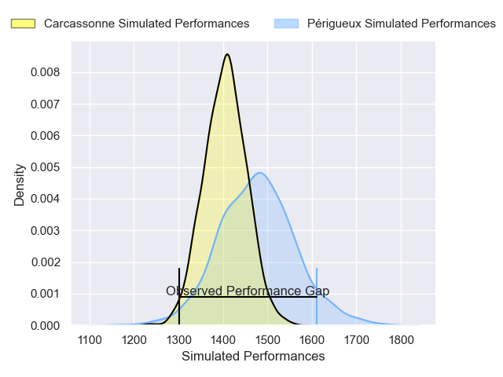
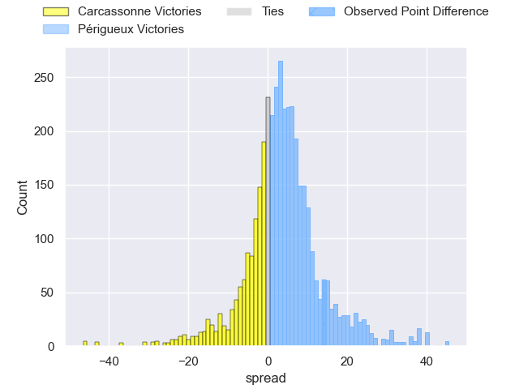
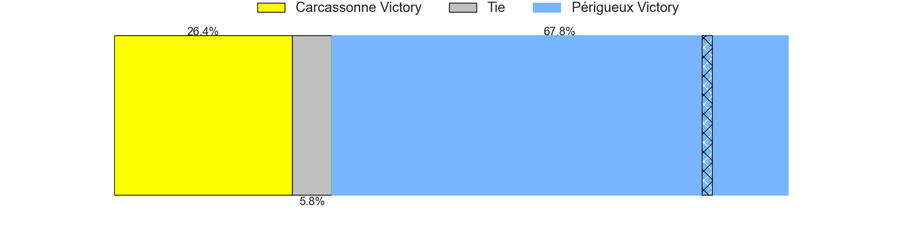
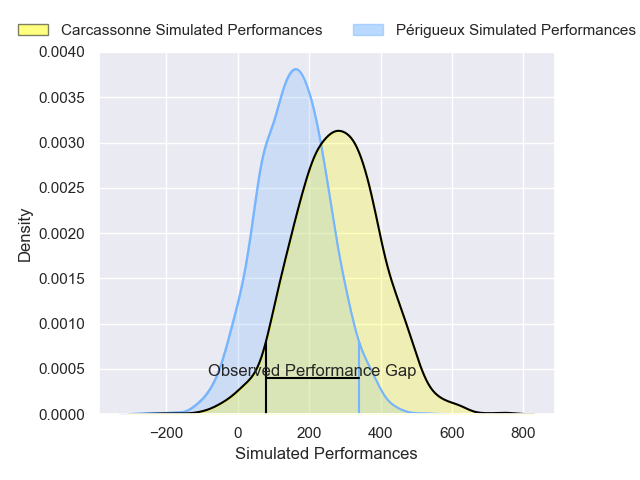
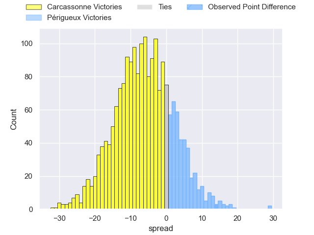
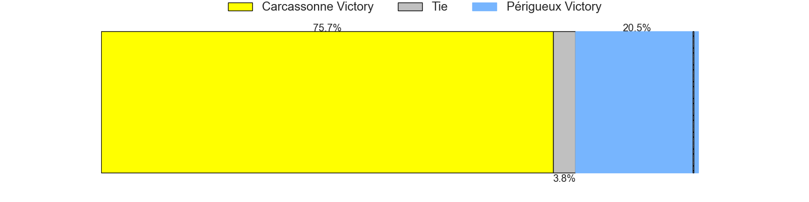

---  
layout: page  
title: Carcassonne at Perigueux; 6-20  
date: 2025-03-08 18:00:00 -0500  
categories: "Nationale 24/25" match review  
---
# Carcassonne at Perigueux; 6-20

# Club Level Predictions

The first set of predictions treats a club as the smallest object, as the club develops its members, organizes a gameplan, and deploys its players as needed for each match. This club model has a prediction of 0.602, which translates to predicting Périgueux to win by 3.6.

Our Over/Under is 42.5 - and combined with the spread above, we have a predicted scoreline of 20 to 23

Each club has a rating and a rating deviation (similar to a Glicko rating), and expected performances can be generated. This allows for simulated matches and spreads like the ones below.
## Projected Performances - Club Model

## Projected Spreads - Club Model

## Projected Results - Club Model

# Player Level Predictions

Treating teams instead as an entity made up of the currently active players, I have ratings for each player in an altogether different system. These can be combined to form team ratings once teamsheets are announced, weighting starters a bit higher than the reserves. After the match is played, players can be weighted by their minutes on the field, allowing for an accurate measure of the team's composition. With these compiled team ratings, we can make predictions, measure inaccuracy, and update the individual player ratings.
## Prediction without Player Minutes: Carcassonne by 2.1

Carcassonne by 5.1 on a neutral pitch

## Projected Performances - Player Model

## Projected Spreads - Player Model

## Projected Results - Player Model

|   Away Minutes | Away Player           |   Away Percentile |   Number |   Home Percentile | Home Player         |   Home Minutes |
|---------------:|:----------------------|------------------:|---------:|------------------:|:--------------------|---------------:|
|             45 | Yan Arnold            |             75.89 |        1 |             81.25 | Emilien Borges      |        22      |
|             22 | Baptiste Moreno       |             72.84 |        2 |             45.16 | Lucas Marijon       |        34      |
|             22 | Siua Halanukonuka     |             68.26 |        3 |             52.6  | Kalaveti Tawake     |        28      |
|             63 | Valentin Sese         |             14.17 |        4 |             47.56 | Richard Fourcade    |        58      |
|             80 | Clément Fontaine      |             31.71 |        5 |             18.11 | Jaco Willemse       |        23      |
|             80 | Gary Graham           |             62.3  |        6 |             52.2  | Sacha Rosenberg     |        18      |
|             80 | Etienne Herjean       |             86.62 |        7 |             74.65 | Clement Lanen       |        80      |
|             80 | Thomas Hoarau         |             19.22 |        8 |             37.01 | Nahum Merigan       |        19      |
|             46 | Yvan David            |             47.91 |        9 |             43.21 | Max Green           |        20.6667 |
|             52 | Johnny McPhillips     |             54.01 |       10 |             71.1  | Greg Hutley         |        80      |
|             80 | Clement Egiziano      |             87.58 |       11 |             86.66 | Tim Giresse         |        80      |
|             58 | Jeremy To'a           |             26.31 |       12 |             83.63 | Fred Hickes         |        19      |
|             80 | Lukas Doyhenard       |             65.56 |       13 |             76.71 | Dorian Lavernhe     |        60      |
|              0 | Paul Gadea            |             44.43 |       14 |             86.2  | Vincent Fouillade   |        20.6667 |
|             46 | Maxime Gianet         |             85.34 |       15 |             56.22 | Yon Camou           |        25      |
|             11 | Florent Lorenzon      |             43.59 |       16 |             25.57 | Jason Tindiliere    |         0      |
|             50 | Fabien Lorenzon       |             85.15 |       17 |              1.02 | Manu Leiataua       |        27      |
|             15 | Gabin Villerouge      |             72.16 |       18 |             77.68 | Anthony Pelmard     |        30      |
|             55 | Romain Guyot          |             82.93 |       19 |             65.76 | Raphaël Vieilledent |        80      |
|             53 | Bilal Fadli           |             67.63 |       20 |             65.24 | Karl Lambert        |        20      |
|             49 | Tomas Munilla lo Duca |             19.69 |       21 |             46.12 | Hendri Storm        |        58      |
|             80 | Gabin Michet          |             93.25 |       22 |             25.26 | Nicolas Faltrept    |        58      |
|             47 | Pierre Aguillon       |            nan    |       23 |             15.46 | Nicolas Piaton      |        80      |

