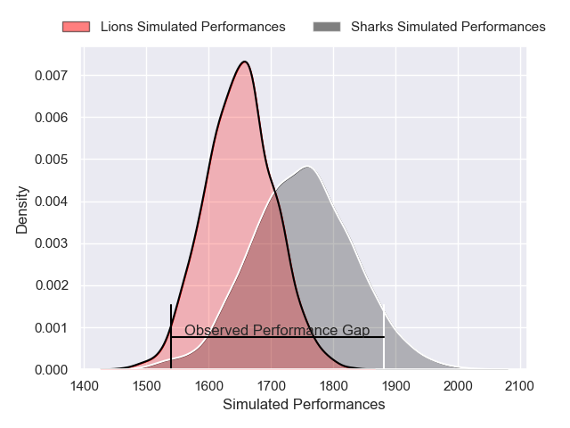
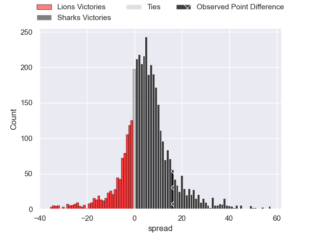
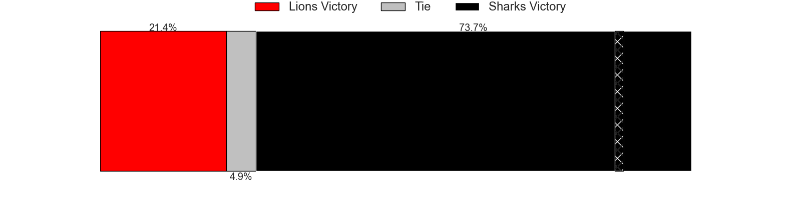
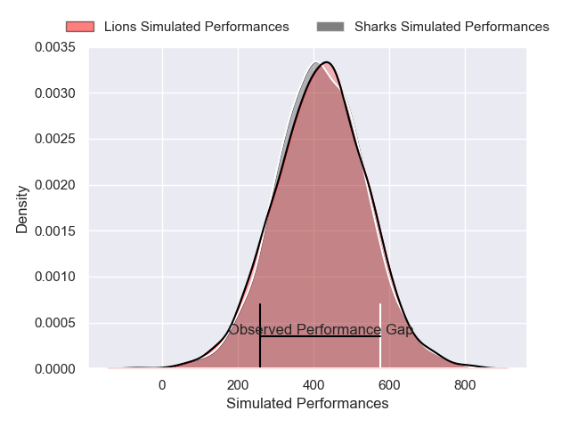
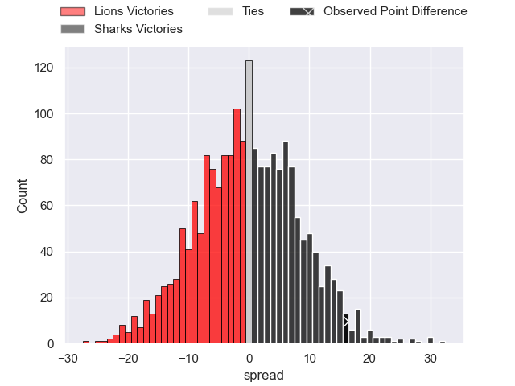
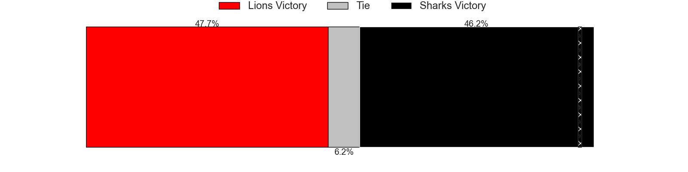

---  
layout: page  
title: Lions at Sharks; 20-36  
date: 2025-03-08 18:00:00 -0500  
categories: "United Rugby Championship 24/25" match review  
---
# Lions at Sharks; 20-36

# Club Level Predictions

The first set of predictions treats a club as the smallest object, as the club develops its members, organizes a gameplan, and deploys its players as needed for each match. This club model has a prediction of 0.638, which translates to predicting Sharks to win by 5.0.

Our Over/Under is 56.5 - and combined with the spread above, we have a predicted scoreline of 26 to 31

Each club has a rating and a rating deviation (similar to a Glicko rating), and expected performances can be generated. This allows for simulated matches and spreads like the ones below.
## Projected Performances - Club Model

## Projected Spreads - Club Model

## Projected Results - Club Model

# Player Level Predictions

Treating teams instead as an entity made up of the currently active players, I have ratings for each player in an altogether different system. These can be combined to form team ratings once teamsheets are announced, weighting starters a bit higher than the reserves. After the match is played, players can be weighted by their minutes on the field, allowing for an accurate measure of the team's composition. With these compiled team ratings, we can make predictions, measure inaccuracy, and update the individual player ratings.
## Prediction without Player Minutes: Sharks by 1.2

Lions by 6.9 on a neutral pitch

## Projected Performances - Player Model

## Projected Spreads - Player Model

## Projected Results - Player Model

|   Away Minutes | Away Player            |   Away Percentile |   Number |   Home Percentile | Home Player         |   Home Minutes |
|---------------:|:-----------------------|------------------:|---------:|------------------:|:--------------------|---------------:|
|           80   | Juan Schoeman          |             53.08 |        1 |             99.43 | Ox Nche             |             72 |
|           11   | PJ Botha               |             82    |        2 |             99.15 | Bongi Mbonambi      |              0 |
|           17   | Asenathi Ntlabakanye   |             73.38 |        3 |             92.29 | Vincent Koch        |             54 |
|           18   | Ruben Schoeman         |             89.49 |        4 |             82.55 | Jason Jenkins       |             26 |
|           34   | Ruben Schoeman         |             89.49 |        4 |             82.55 | Jason Jenkins       |             26 |
|           10.5 | Ruben Schoeman         |             89.49 |        4 |             82.55 | Jason Jenkins       |             26 |
|           37   | Ruben Schoeman         |             89.49 |        4 |             82.55 | Jason Jenkins       |             26 |
|           21   | Darrien-Lane Landsberg |             78.24 |        5 |             35.27 | Emile van Heerden   |             80 |
|           10.5 | Darrien-Lane Landsberg |             78.24 |        5 |             35.27 | Emile van Heerden   |             80 |
|           65   | Jarod Cairns           |             19.93 |        6 |             79.23 | Phepsi Buthelezi    |             54 |
|           52   | Sibabalo Qoma          |             32.83 |        7 |             54.91 | Jeandre Labuschagne |             80 |
|           23   | Francke Horn           |             98.36 |        8 |             86.5  | Siya Kolisi         |             72 |
|           80   | Morne van den Berg     |             86.24 |        9 |             91.11 | Grant Williams      |             80 |
|           17   | Gianni Lombard         |             87.76 |       10 |             92.41 | Jordan Hendrikse    |             80 |
|           80   | Edwill van der Merwe   |             93.28 |       11 |             79.85 | Ethan Hooker        |             57 |
|           26   | Marius Louw            |             94.28 |       12 |             60.74 | Francois Venter     |              0 |
|           80   | Manuel Rass            |             12.45 |       13 |             87.55 | Jurenzo Julius      |             80 |
|           60   | Richard Kriel          |             38.27 |       14 |              6.62 | Yaw Penxe           |             68 |
|           65   | Tapiwa Mafura          |             85.54 |       15 |             84.34 | Henry Immelman      |             80 |
|           28   | Franco Marais          |              5.43 |       16 |             88.46 | Fez Mbatha          |             69 |
|            8   | Morgan Naude           |             67.78 |       17 |             23.54 | Ntuthuko Mchunu     |             63 |
|           28   | Conraad van Vuuren     |             63.07 |       18 |            nan    | Hanro Jacobs        |             29 |
|           80   | Ruan Delport           |             58.63 |       19 |             19.89 | Corne Rahl          |             37 |
|           80   | Izan Esterhuizen       |             58.47 |       20 |             57.44 | James Venter        |             28 |
|           28.5 | Nico Steyn             |             70.73 |       21 |             61.15 | Nick Hatton         |             52 |
|           28.5 | WJ Steenkamp           |             62.58 |       22 |             86.76 | Jaden Hendrikse     |             18 |
|           54   | Rynhardt Jonker        |             84.14 |       23 |             66.87 | Hakeem Kunene       |             12 |

