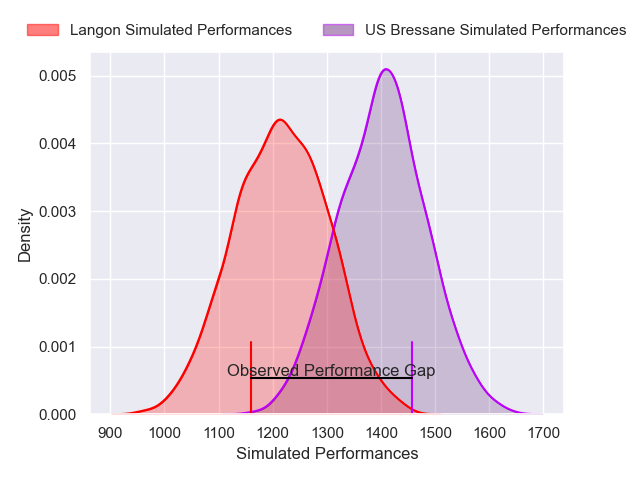
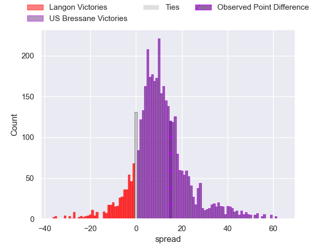
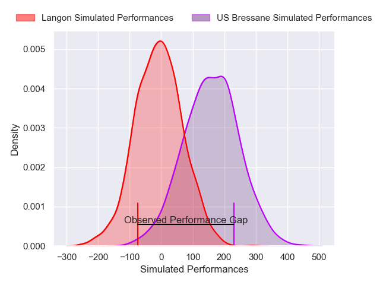
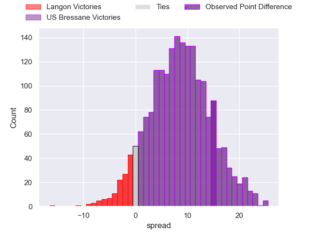
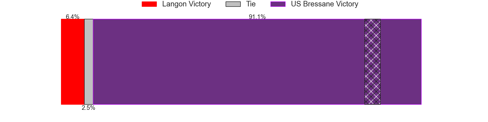

---  
layout: page  
title: Langon at US Bressane; 19-34  
date: 2025-03-08 18:00:00 -0500  
categories: "Nationale 24/25" match review  
---
# Langon at US Bressane; 19-34

# Club Level Predictions

The first set of predictions treats a club as the smallest object, as the club develops its members, organizes a gameplan, and deploys its players as needed for each match. This club model has a prediction of 0.74, which translates to predicting US Bressane to win by 9.4.

Our Over/Under is 41.5 - and combined with the spread above, we have a predicted scoreline of 16 to 25

Each club has a rating and a rating deviation (similar to a Glicko rating), and expected performances can be generated. This allows for simulated matches and spreads like the ones below.
## Projected Performances - Club Model

## Projected Spreads - Club Model

## Projected Results - Club Model

# Player Level Predictions

Treating teams instead as an entity made up of the currently active players, I have ratings for each player in an altogether different system. These can be combined to form team ratings once teamsheets are announced, weighting starters a bit higher than the reserves. After the match is played, players can be weighted by their minutes on the field, allowing for an accurate measure of the team's composition. With these compiled team ratings, we can make predictions, measure inaccuracy, and update the individual player ratings.
## Prediction without Player Minutes: US Bressane by 9.2

US Bressane by 3.7 on a neutral pitch

## Projected Performances - Player Model

## Projected Spreads - Player Model

## Projected Results - Player Model

|   Away Minutes | Away Player              |   Away Percentile |   Number |   Home Percentile | Home Player          |   Home Minutes |
|---------------:|:-------------------------|------------------:|---------:|------------------:|:---------------------|---------------:|
|        34      | Ratu Nailoma Vatubua     |             14.81 |        1 |             20.23 | Teo Bordenave        |             33 |
|        22      | Clement Renaud           |             22.26 |        2 |             32.72 | Louis Dasalmartini   |             11 |
|        80      | Maxime Gau               |              2.1  |        3 |             23.54 | Atonio Ulutuipalelei |             80 |
|        80      | Simon Lobjoit            |             38.65 |        4 |             10.41 | Quentin Witt         |             58 |
|        19      | Isikili Seva Davetawalu  |             21.76 |        5 |             67.92 | Pierre Reynaud       |             80 |
|        18      | Thomas Mendy             |             46.71 |        6 |             87.95 | Lucas Lyons          |             52 |
|        15      | Ludovic Sempé            |             39.39 |        7 |             59.78 | Nail Ait Naceur      |             14 |
|        20.6667 | Thomas De Molder         |              6.11 |        8 |             87.78 | Loic Baradel         |             80 |
|        30      | Paul Castera             |             57.04 |        9 |             28.52 | Jeremie Martin       |             46 |
|        27      | Vincent Debladis         |             12.39 |       10 |             87.39 | Fred Zeilinga        |             28 |
|         0      | Thomas Wallraf           |             68.42 |       11 |             15.01 | Élie De Fleurian     |             80 |
|        20      | Guillaume Christophe     |             36.36 |       12 |             45.76 | Benjamin Doy         |             63 |
|         0      | Yul Charrier             |             34.85 |       13 |             43.03 | Joe Margetts         |             22 |
|        58      | Quentin Lefort           |              8.75 |       14 |             17.68 | Alexandre Badet      |             22 |
|        80      | Baptiste Tisne Cardeneau |             53.06 |       15 |             23.47 | Nathan Azais         |             28 |

