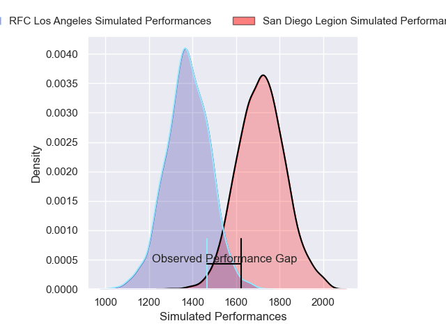
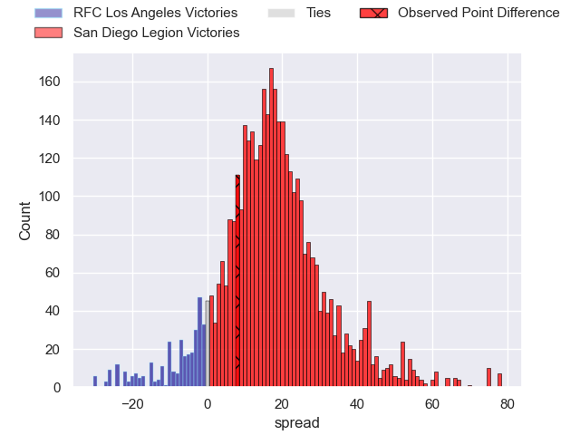
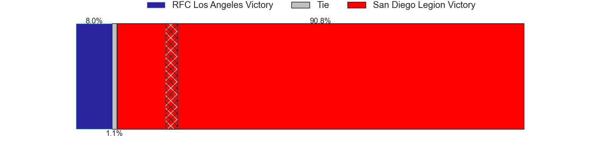
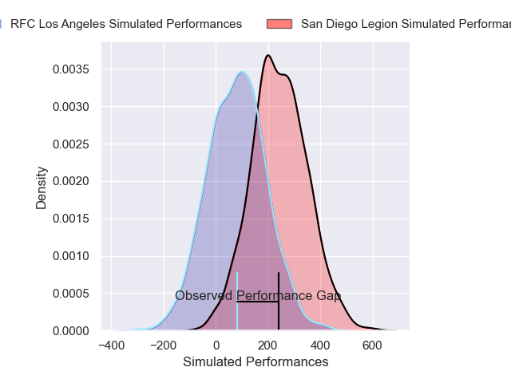
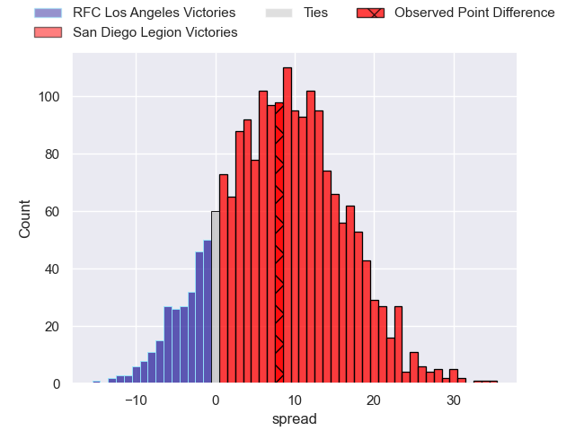
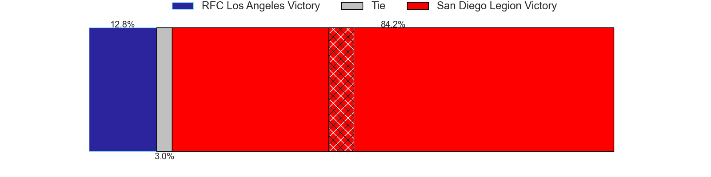

---  
layout: page  
title: RFC Los Angeles at San Diego Legion; 28-36  
date: 2025-03-09 18:00:00 -0500  
categories: "Major League Rugby 2025" match review  
---
# RFC Los Angeles at San Diego Legion; 28-36

# Club Level Predictions

The first set of predictions treats a club as the smallest object, as the club develops its members, organizes a gameplan, and deploys its players as needed for each match. This club model has a prediction of 0.866, which translates to predicting San Diego Legion to win by 17.0.

Our Over/Under is 67.5 - and combined with the spread above, we have a predicted scoreline of 25 to 42

Each club has a rating and a rating deviation (similar to a Glicko rating), and expected performances can be generated. This allows for simulated matches and spreads like the ones below.
## Projected Performances - Club Model

## Projected Spreads - Club Model

## Projected Results - Club Model

# Player Level Predictions

Treating teams instead as an entity made up of the currently active players, I have ratings for each player in an altogether different system. These can be combined to form team ratings once teamsheets are announced, weighting starters a bit higher than the reserves. After the match is played, players can be weighted by their minutes on the field, allowing for an accurate measure of the team's composition. With these compiled team ratings, we can make predictions, measure inaccuracy, and update the individual player ratings.
## Prediction without Player Minutes: San Diego Legion by 9.6

San Diego Legion by 6.3 on a neutral pitch

## Projected Performances - Player Model

## Projected Spreads - Player Model

## Projected Results - Player Model

|   Away Minutes | Away Player           |   Away Percentile |   Number |   Home Percentile | Home Player         |   Home Minutes |
|---------------:|:----------------------|------------------:|---------:|------------------:|:--------------------|---------------:|
|             55 | Dane Zander           |             55.1  |        1 |             22.73 | Payton Telea-Ilalio |             36 |
|             39 | Mike Sosene-Feagai    |             30.35 |        2 |             71.33 | Hugh Roach          |             80 |
|             68 | Maliu Niuafe          |             49.35 |        3 |             38.35 | Darcy Breen         |             80 |
|             62 | Jason Damm            |              6.47 |        4 |             14.07 | Jed Holloway        |             80 |
|             50 | Reegan O'Gorman       |             90.81 |        5 |             71.86 | Vili Helu           |             31 |
|             80 | Tim Anstee            |              2.59 |        6 |             80.72 | Christian Poidevin  |             80 |
|             80 | Matt Heaton           |              0.83 |        7 |             38    | Brad Wilkin         |              5 |
|             80 | Ben Houston           |             42.36 |        8 |             41.14 | Jimmy Hokafonu      |             19 |
|             80 | Gonzalo Bertranou     |             74.78 |        9 |             95.83 | Richard Judd        |             80 |
|             80 | Christian Leali'ifano |             82.56 |       10 |             71.01 | Lincoln McClutchie  |             53 |
|             18 | Andrew Coe            |             80.02 |       11 |             21.92 | Ryan James          |             57 |
|             50 | Bill Meakes           |             94.44 |       12 |             83.43 | Tiaan Loots         |             53 |
|             67 | Nicholas Chan         |             46.77 |       13 |             89.8  | Tavite Lopeti       |             43 |
|             67 | Christian Dyer        |             91.9  |       14 |             83.24 | Tomas Aoake         |             80 |
|             25 | Rory van Vugt         |              3.06 |       15 |             69.59 | Ethan Grayson       |             80 |

