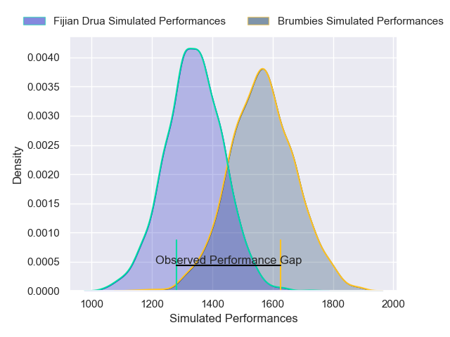
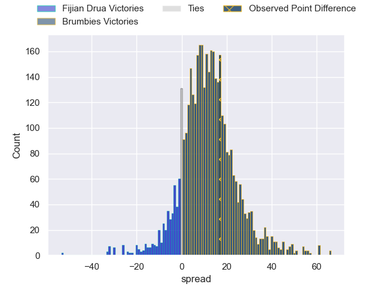
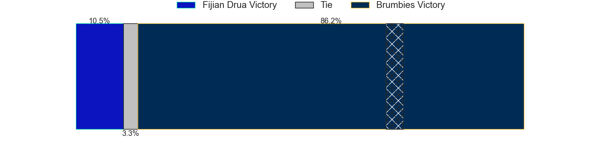
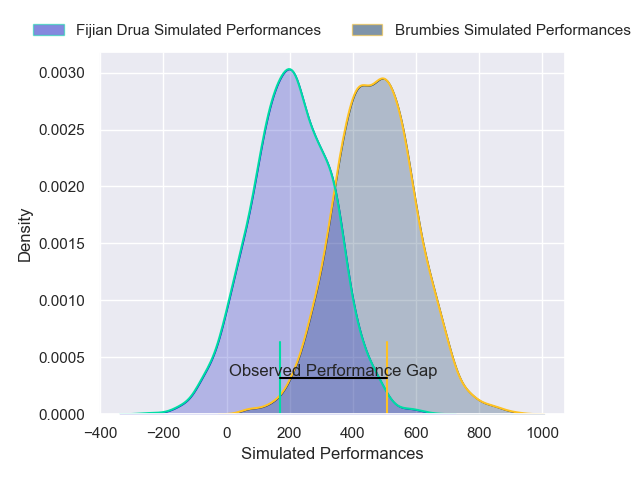
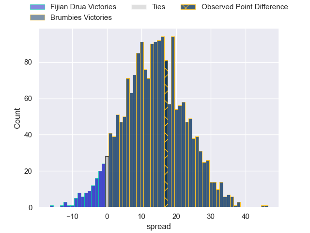
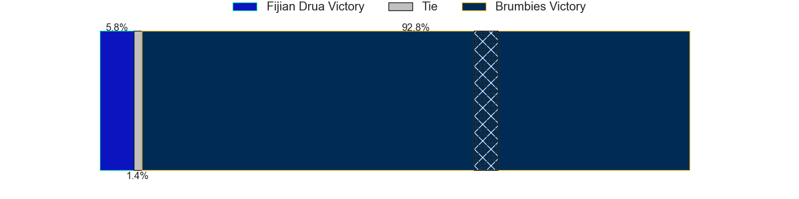

---  
layout: page  
title: Fijian Drua at Brumbies; 21-38  
date: 2025-03-14 18:00:00 -0500  
categories: "Super Rugby Pacific 2025" match review  
---
# Fijian Drua at Brumbies; 21-38

# Club Level Predictions

The first set of predictions treats a club as the smallest object, as the club develops its members, organizes a gameplan, and deploys its players as needed for each match. This club model has a prediction of 0.78, which translates to predicting Brumbies to win by 11.4.

Our Over/Under is 65.5 - and combined with the spread above, we have a predicted scoreline of 27 to 39

Each club has a rating and a rating deviation (similar to a Glicko rating), and expected performances can be generated. This allows for simulated matches and spreads like the ones below.
## Projected Performances - Club Model

## Projected Spreads - Club Model

## Projected Results - Club Model

# Player Level Predictions

Treating teams instead as an entity made up of the currently active players, I have ratings for each player in an altogether different system. These can be combined to form team ratings once teamsheets are announced, weighting starters a bit higher than the reserves. After the match is played, players can be weighted by their minutes on the field, allowing for an accurate measure of the team's composition. With these compiled team ratings, we can make predictions, measure inaccuracy, and update the individual player ratings.
## Prediction without Player Minutes: Brumbies by 13.8

Brumbies by 5.4 on a neutral pitch

## Projected Performances - Player Model

## Projected Spreads - Player Model

## Projected Results - Player Model

|   Away Minutes | Away Player             |   Away Percentile |   Number |   Home Percentile | Home Player      |   Home Minutes |
|---------------:|:------------------------|------------------:|---------:|------------------:|:-----------------|---------------:|
|           80   | Haereiti Hetet          |             88.35 |        1 |             94.57 | James Slipper    |           55   |
|           80   | Haereiti Hetet          |             88.35 |        1 |             94.57 | James Slipper    |           80   |
|           17   | Zuriel Togiatama        |             59.72 |        2 |             80.38 | Billy Pollard    |           80   |
|           80   | Mesake Doge             |             24.18 |        3 |             97.53 | Allan Alaalatoa  |           71   |
|           80   | Mesake Vocevoce         |             77.49 |        4 |             62.77 | Nick Frost       |           80   |
|           24   | Isoa Nasilasila         |             72.08 |        5 |             48.34 | Lachie Shaw      |           62   |
|            9   | Ratu Meli Derenalagi    |             88.34 |        6 |             52.77 | Tom Hooper       |           80   |
|           24   | Motikiai Murray         |             57.65 |        7 |             58.7  | Rory Scott       |           55   |
|           12.5 | Elia Canakaivata        |             80.12 |        8 |             60.45 | Charlie Cale     |           80   |
|           12   | Frank Lomani            |             83.07 |        9 |             91.45 | Ryan Lonergan    |           61   |
|           17   | Isaiah Armstrong-Ravula |             14.86 |       10 |             84.71 | Noah Lolesio     |           58   |
|           35   | Isaiah Armstrong-Ravula |             14.86 |       10 |             84.71 | Noah Lolesio     |           58   |
|           35   | Ponepati Loganimasi     |             44.75 |       11 |             66.23 | Corey Toole      |           55   |
|           35   | Tuidraki Samusamuvodre  |             18.39 |       12 |             37.4  | David Feliuai    |           62   |
|           80   | Iosefo Masi             |             88.22 |       13 |             79.75 | Len Ikitau       |           15   |
|           56   | Selestino Ravutaumada   |             93.06 |       14 |             94.84 | Andy Muirhead    |           18   |
|            8   | Vuate Karawalevu        |             42.24 |       15 |             76.94 | Tom Wright       |           55   |
|           80   | Isikeli Rabitu          |             18.05 |       16 |             92.03 | Ollie Sapsford   |            0   |
|           80   | Vilive Miramira         |             76.29 |       17 |             46.08 | Luke Reimer      |           25   |
|           80   | Emosi Tuqiri            |             65.36 |       18 |             12.05 | Lachlan Lonergan |           25   |
|           40   | Tevita Ikanivere        |             91.91 |       19 |             99.53 | Cadeyrn Neville  |            0   |
|           80   | Samu Tawake             |              9.66 |       20 |             50.44 | Blake Schoupp    |           25   |
|           74   | Simione Kuruvoli        |             17.63 |       21 |             54.59 | Feao Fotuaika    |           12.5 |
|           80   | Etonia Waqa             |             82.03 |       22 |             25.83 | Harrison Goddard |           80   |
|           80   | Isoa Tuwai              |            nan    |       23 |            nan    | Declan Meredith  |           55   |

