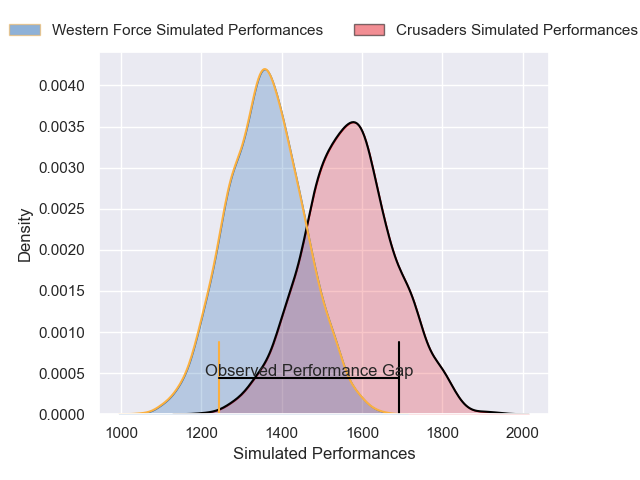
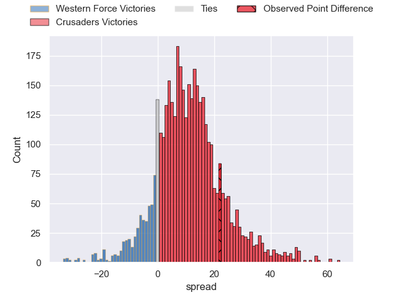
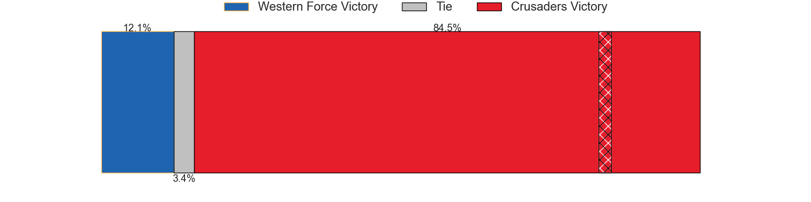
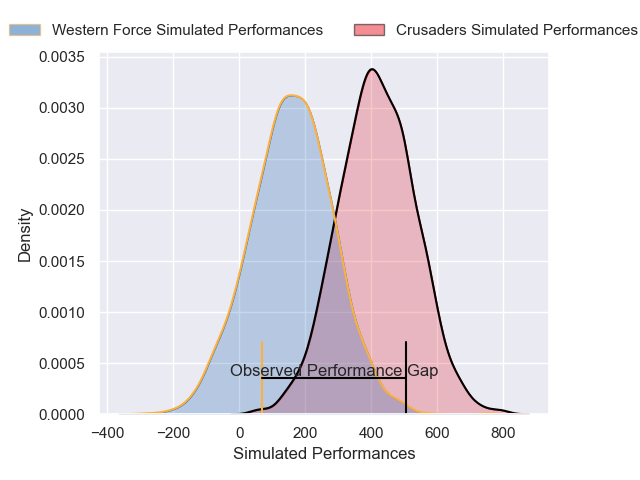
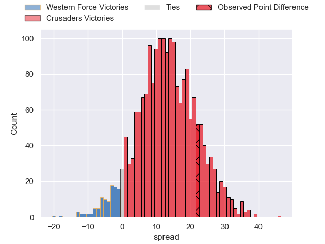
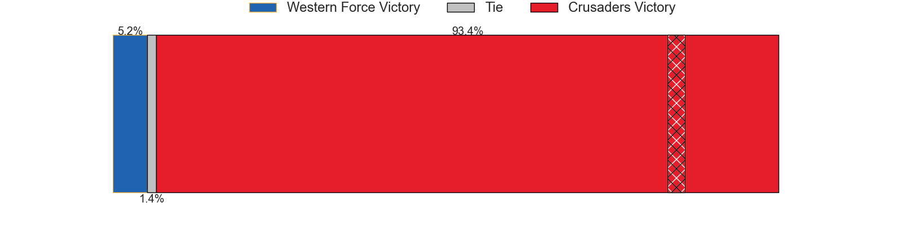

---  
layout: page  
title: Western Force at Crusaders; 33-55  
date: 2025-03-14 18:00:00 -0500  
categories: "Super Rugby Pacific 2025" match review  
---
# Western Force at Crusaders; 33-55

# Club Level Predictions

The first set of predictions treats a club as the smallest object, as the club develops its members, organizes a gameplan, and deploys its players as needed for each match. This club model has a prediction of 0.758, which translates to predicting Crusaders to win by 10.3.

Our Over/Under is 59.5 - and combined with the spread above, we have a predicted scoreline of 25 to 35

Each club has a rating and a rating deviation (similar to a Glicko rating), and expected performances can be generated. This allows for simulated matches and spreads like the ones below.
## Projected Performances - Club Model

## Projected Spreads - Club Model

## Projected Results - Club Model

# Player Level Predictions

Treating teams instead as an entity made up of the currently active players, I have ratings for each player in an altogether different system. These can be combined to form team ratings once teamsheets are announced, weighting starters a bit higher than the reserves. After the match is played, players can be weighted by their minutes on the field, allowing for an accurate measure of the team's composition. With these compiled team ratings, we can make predictions, measure inaccuracy, and update the individual player ratings.
## Prediction without Player Minutes: Crusaders by 12.1

Crusaders by 4.6 on a neutral pitch

## Projected Performances - Player Model

## Projected Spreads - Player Model

## Projected Results - Player Model

|   Away Minutes | Away Player           |   Away Percentile |   Number |   Home Percentile | Home Player          |   Home Minutes |
|---------------:|:----------------------|------------------:|---------:|------------------:|:---------------------|---------------:|
|           80   | Marley Pearce         |             29.17 |        1 |             92.86 | Tamaiti Williams     |             53 |
|           80   | Brandon Paenga-Amosa  |             77.74 |        2 |             98.46 | Codie Taylor         |             30 |
|           20   | Tom Robertson         |             94.29 |        3 |              5.94 | Fletcher Newell      |             20 |
|           80   | Jeremy Williams       |             13.33 |        4 |             96.19 | Scott Barrett        |             80 |
|           66   | Darcy Swain           |             60    |        5 |             25.62 | Antonio Shalfoon     |             68 |
|           30.5 | Will Harris           |             72.74 |        6 |             32.45 | Corey Kellow         |             40 |
|           50   | Kane Koteka           |              9.15 |        7 |             76.79 | Tom Christie         |             80 |
|           40   | Reed Prinsep          |             91.2  |        8 |             66    | Christian Lio-Willie |             18 |
|           61   | Issak Fines-Leleiwasa |             13.43 |        9 |             31.67 | Kyle Preston         |             80 |
|           72   | Max Burey             |              3.63 |       10 |              9.19 | Taha Kemara          |             80 |
|           59   | George Poolman        |             48.12 |       11 |             37.69 | Macca Springer       |             60 |
|           30.5 | Reesjan Pasitoa       |             60.29 |       12 |             95.52 | David Havili         |             80 |
|           64   | Sio Tomkinson         |             86.15 |       13 |             90.12 | Braydon Ennor        |             80 |
|           80   | Harry Potter          |             52.73 |       14 |             85.43 | Sevu Reece           |             20 |
|           80   | Mac Grealy            |             81.53 |       15 |             94.7  | Will Jordan          |             74 |
|           21   | Nic Dolly             |            nan    |       16 |            nan    | Ioane Moananu        |             40 |
|           40   | Ryan Coxon            |             25.56 |       17 |             12.71 | George Bower         |             34 |
|           25   | Atu Moli              |            nan    |       18 |            nan    | Seb Calder           |             30 |
|            8   | Sam Carter            |             94.76 |       19 |             18.95 | Tahlor Cahill        |             19 |
|           62   | Josh Thompson         |            nan    |       20 |             22.45 | Xavier Saifoloi      |             19 |
|           40   | Henry Robertson       |            nan    |       21 |             87.26 | Mitchell Drummond    |             40 |
|           27   | Coby Miln             |            nan    |       22 |            nan    | James O'Connor       |             33 |
|           80   | Divad Palu            |            nan    |       23 |             78.82 | Levi Aumua           |             80 |

