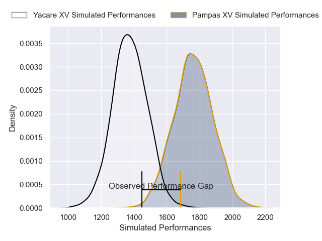
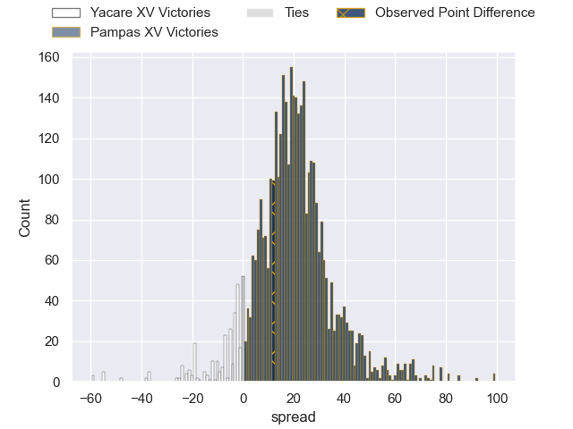
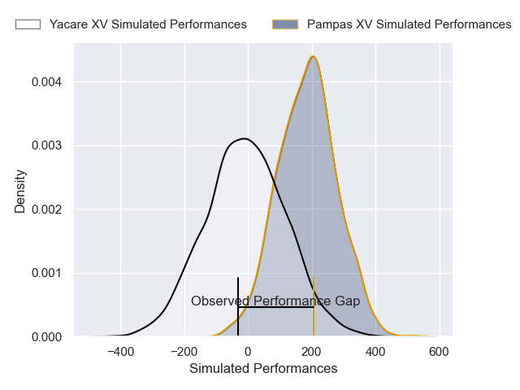
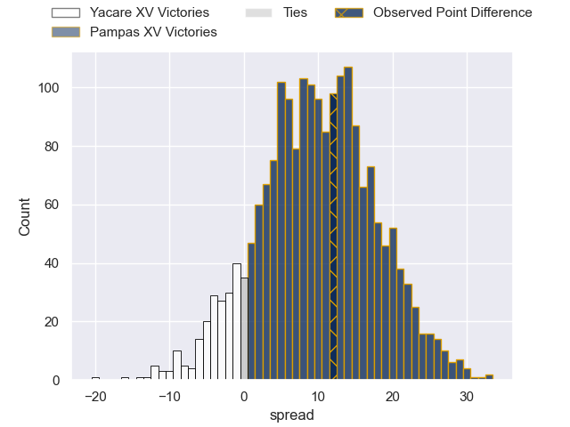

---  
layout: page  
title: Yacare XV at Pampas XV; 7-19  
date: 2025-03-14 18:00:00 -0500  
categories: "Super Rugby Americas 2025" match review  
---
# Yacare XV at Pampas XV; 7-19

# Club Level Predictions

The first set of predictions treats a club as the smallest object, as the club develops its members, organizes a gameplan, and deploys its players as needed for each match. This club model has a prediction of 0.892, which translates to predicting Pampas XV to win by 19.3.

Our Over/Under is 56.5 - and combined with the spread above, we have a predicted scoreline of 19 to 38

Each club has a rating and a rating deviation (similar to a Glicko rating), and expected performances can be generated. This allows for simulated matches and spreads like the ones below.
## Projected Performances - Club Model

## Projected Spreads - Club Model

## Projected Results - Club Model

# Player Level Predictions

Treating teams instead as an entity made up of the currently active players, I have ratings for each player in an altogether different system. These can be combined to form team ratings once teamsheets are announced, weighting starters a bit higher than the reserves. After the match is played, players can be weighted by their minutes on the field, allowing for an accurate measure of the team's composition. With these compiled team ratings, we can make predictions, measure inaccuracy, and update the individual player ratings.
## Prediction without Player Minutes: Pampas XV by 11.3

Pampas XV by 8.9 on a neutral pitch

## Projected Performances - Player Model

## Projected Spreads - Player Model

## Projected Results - Player Model

|   Away Minutes | Away Player                 |   Away Percentile |   Number |   Home Percentile | Home Player               |   Home Minutes |
|---------------:|:----------------------------|------------------:|---------:|------------------:|:--------------------------|---------------:|
|           80   | Mariano Muntaner            |             63.69 |        1 |             85.79 | Matias Medrano            |           60   |
|           22   | Axel Zapata                 |              7.92 |        2 |             70.22 | Ignacio Bottazzini        |           38.5 |
|            8   | Rolando Portillo            |             15.48 |        3 |             82.92 | Tomas Rapetti             |           80   |
|           56   | Mariano Garcete Elli        |             14.43 |        4 |             89.65 | Leo Mazzini               |           17   |
|           13   | Lucas Sommer                |             98.86 |        5 |             73.03 | Franco Carrera            |           58   |
|           20   | Ariel Nunez Lesme           |              4.49 |        6 |             74.47 | Manuel Bernstein          |           34   |
|           72   | Felipe Puertas              |              3.63 |        7 |             23.71 | Juan Cruz Perez Rachel    |           34   |
|           24   | Santiago Ruiz               |             89.96 |        8 |             63.73 | Joaquin Moro              |            0   |
|           30   | Juan Cruz Strada            |              9.77 |        9 |             83.77 | Mateo Albanese            |           25   |
|           22   | Joaquin Lamas               |             91.72 |       10 |             18.9  | Jeronimo Solveyra         |           34   |
|           80   | Juan Gonzalez               |              2.72 |       11 |             68.2  | Alfonso Latorre           |            0   |
|           80   | Sebastian Urbieta Liegard   |              7.85 |       12 |             88.74 | Juan Pablo Castro Collado |           56   |
|           58   | Ramiro Amarilla             |             21.59 |       13 |             60.64 | Bruno Heit                |           32   |
|           80   | Arturo Lopez                |             35.65 |       14 |             84.8  | Ramon Fuentes             |           27   |
|           80   | Julian Quetglas             |              8.98 |       15 |             18.37 | Francisco Quinn           |            0   |
|           80   | Valentino Dicapua           |             40.61 |       16 |             10.93 | Javier Corvalan           |           27   |
|           80   | Ramiro Nicolas Parada       |              6.76 |       17 |             42    | Ramiro Gurovich           |           80   |
|           53   | Enzo Egea Bordon            |             47.49 |       18 |             24.12 | Federico Ignacio Lavanini |           80   |
|           30   | Facundo Paiva               |            nan    |       19 |             24.78 | Eliseo Morales Abraham    |           67   |
|           63   | Cesar Perez                 |             37.91 |       20 |             16.14 | Estanislao Renthel        |           22   |
|           38.5 | Juan-Jose Heisecke Schauman |            nan    |       21 |             92.77 | Justo Piccardo            |           24   |
|           80   | Gonzalo Bareiro Ochipinti   |            nan    |       22 |             79    | Francisco Lusarreta       |           27   |
|           52   | Jordi Chavez                |            nan    |       23 |             76.48 | Nicolas Damorim           |           18   |

