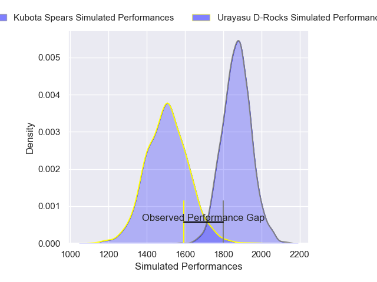
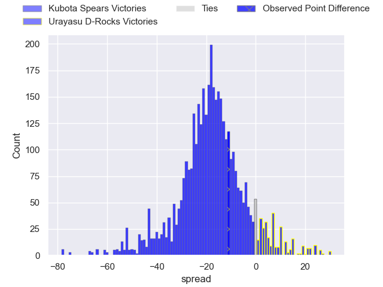
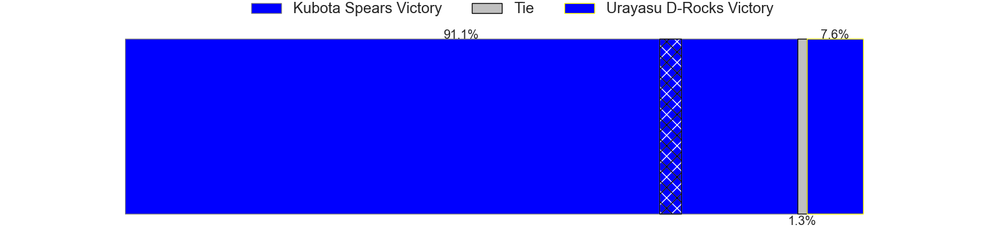
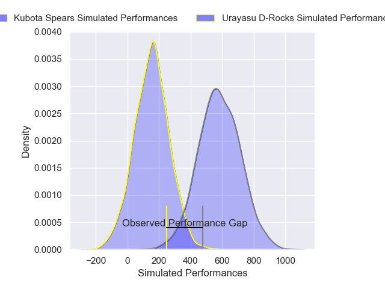
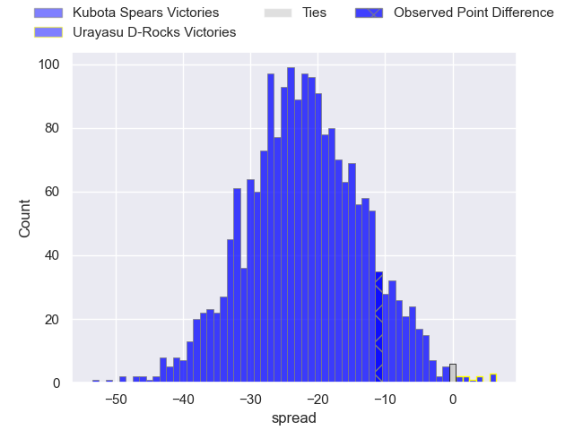
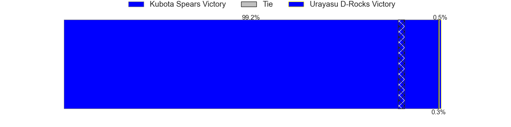

---  
layout: page  
title: Kubota Spears at Urayasu D-Rocks; 33-22  
date: 2025-03-14 18:00:00 -0500  
categories: "Japan Rugby League One 24/25" match review  
---
# Kubota Spears at Urayasu D-Rocks; 33-22

# Club Level Predictions

The first set of predictions treats a club as the smallest object, as the club develops its members, organizes a gameplan, and deploys its players as needed for each match. This club model has a prediction of 0.115, which translates to predicting Kubota Spears to win by 18.2.

Our Over/Under is 50.5 - and combined with the spread above, we have a predicted scoreline of 35 to 16

Each club has a rating and a rating deviation (similar to a Glicko rating), and expected performances can be generated. This allows for simulated matches and spreads like the ones below.
## Projected Performances - Club Model

## Projected Spreads - Club Model

## Projected Results - Club Model

# Player Level Predictions

Treating teams instead as an entity made up of the currently active players, I have ratings for each player in an altogether different system. These can be combined to form team ratings once teamsheets are announced, weighting starters a bit higher than the reserves. After the match is played, players can be weighted by their minutes on the field, allowing for an accurate measure of the team's composition. With these compiled team ratings, we can make predictions, measure inaccuracy, and update the individual player ratings.
## Prediction without Player Minutes: Kubota Spears by 12.2

Kubota Spears by 16.5 on a neutral pitch

## Projected Performances - Player Model

## Projected Spreads - Player Model

## Projected Results - Player Model

|   Away Minutes | Away Player        |   Away Percentile |   Number |   Home Percentile | Home Player        |   Home Minutes |
|---------------:|:-------------------|------------------:|---------:|------------------:|:-------------------|---------------:|
|             19 | Yota Kamimori      |             66.08 |        1 |              5.03 | Hidetomo Nabeshima |             15 |
|             28 | Hayate Era         |             68.33 |        2 |             11.36 | Ryuji Fujimura     |             80 |
|             24 | Keijiro Tamefusa   |             63.61 |        3 |             74.14 | Kim Ryom           |             80 |
|             80 | David Van Zeeland  |             66.67 |        4 |             67.05 | Uwe Helu           |             65 |
|             61 | David Bulbring     |             83.19 |        5 |             74.45 | Lourens Erasmus    |             65 |
|             77 | Finau Tupa         |             82.89 |        6 |             29.35 | Shinya Osugi       |             25 |
|              0 | Takeo Suenaga      |             92.83 |        7 |             22.85 | Tetta Shigemitsu   |             25 |
|             19 | Tyler Paul         |             97.54 |        8 |             94.88 | Tone Tukufuka      |             19 |
|             80 | Bryn Hall          |             95.81 |        9 |             69.63 | Ren Iinuma         |             25 |
|             64 | Bernard Foley      |             99.15 |       10 |             61.36 | Otere Black        |             18 |
|             80 | Haruto Kida        |             77.49 |       11 |             19.61 | Caleb Cavubati     |             80 |
|             56 | Yuya Hirose        |             61.05 |       12 |             93.08 | Samu Kerevi        |              6 |
|             56 | Rikus Pretorius    |             55.17 |       13 |             16.84 | Shane Gates        |             53 |
|             56 | Halatoa Vailea     |             84.99 |       14 |             30.96 | Soma Matsumoto     |             69 |
|             80 | Atsushi Oshikawa   |             73.06 |       15 |             72.24 | Chris Cosgrave     |             62 |
|             80 | Koga Nezuka        |             88.93 |       16 |             71.04 | Tom Parsons        |             80 |
|             80 | Malcolm Marx       |            100    |       17 |              5.83 | Shuhei Takeuchi    |             40 |
|             14 | Opeti Helu         |             90.1  |       18 |             28.3  | Hendrik Tui        |             80 |
|             53 | Shinobu Fujiwara   |             72.95 |       19 |            nan    | Sekonaia Pole      |             28 |
|             80 | Ruan Botha         |             99.62 |       20 |             93.5  | Brody MacAskill    |             14 |
|             58 | Harumichi Tatekawa |             90.81 |       21 |              1.75 | Norifumi Hashimoto |             55 |
|             80 | Kota Kaishi        |             89.78 |       22 |             88.46 | Takuhei Yasuda     |             24 |
|             50 | Merwe Olivier      |             78.11 |       23 |            nan    | Shokei Kin         |             24 |

