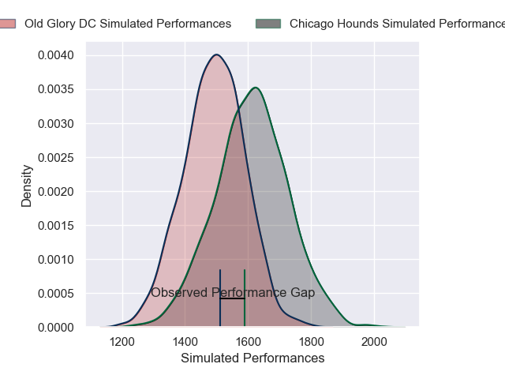
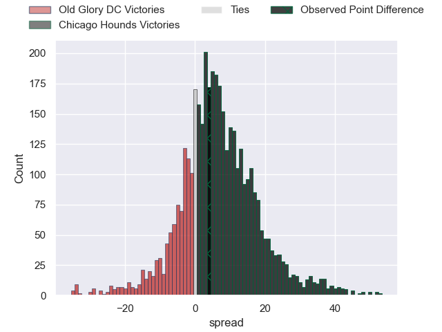
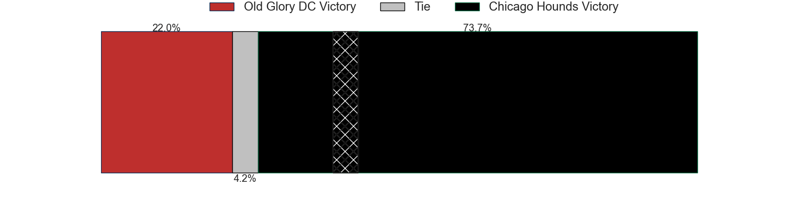
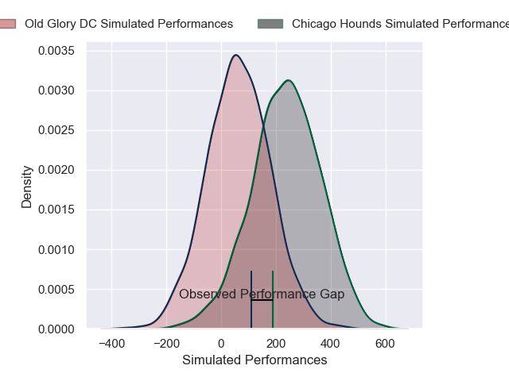
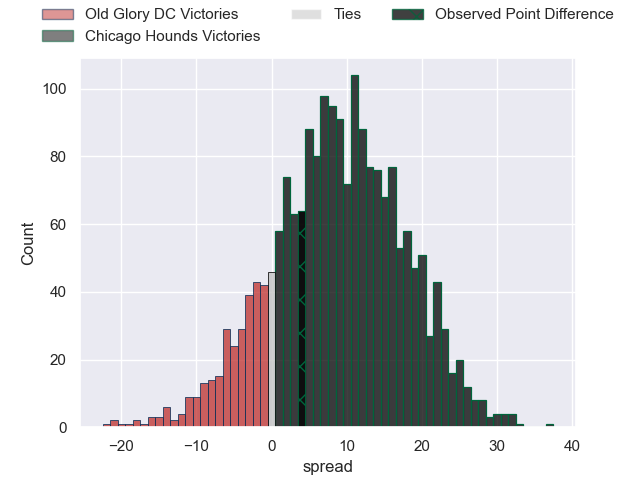
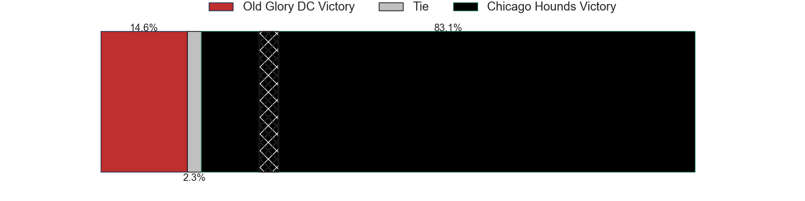

---  
layout: page  
title: Old Glory DC at Chicago Hounds; 26-30  
date: 2025-03-15 18:00:00 -0500  
categories: "Major League Rugby 2025" match review  
---
# Old Glory DC at Chicago Hounds; 26-30

# Club Level Predictions

The first set of predictions treats a club as the smallest object, as the club develops its members, organizes a gameplan, and deploys its players as needed for each match. This club model has a prediction of 0.659, which translates to predicting Chicago Hounds to win by 6.0.

Our Over/Under is 58.5 - and combined with the spread above, we have a predicted scoreline of 26 to 32

Each club has a rating and a rating deviation (similar to a Glicko rating), and expected performances can be generated. This allows for simulated matches and spreads like the ones below.
## Projected Performances - Club Model

## Projected Spreads - Club Model

## Projected Results - Club Model

# Player Level Predictions

Treating teams instead as an entity made up of the currently active players, I have ratings for each player in an altogether different system. These can be combined to form team ratings once teamsheets are announced, weighting starters a bit higher than the reserves. After the match is played, players can be weighted by their minutes on the field, allowing for an accurate measure of the team's composition. With these compiled team ratings, we can make predictions, measure inaccuracy, and update the individual player ratings.
## Prediction without Player Minutes: Chicago Hounds by 4.3

Chicago Hounds by 1.8 on a neutral pitch

## Projected Performances - Player Model

## Projected Spreads - Player Model

## Projected Results - Player Model

|   Away Minutes | Away Player              |   Away Percentile |   Number |   Home Percentile | Home Player      |   Home Minutes |
|---------------:|:-------------------------|------------------:|---------:|------------------:|:-----------------|---------------:|
|             80 | Jack Iscaro              |             31.61 |        1 |             89.1  | Zurabi Zhvania   |             80 |
|              0 | KoiKoi Nelligan          |             44.02 |        2 |             99.16 | Dylan Fawsitt    |             72 |
|             21 | Sam Davies               |             92.08 |        3 |             99.92 | Paddy Ryan       |             67 |
|             21 | Sam Davies               |             92.08 |        3 |             99.92 | Paddy Ryan       |             80 |
|             26 | Rob Harley               |             91.26 |        4 |             85.67 | James Scott      |             62 |
|              0 | Tevita Naqali            |             45.07 |        5 |              4.74 | Mason Flesch     |             80 |
|             66 | Jamason Fa'anana-Schultz |             24.25 |        6 |             55.97 | Conall Boomer    |             51 |
|             80 | Brady Daniel             |             52.99 |        7 |             39.46 | Maclean Jones    |             46 |
|             80 | Lautaro Bavaro           |             23.74 |        8 |              2.14 | Lucas Rumball    |             44 |
|             80 | Connor Buckley           |             50.34 |        9 |             59.66 | Mitch Short      |             59 |
|             80 | Jason Robertson          |              1.06 |       10 |              5.32 | Chris Hilsenbeck |             80 |
|             80 | Axel Muller              |             86.33 |       11 |             97.94 | Nate Augspurger  |             71 |
|             50 | Nick Grigg               |             14.3  |       12 |             46.8  | Ollie Devoto     |             11 |
|             26 | Steffan Hughes           |             79.3  |       13 |             83.3  | Bryce Campbell   |             17 |
|             21 | Perry Humphreys          |             25.84 |       14 |             69.01 | Noah Brown       |              0 |
|             14 | Damien Hoyland           |             62.6  |       15 |             70.93 | Adriaan Carelse  |             40 |
|             18 | Facundo Gattas           |             73.74 |       16 |            nan    | Jackson Zabierek |             80 |
|             63 | Calixto Martinez         |            nan    |       17 |            nan    | Liam Fletcher    |             43 |
|             80 | Isikeli Kava             |            nan    |       18 |             51.76 | Charlie Abel     |             80 |
|             15 | Bill Whiteside           |            nan    |       19 |              8.95 | Luke White       |             54 |
|             15 | Collin Grosse            |            nan    |       20 |            nan    | Matt Oworu       |             43 |
|             26 | Ethan McVeigh            |            nan    |       21 |              7.07 | Jason Higgins    |             59 |
|             71 | John Powers-Velasquez    |            nan    |       22 |             60.77 | Mark O'Keeffe    |              9 |
|              0 | Owen Sheehy              |            nan    |       23 |             42.6  | Noah Flesch      |             29 |

