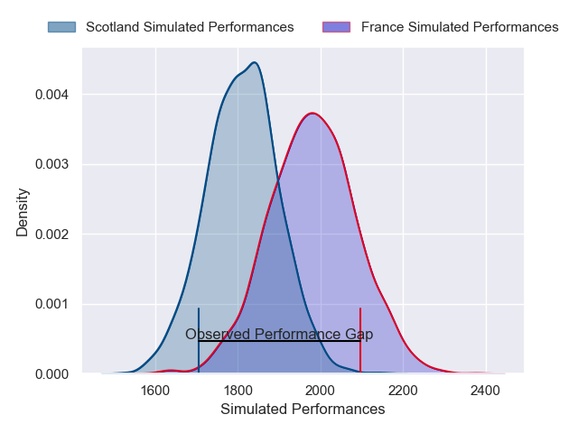
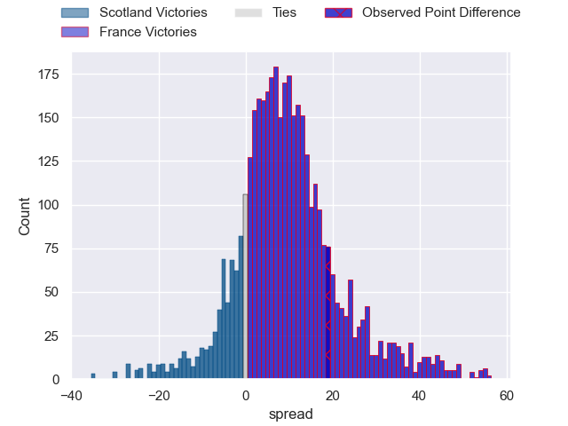
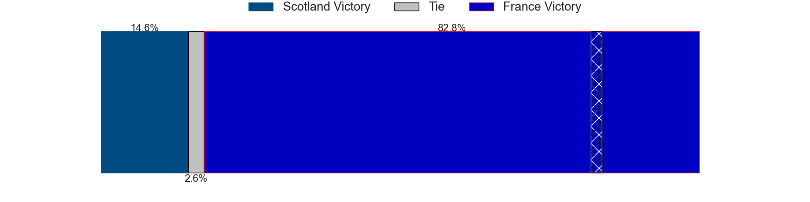
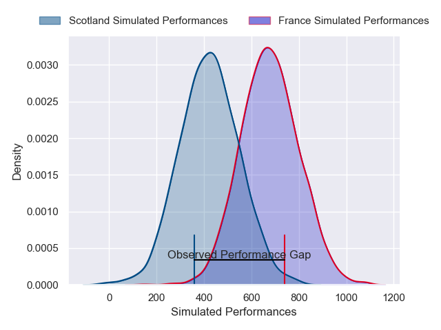
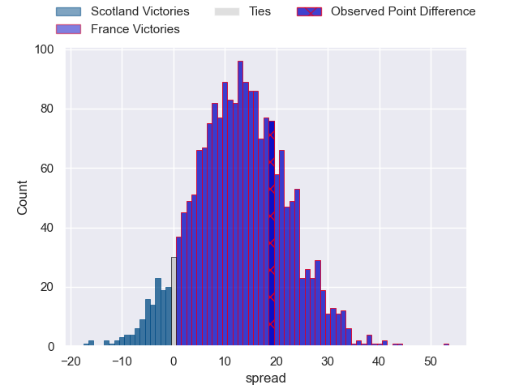

---  
layout: page  
title: Scotland at France; 16-35  
date: 2025-03-15 18:00:00 -0500  
categories: "Six Nations Championship 2025" match review  
---
# Scotland at France; 16-35

# Club Level Predictions

The first set of predictions treats a club as the smallest object, as the club develops its members, organizes a gameplan, and deploys its players as needed for each match. This club model has a prediction of 0.724, which translates to predicting France to win by 8.7.

Our Over/Under is 50.5 - and combined with the spread above, we have a predicted scoreline of 21 to 30

Each club has a rating and a rating deviation (similar to a Glicko rating), and expected performances can be generated. This allows for simulated matches and spreads like the ones below.
## Projected Performances - Club Model

## Projected Spreads - Club Model

## Projected Results - Club Model

# Player Level Predictions

Treating teams instead as an entity made up of the currently active players, I have ratings for each player in an altogether different system. These can be combined to form team ratings once teamsheets are announced, weighting starters a bit higher than the reserves. After the match is played, players can be weighted by their minutes on the field, allowing for an accurate measure of the team's composition. With these compiled team ratings, we can make predictions, measure inaccuracy, and update the individual player ratings.
## Prediction without Player Minutes: France by 13.1

France by 7.0 on a neutral pitch

## Projected Performances - Player Model

## Projected Spreads - Player Model

## Projected Results - Player Model

|   Away Minutes | Away Player         |   Away Percentile |   Number |   Home Percentile | Home Player          |   Home Minutes |
|---------------:|:--------------------|------------------:|---------:|------------------:|:---------------------|---------------:|
|             80 | Pierre Schoeman     |             40.24 |        1 |             97.65 | Jean-Baptiste Gros   |             64 |
|             80 | Dave Cherry         |             58.92 |        2 |             94.61 | Peato Mauvaka        |             80 |
|             28 | Zander Fagerson     |             98.67 |        3 |             97.88 | Uini Atonio          |             80 |
|             20 | Gregor Brown        |             41.02 |        4 |             90.05 | Thibaud Flament      |             12 |
|             44 | Grant Gilchrist     |             93.49 |        5 |             63.26 | Mickael Guillard     |             22 |
|             80 | Jamie Ritchie       |             99.53 |        6 |             96.08 | Francois Cros        |             80 |
|             50 | Rory Darge          |             88.99 |        7 |              9.05 | Paul Boudehent       |             80 |
|             68 | Matt Fagerson       |             96.3  |        8 |             98.83 | Gregory Alldritt     |             80 |
|             80 | Ben White           |             94.66 |        9 |             98.97 | Maxime Lucu          |             22 |
|             77 | Finn Russell        |             99.15 |       10 |             96.6  | Romain Ntamack       |             16 |
|              3 | Duhan van der Merwe |             84.93 |       11 |             76.87 | Louis Bielle-Biarrey |             13 |
|             56 | Tom Jordan          |             33.4  |       12 |             88.8  | Yoram Moefana        |              0 |
|             68 | Huw Jones           |             79    |       13 |             97.8  | Gael Fickou          |             52 |
|             20 | Darcy Graham        |             17.6  |       14 |             97.57 | Damian Penaud        |             28 |
|             12 | Blair Kinghorn      |            100    |       15 |             95.33 | Thomas Ramos         |             10 |
|             52 | Ewan Ashman         |             66.67 |       16 |             98.82 | Julien Marchand      |             52 |
|             60 | Rory Sutherland     |             17.73 |       17 |             96.63 | Cyril Baille         |             80 |
|             24 | Will Hurd           |             48    |       18 |             90.51 | Dorian Aldegheri     |             80 |
|             80 | Ewan Johnson        |             51.63 |       19 |             47.07 | Hugo Auradou         |             67 |
|             80 | Marshall Sykes      |             29.86 |       20 |             78.05 | Emmanuel Meafou      |             80 |
|             80 | Ben Muncaster       |             43.97 |       21 |             63.15 | Oscar Jegou          |             80 |
|             30 | Jamie Dobie         |             85    |       22 |             99.22 | Anthony Jelonch      |             80 |
|             28 | Stafford McDowall   |             90.1  |       23 |             80.17 | Nolann Le Garrec     |             80 |

