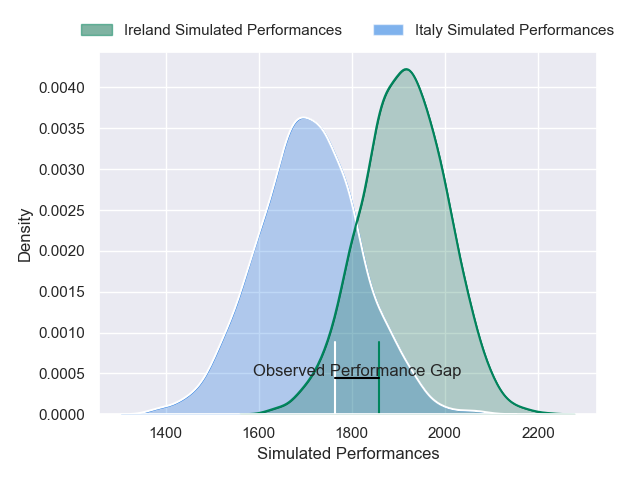
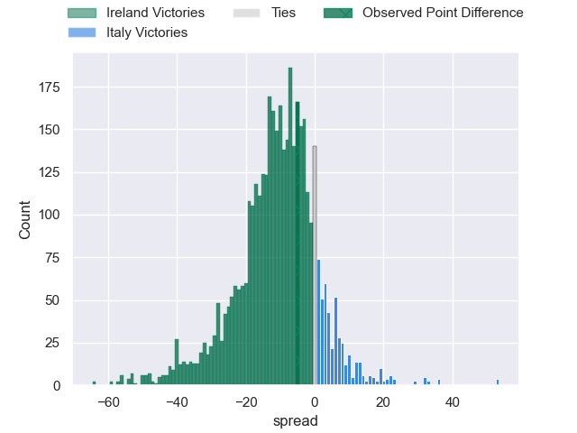
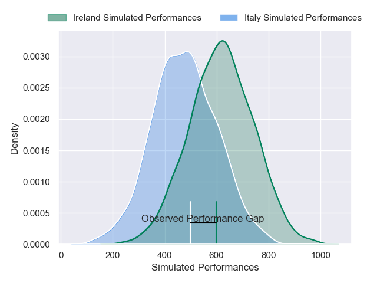
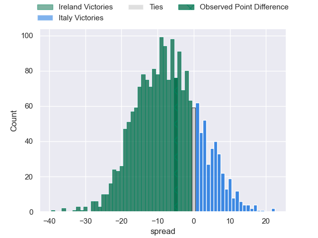

---  
layout: page  
title: Ireland at Italy; 22-17  
date: 2025-03-15 18:00:00 -0500  
categories: "Six Nations Championship 2025" match review  
---
# Ireland at Italy; 22-17

# Club Level Predictions

The first set of predictions treats a club as the smallest object, as the club develops its members, organizes a gameplan, and deploys its players as needed for each match. This club model has a prediction of 0.246, which translates to predicting Ireland to win by 10.1.

Our Over/Under is 59.5 - and combined with the spread above, we have a predicted scoreline of 35 to 25

Each club has a rating and a rating deviation (similar to a Glicko rating), and expected performances can be generated. This allows for simulated matches and spreads like the ones below.
## Projected Performances - Club Model

## Projected Spreads - Club Model

## Projected Results - Club Model

# Player Level Predictions

Treating teams instead as an entity made up of the currently active players, I have ratings for each player in an altogether different system. These can be combined to form team ratings once teamsheets are announced, weighting starters a bit higher than the reserves. After the match is played, players can be weighted by their minutes on the field, allowing for an accurate measure of the team's composition. With these compiled team ratings, we can make predictions, measure inaccuracy, and update the individual player ratings.
## Prediction without Player Minutes: Ireland by 8.5

Ireland by 13.7 on a neutral pitch

## Projected Performances - Player Model

## Projected Spreads - Player Model

## Projected Results - Player Model

|   Away Minutes | Away Player         |   Away Percentile |   Number |   Home Percentile | Home Player        |   Home Minutes |
|---------------:|:--------------------|------------------:|---------:|------------------:|:-------------------|---------------:|
|             80 | Andrew Porter       |             89.25 |        1 |             65.25 | Danilo Fischetti   |             80 |
|             51 | Dan Sheehan         |             72.9  |        2 |             88.72 | Gianmarco Lucchesi |             80 |
|             53 | Finlay Bealham      |             97.02 |        3 |             95.14 | Simone Ferrari     |              8 |
|             18 | James Ryan          |             95.91 |        4 |             68.37 | Dino Lamb          |             51 |
|             27 | Tadhg Beirne        |             99.72 |        5 |             95.16 | Federico Ruzza     |             80 |
|             40 | Jack Conan          |             98.79 |        6 |             83.3  | Sebastian Negri    |             80 |
|             21 | Josh van der Flier  |             98.51 |        7 |             63.71 | Manuel Zuliani     |             18 |
|             25 | Caelan Doris        |             96.11 |        8 |             97.47 | Lorenzo Cannone    |             59 |
|             66 | Jamison Gibson-Park |             96.03 |        9 |             68.1  | Martin Page-Relo   |             66 |
|             63 | Jack Crowley        |             14.04 |       10 |             85.74 | Paolo Garbisi      |             60 |
|             16 | James Lowe          |            100    |       11 |             97.47 | Monty Ioane        |             40 |
|             80 | Robbie Henshaw      |             91.4  |       12 |             94.9  | Tommaso Menoncello |             72 |
|             76 | Garry Ringrose      |             98.6  |       13 |             93.2  | Juan Ignacio Brex  |             52 |
|             40 | Mack Hansen         |             79.96 |       14 |             98.03 | Ange Capuozzo      |             62 |
|             40 | Hugo Keenan         |             99.19 |       15 |             68.09 | Tommaso Allan      |             80 |
|             40 | Gus McCarthy        |             50    |       16 |             96.13 | Giacomo Nicotera   |             70 |
|             62 | Gus McCarthy        |             50    |       16 |             96.13 | Giacomo Nicotera   |             70 |
|              8 | Jack Boyle          |             53.65 |       17 |             59.06 | Mirco Spagnolo     |             59 |
|             40 | Tadhg Furlong       |             97.18 |       18 |             51.45 | Giosue Zilocchi    |             80 |
|             40 | Joe McCarthy        |             71.81 |       19 |             62.33 | Niccolo Cannone    |             13 |
|             80 | Peter O'Mahony      |             97.2  |       20 |             95.8  | Michele Lamaro     |             26 |
|             80 | Conor Murray        |             99.48 |       21 |             79.57 | Ross Vintcent      |              0 |
|             80 | Sam Prendergast     |             21.91 |       22 |              0.52 | Stephen Varney     |             80 |
|             30 | Bundee Aki          |             99.7  |       23 |             71.75 | Leonardo Marin     |             11 |

