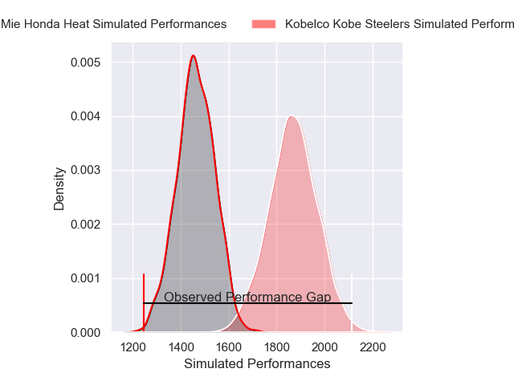
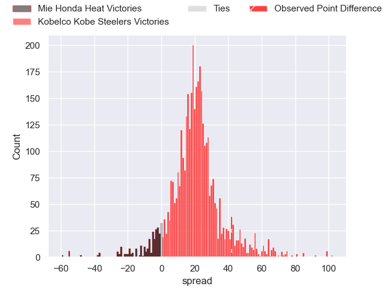
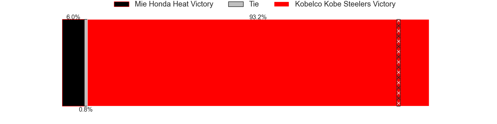
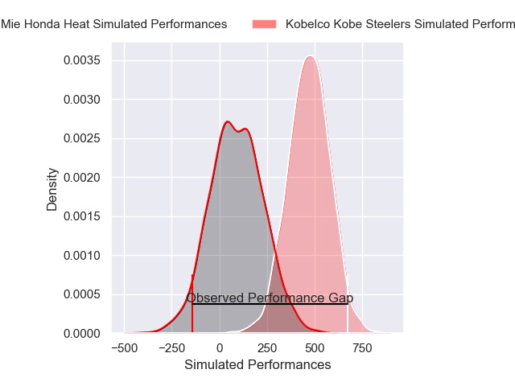
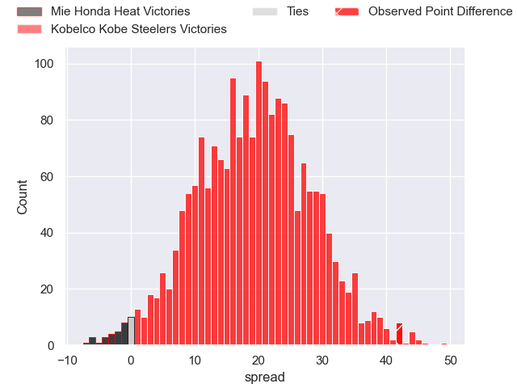
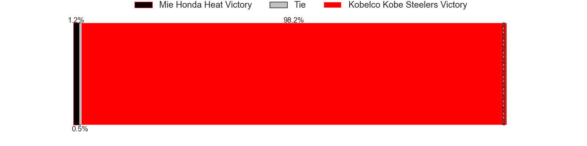

---  
layout: page  
title: Mie Honda Heat at Kobelco Kobe Steelers; 5-47  
date: 2025-03-15 18:00:00 -0500  
categories: "Japan Rugby League One 24/25" match review  
---
# Mie Honda Heat at Kobelco Kobe Steelers; 5-47

# Club Level Predictions

The first set of predictions treats a club as the smallest object, as the club develops its members, organizes a gameplan, and deploys its players as needed for each match. This club model has a prediction of 0.906, which translates to predicting Kobelco Kobe Steelers to win by 20.3.

Our Over/Under is 57.5 - and combined with the spread above, we have a predicted scoreline of 19 to 39

Each club has a rating and a rating deviation (similar to a Glicko rating), and expected performances can be generated. This allows for simulated matches and spreads like the ones below.
## Projected Performances - Club Model

## Projected Spreads - Club Model

## Projected Results - Club Model

# Player Level Predictions

Treating teams instead as an entity made up of the currently active players, I have ratings for each player in an altogether different system. These can be combined to form team ratings once teamsheets are announced, weighting starters a bit higher than the reserves. After the match is played, players can be weighted by their minutes on the field, allowing for an accurate measure of the team's composition. With these compiled team ratings, we can make predictions, measure inaccuracy, and update the individual player ratings.
## Prediction without Player Minutes: Kobelco Kobe Steelers by 20.0

Kobelco Kobe Steelers by 15.1 on a neutral pitch

## Projected Performances - Player Model

## Projected Spreads - Player Model

## Projected Results - Player Model

|   Away Minutes | Away Player            |   Away Percentile |   Number |   Home Percentile | Home Player          |   Home Minutes |
|---------------:|:-----------------------|------------------:|---------:|------------------:|:---------------------|---------------:|
|             65 | Tatsuhiko Tsurukawa    |              1.88 |        1 |             78.98 | Shigure Takao        |             80 |
|             80 | Koki Hida              |             53.7  |        2 |             99.83 | George Turner        |             61 |
|             59 | Feinga Kihe Lotu Fakai |              3.45 |        3 |             94.67 | Hiroshi Yamashita    |             80 |
|             64 | Ryoma Nishimura        |             84.93 |        4 |             89.95 | Gerard Cowley-Tuioti |             35 |
|             21 | Franco Mostert         |             90.14 |        5 |            100    | Brodie Retallick     |             80 |
|             45 | Pablo Matera           |             99.07 |        6 |             87.03 | Tiennan Costley      |             79 |
|             59 | Tony Ray Hunt          |              7.09 |        7 |             73.13 | Solomone Funaki      |             59 |
|             80 | Talifolofola Tangipa   |             38.33 |        8 |             71.79 | Amanaki Saumaki      |             62 |
|             80 | Azuma Doei             |             62.41 |        9 |             93.1  | Atsushi Hiwasa       |             35 |
|             45 | Hayata Nakao           |             78.94 |       10 |             93.83 | Bryn Gatland         |             55 |
|             45 | Tevita Li              |             96.54 |       11 |             50.37 | Kenta Matsunaga      |             27 |
|             80 | Fraser Quirk           |              5.1  |       12 |              5.9  | Seungsin Lee         |             27 |
|             53 | Dawid Kellerman        |             14.8  |       13 |             76.5  | Michael Little       |             64 |
|             53 | Haruhiko Uemura        |              8.52 |       14 |             28.93 | Ataata Moeakiola     |             80 |
|             80 | Gwangtee Oh            |             15.85 |       15 |             92.48 | Rakuhei Yamashita    |             24 |
|             80 | Ryota Kobayashi        |              4.57 |       16 |             66.33 | Kenta Matsuoka       |             25 |
|             64 | Takumi Fuji            |             14.2  |       17 |             84.44 | Waisake Raratubua    |             20 |
|             80 | Taichi Takenaka        |             20.69 |       18 |             23.53 | Kauvaka Kaivelata    |             19 |
|             60 | Kyogo Okano            |             37    |       19 |              1.1  | Koo Ji-won           |             16 |
|             80 | Janko Swanepoel        |             81.58 |       20 |             41.6  | Timothy Lafaele      |             16 |
|             21 | Ikuma Yamada           |             62.46 |       21 |            nan    | Inoke Burua          |             16 |
|             35 | Naoki Motomura         |             27.25 |       22 |            nan    | Itsuki Kamimura      |             12 |
|             80 | Katsuyuki Hoshino      |             17.33 |       23 |             80.5  | Hikaru Hashimoto     |             80 |

