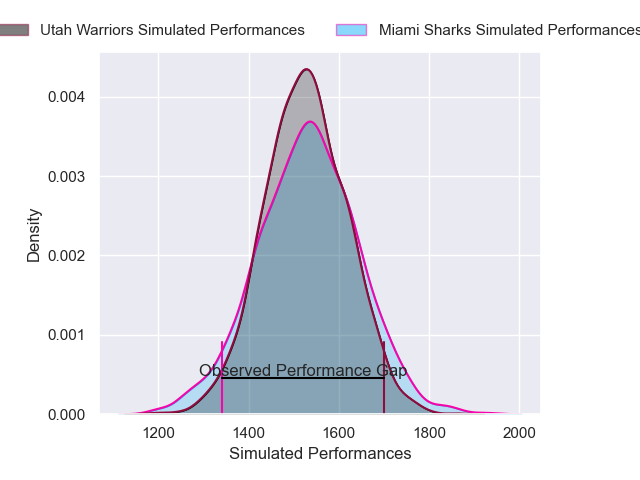
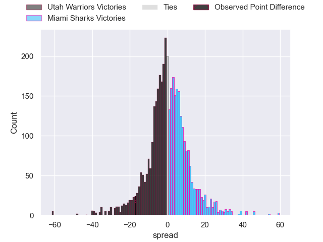
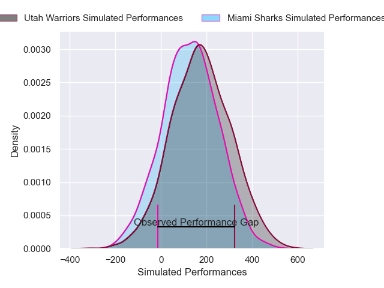
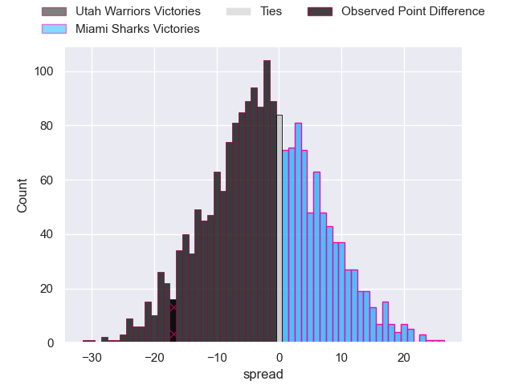

---  
layout: page  
title: Utah Warriors at Miami Sharks; 36-19  
date: 2025-03-15 18:00:00 -0500  
categories: "Major League Rugby 2025" match review  
---
# Utah Warriors at Miami Sharks; 36-19

# Club Level Predictions

The first set of predictions treats a club as the smallest object, as the club develops its members, organizes a gameplan, and deploys its players as needed for each match. This club model has a prediction of 0.503, which translates to predicting Miami Sharks to win by 0.1.

Our Over/Under is 61.5 - and combined with the spread above, we have a predicted scoreline of 31 to 31

Each club has a rating and a rating deviation (similar to a Glicko rating), and expected performances can be generated. This allows for simulated matches and spreads like the ones below.
## Projected Performances - Club Model

## Projected Spreads - Club Model

## Projected Results - Club Model

# Player Level Predictions

Treating teams instead as an entity made up of the currently active players, I have ratings for each player in an altogether different system. These can be combined to form team ratings once teamsheets are announced, weighting starters a bit higher than the reserves. After the match is played, players can be weighted by their minutes on the field, allowing for an accurate measure of the team's composition. With these compiled team ratings, we can make predictions, measure inaccuracy, and update the individual player ratings.
## Prediction without Player Minutes: Utah Warriors by 3.1

Utah Warriors by 5.4 on a neutral pitch

## Projected Performances - Player Model

## Projected Spreads - Player Model

## Projected Results - Player Model

|   Away Minutes | Away Player     |   Away Percentile |   Number |   Home Percentile | Home Player        |   Home Minutes |
|---------------:|:----------------|------------------:|---------:|------------------:|:-------------------|---------------:|
|             61 | Fred Apulu      |             80.08 |        1 |             46.69 | Ma'ake Muti        |           38.5 |
|             80 | Tuvere Vugakoto |             36.64 |        2 |             10.45 | Kirby Myhill       |           22   |
|             24 | Remsy Lemisio   |             75.34 |        3 |              7.97 | Tau Koloamatangi   |            8   |
|             80 | Frank Lochore   |             45.52 |        4 |             58.19 | Tomas Casares      |           62   |
|             28 | Gavin Thornbury |             89.71 |        5 |             48.19 | Federico Gutierrez |           80   |
|             56 | Bailey Wilson   |             63.68 |        6 |             45.28 | Manuel Ardao       |           80   |
|             19 | Kalisi Moli     |             53.96 |        7 |             27.26 | Ronan Foley        |           80   |
|             24 | Dylan Nel       |             85.4  |        8 |             50.6  | Marques Fuala'au   |           14   |
|             80 | Zion Going      |             75.04 |        9 |             25.13 | Tomas Cubelli      |           22   |
|             80 | Joel Hodgson    |             36.97 |       10 |             50.21 | Martin Elias       |           13   |
|             80 | Joe Mano        |             75.56 |       11 |             40.13 | Connor Burns       |           30   |
|             56 | D'Angelo Leuila |             20.26 |       12 |             55.4  | Tomas Cubilla      |           20   |
|             72 | Spencer Jones   |             84.52 |       13 |              2.44 | Matias Orlando     |           80   |
|             56 | Nic Benn        |             77.82 |       14 |             47.84 | Marcos Young       |           63   |
|             80 | Jordan Trainor  |             91.16 |       15 |             18.27 | Santiago Videla    |           80   |
|             55 | Liam Coltman    |             88.53 |       16 |            nan    | Sean McNulty       |           77   |
|             14 | Aki Seiuli      |             15.79 |       17 |            nan    | Alec McDonnell     |           80   |
|             58 | Tonga Kofe      |             53.98 |       18 |             51.28 | Alex Tucci         |           80   |
|             64 | Matt Jensen     |             67.43 |       19 |            nan    | Chase Schor Haskin |           52   |
|             53 | Reid Davis      |            nan    |       20 |            nan    | Tomas Bekerman     |           56   |
|             50 | Logan Crowley   |             39.76 |       21 |            nan    | Damien Morley      |           28   |
|             80 | Paul Lasike     |              4.79 |       22 |              9.82 | Shane O'Leary      |           58   |
|             24 | Gabe Casey      |            nan    |       23 |              3.67 | Guiseppe du Toit   |           80   |

