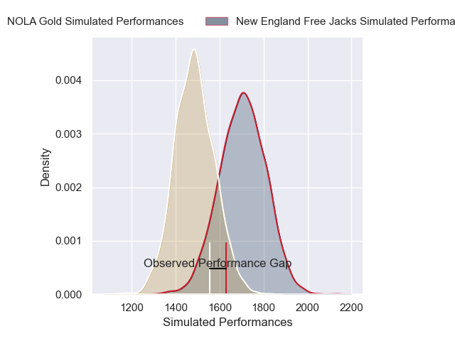
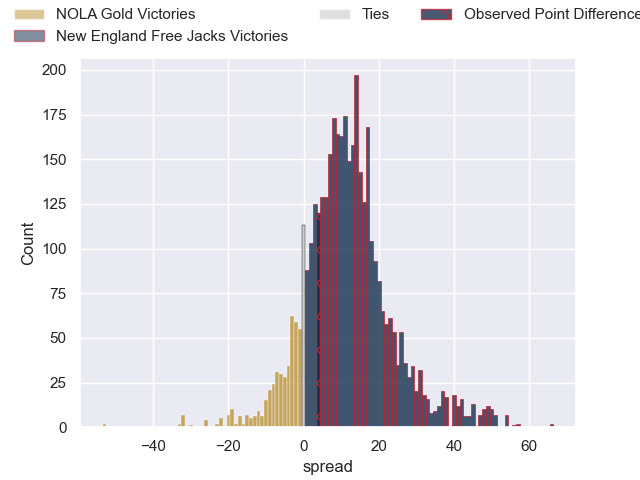
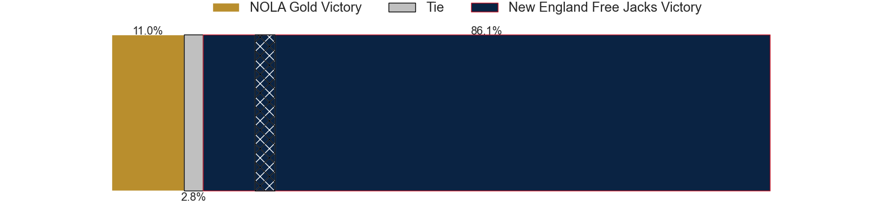
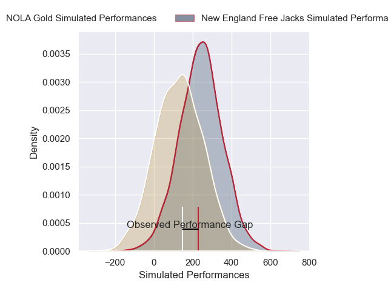
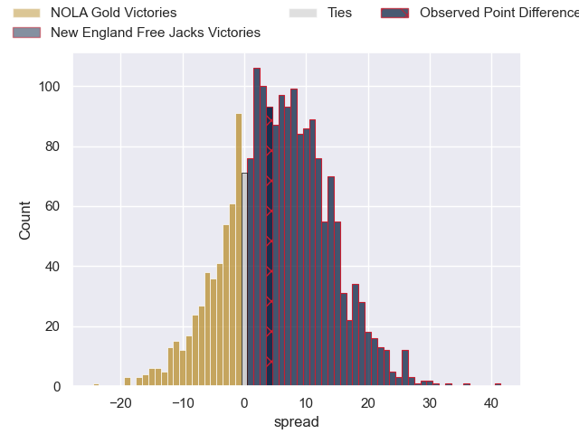
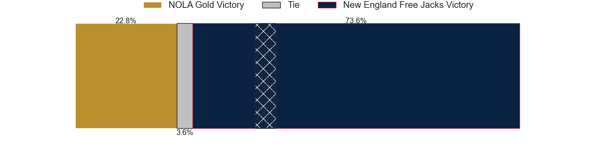

---  
layout: page  
title: NOLA Gold at New England Free Jacks; 31-35  
date: 2025-03-15 18:00:00 -0500  
categories: "Major League Rugby 2025" match review  
---
# NOLA Gold at New England Free Jacks; 31-35

# Club Level Predictions

The first set of predictions treats a club as the smallest object, as the club develops its members, organizes a gameplan, and deploys its players as needed for each match. This club model has a prediction of 0.771, which translates to predicting New England Free Jacks to win by 11.0.

Our Over/Under is 61.5 - and combined with the spread above, we have a predicted scoreline of 25 to 36

Each club has a rating and a rating deviation (similar to a Glicko rating), and expected performances can be generated. This allows for simulated matches and spreads like the ones below.
## Projected Performances - Club Model

## Projected Spreads - Club Model

## Projected Results - Club Model

# Player Level Predictions

Treating teams instead as an entity made up of the currently active players, I have ratings for each player in an altogether different system. These can be combined to form team ratings once teamsheets are announced, weighting starters a bit higher than the reserves. After the match is played, players can be weighted by their minutes on the field, allowing for an accurate measure of the team's composition. With these compiled team ratings, we can make predictions, measure inaccuracy, and update the individual player ratings.
## Prediction without Player Minutes: New England Free Jacks by 10.4

New England Free Jacks by 7.6 on a neutral pitch

## Projected Performances - Player Model

## Projected Spreads - Player Model

## Projected Results - Player Model

|   Away Minutes | Away Player          |   Away Percentile |   Number |   Home Percentile | Home Player             |   Home Minutes |
|---------------:|:---------------------|------------------:|---------:|------------------:|:------------------------|---------------:|
|           10.5 | Matthew Harmon       |             19.92 |        1 |             18.98 | Malakai Hala-Ngatai     |           23   |
|           18   | Alex Lopeti          |             63.97 |        2 |              2.69 | Andrew Quattrin         |           52   |
|           37   | Isaac Salmon         |             63.76 |        3 |             64.24 | Jone Koroiduadua        |           80   |
|           80   | Chase Jones          |             49.3  |        4 |             61.3  | Jeronimo Gomez Vara     |           80   |
|           10.5 | William Waguespack   |             65.58 |        5 |              1.86 | Sam Caird               |           28   |
|           63   | Malcolm May          |             43.75 |        6 |             81.16 | Jed Melvin              |           80   |
|           80   | Jonah Mau'u          |             66.7  |        7 |             79.48 | Joe Johnston            |           80   |
|           17   | Tupou Ma'afu-Afungia |             26.26 |        8 |             95.53 | Wian Conradie           |           57   |
|           21   | Ruben de Haas        |             53.62 |        9 |             55.86 | Oscar Lennon            |           12   |
|           34   | Luke Carty           |             27.45 |       10 |             92.98 | Jayson Potroz           |           23   |
|           37   | Ed Fidow             |             72.19 |       11 |             33.99 | Killian Coghlan         |           36   |
|           29   | Nikolai Foliaki      |              2.8  |       12 |             90.8  | Le Roux Malan           |           28   |
|            0   | Isaac Te Tamaki      |              3.9  |       13 |             44.7  | Wayne van der Bank      |           28   |
|           80   | Xavier Mignot        |             79.78 |       14 |             21.25 | Isaac Olson             |           69   |
|            8   | Cooper Coats         |             12.2  |       15 |             45.73 | Simon-Peter Toleafoa    |           54   |
|           80   | Joe Taufete'e        |             88.05 |       16 |            nan    | Foster Dewitt           |           80   |
|           65   | Jarred Adams         |             90.2  |       17 |             64    | Cole Keith              |           72   |
|           80   | Paul Mullen          |             16.86 |       18 |             80.63 | Kaleb Geiger            |           28.5 |
|           65   | Kaden Duguid         |             24.19 |       19 |             75.81 | Conor Keys              |           52   |
|           80   | Aidan King           |            nan    |       20 |             60.47 | Kyle Baillie            |           60   |
|           72   | Osaiasi Tongauiha    |            nan    |       21 |             19.83 | Cameron Nordli-Kelemeti |           18   |
|           54   | Luke Campbell        |              4.48 |       22 |             42.34 | Harrison Boyle          |           54   |
|           68   | Reece Botha          |            nan    |       23 |            nan    | Faletoi Peni            |           28.5 |

