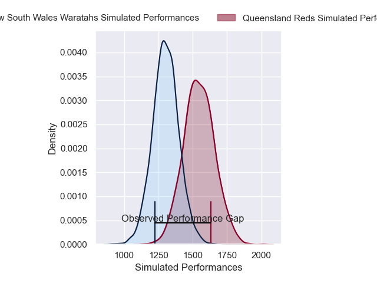
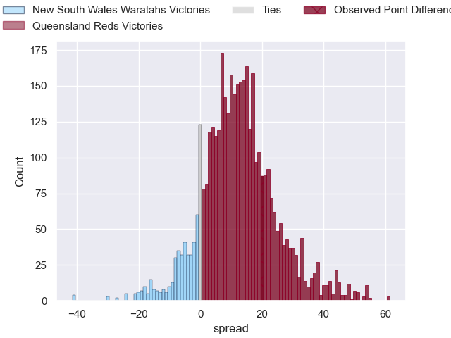
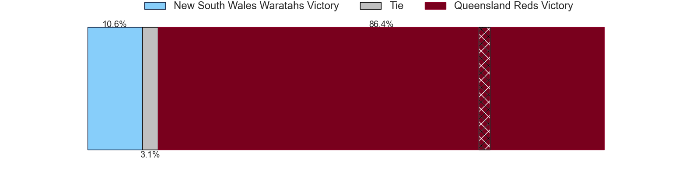
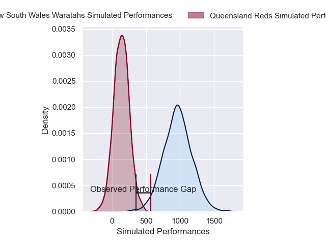
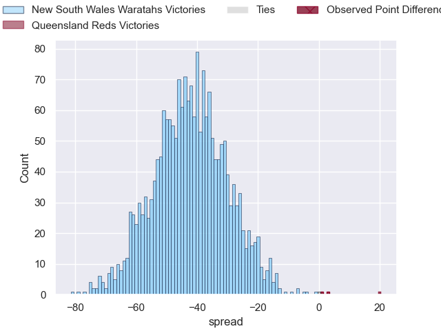
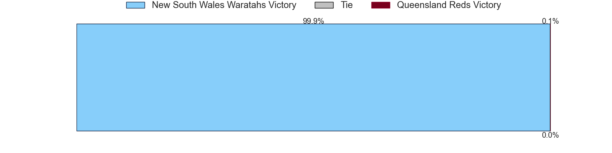

---  
layout: page  
title: New South Wales Waratahs at Queensland Reds; 15-35  
date: 2025-03-15 18:00:00 -0500  
categories: "Super Rugby Pacific 2025" match review  
---
# New South Wales Waratahs at Queensland Reds; 15-35

# Club Level Predictions

The first set of predictions treats a club as the smallest object, as the club develops its members, organizes a gameplan, and deploys its players as needed for each match. This club model has a prediction of 0.789, which translates to predicting Queensland Reds to win by 12.0.

Our Over/Under is 62.5 - and combined with the spread above, we have a predicted scoreline of 25 to 37

Each club has a rating and a rating deviation (similar to a Glicko rating), and expected performances can be generated. This allows for simulated matches and spreads like the ones below.
## Projected Performances - Club Model

## Projected Spreads - Club Model

## Projected Results - Club Model

# Player Level Predictions

Treating teams instead as an entity made up of the currently active players, I have ratings for each player in an altogether different system. These can be combined to form team ratings once teamsheets are announced, weighting starters a bit higher than the reserves. After the match is played, players can be weighted by their minutes on the field, allowing for an accurate measure of the team's composition. With these compiled team ratings, we can make predictions, measure inaccuracy, and update the individual player ratings.
## Prediction without Player Minutes: New South Wales Waratahs by 0.1

New South Wales Waratahs by 8.3 on a neutral pitch

## Projected Performances - Player Model

## Projected Spreads - Player Model

## Projected Results - Player Model

|   Away Minutes | Away Player      |   Away Percentile |   Number |   Home Percentile | Home Player               |   Home Minutes |
|---------------:|:-----------------|------------------:|---------:|------------------:|:--------------------------|---------------:|
|           80   | Angus Bell       |             80.3  |        1 |             75.64 | Sef Fa'agase              |             21 |
|           29   | Angus Bell       |             80.3  |        1 |             75.64 | Sef Fa'agase              |             21 |
|           37   | Angus Bell       |             80.3  |        1 |             75.64 | Sef Fa'agase              |             21 |
|           34   | Angus Bell       |             80.3  |        1 |             75.64 | Sef Fa'agase              |             21 |
|           18   | Angus Bell       |             80.3  |        1 |             75.64 | Sef Fa'agase              |             21 |
|           21   | Angus Bell       |             80.3  |        1 |             75.64 | Sef Fa'agase              |             21 |
|           65   | Angus Bell       |             80.3  |        1 |             75.64 | Sef Fa'agase              |             21 |
|           17   | Angus Bell       |             80.3  |        1 |             75.64 | Sef Fa'agase              |             21 |
|           10.5 | Angus Bell       |             80.3  |        1 |             75.64 | Sef Fa'agase              |             21 |
|           63   | Dave Porecki     |             64.73 |        2 |             73.46 | Matt Faessler             |              0 |
|           69   | Taniela Tupou    |             90.23 |        3 |             90.15 | Zane Nonggorr             |             71 |
|           72   | Hugh Sinclair    |              3.24 |        4 |             24.1  | Josh Canham               |             40 |
|           80   | Ben Grant        |             97.05 |        5 |             39.62 | Ryan Smith                |             63 |
|           18   | Rob Leota        |              1.79 |        6 |             80.75 | Seru Uru                  |             59 |
|           54   | Charlie Gamble   |             23.68 |        7 |             95.19 | Fraser McReight           |             18 |
|           54   | Leafi Talataina  |             18.2  |        8 |             26.4  | Harry Wilson              |             80 |
|           54   | Leafi Talataina  |             18.2  |        8 |             26.4  | Harry Wilson              |             71 |
|           54   | Teddy Wilson     |             15.15 |        9 |             79.69 | Tate McDermott            |             14 |
|           80   | Lawson Creighton |              3.21 |       10 |             81.84 | Tom Lynagh                |              9 |
|           11   | Max Jorgensen    |             48.31 |       11 |             45.68 | Tim Ryan                  |             59 |
|           43   | Joey Walton      |             28.21 |       12 |             82.99 | Hunter Paisami            |             15 |
|           28.5 | Henry O'Donnell  |             30.45 |       13 |             96.84 | Filipo Daugunu            |             26 |
|            0   | Triston Reilly   |             32.14 |       14 |             87.12 | Lachie Anderson           |             80 |
|           17   | Andrew Kellaway  |             22.59 |       15 |             21.81 | Heremaia Murray           |             15 |
|           80   | Mahe Vailanu     |             15.58 |       16 |            nan    | Richie Asiata             |              0 |
|           72   | Tom Lambert      |            nan    |       17 |             76.54 | Alex Hodgman              |             21 |
|           54   | Siosifa Amone    |            nan    |       18 |             92.63 | Jeff Toomaga-Allen        |             26 |
|           28.5 | Felix Kalapu     |             62.57 |       19 |             93.71 | Angus Blyth               |              0 |
|           80   | Jamie Adamson    |            nan    |       20 |             22    | Joe Brial                 |             66 |
|           60   | Langi Gleeson    |             66.8  |       21 |             84.17 | Kalani Thomas             |             80 |
|            0   | Jack Grant       |            nan    |       22 |             62.39 | Harry McLaughlin-Phillips |             80 |
|           52   | Tane Edmed       |              7.91 |       23 |            nan    | Dre Pakeho                |             26 |

