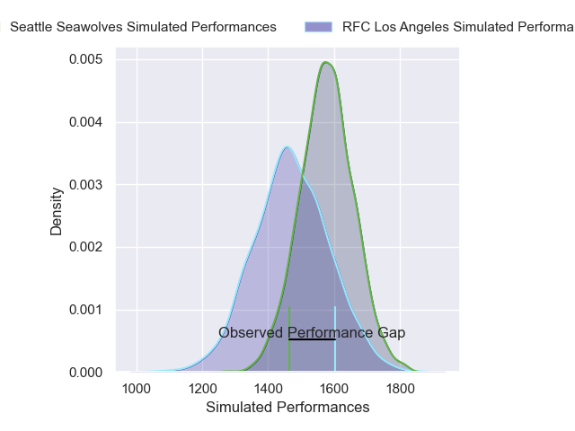
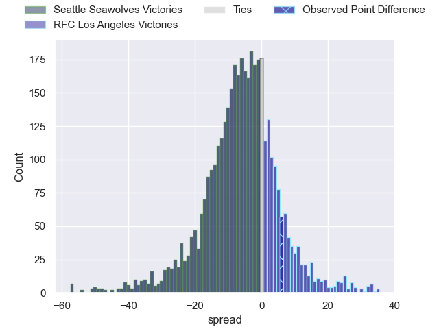
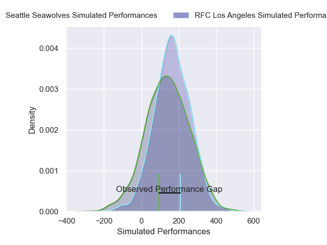
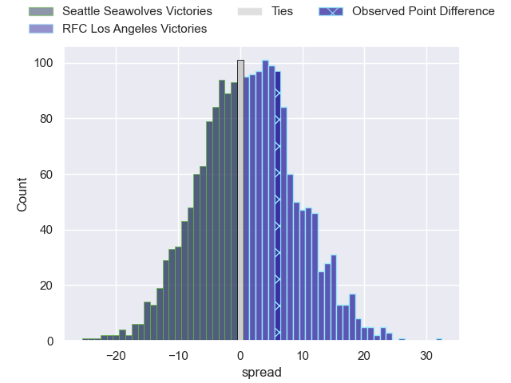

---  
layout: page  
title: Seattle Seawolves at RFC Los Angeles; 29-35  
date: 2025-03-15 18:00:00 -0500  
categories: "Major League Rugby 2025" match review  
---
# Seattle Seawolves at RFC Los Angeles; 29-35

# Club Level Predictions

The first set of predictions treats a club as the smallest object, as the club develops its members, organizes a gameplan, and deploys its players as needed for each match. This club model has a prediction of 0.356, which translates to predicting Seattle Seawolves to win by 5.3.

Our Over/Under is 64.5 - and combined with the spread above, we have a predicted scoreline of 35 to 30

Each club has a rating and a rating deviation (similar to a Glicko rating), and expected performances can be generated. This allows for simulated matches and spreads like the ones below.
## Projected Performances - Club Model

## Projected Spreads - Club Model

## Projected Results - Club Model

# Player Level Predictions

Treating teams instead as an entity made up of the currently active players, I have ratings for each player in an altogether different system. These can be combined to form team ratings once teamsheets are announced, weighting starters a bit higher than the reserves. After the match is played, players can be weighted by their minutes on the field, allowing for an accurate measure of the team's composition. With these compiled team ratings, we can make predictions, measure inaccuracy, and update the individual player ratings.
## Prediction without Player Minutes: RFC Los Angeles by 1.0

Seattle Seawolves by 1.3 on a neutral pitch

## Projected Performances - Player Model

## Projected Spreads - Player Model

## Projected Results - Player Model

|   Away Minutes | Away Player       |   Away Percentile |   Number |   Home Percentile | Home Player           |   Home Minutes |
|---------------:|:------------------|------------------:|---------:|------------------:|:----------------------|---------------:|
|           34   | Cameron Orr       |             74.36 |        1 |             65.26 | Dane Zander           |           80   |
|           22   | Kerron van Vuuren |             53.94 |        2 |             41.27 | Mike Sosene-Feagai    |           27   |
|            0   | Juan Pablo Zeiss  |             76.69 |        3 |             53.46 | Maliu Niuafe          |           27   |
|           15   | Rhyno Herbst      |             91.43 |        4 |             61.05 | Jason Damm            |            0   |
|            0   | Malembe Mpofu     |             46.1  |        5 |             90.38 | Jurie van Vuuren      |           56   |
|           13   | Huw Taylor        |              0.94 |        6 |              3.77 | Tim Anstee            |           18   |
|           58   | Devin Short       |             40.85 |        7 |             47.17 | Edward Timpson        |           27   |
|           60   | Riekert Hattingh  |             88.4  |        8 |             50.8  | Ben Houston           |           67   |
|           34   | Juan Philip Smith |             81.41 |        9 |             78.49 | Gonzalo Bertranou     |           53   |
|           80   | Eddie Fouche      |             34.19 |       10 |             88.68 | Christian Leali'ifano |           80   |
|           48   | Malacchi Esdale   |             42.86 |       11 |             84.21 | Andrew Coe            |            0   |
|           80   | Rodney Iona       |             38.8  |       12 |             48.47 | Billy Meakes          |           34   |
|           24   | Divan Rossouw     |             10.69 |       13 |             47.15 | Nick Chan             |           25   |
|           55   | Lauina Futi       |             42.67 |       14 |             92.76 | Christian Dyer        |           32   |
|           15   | Duncan Matthews   |             91.55 |       15 |              3.73 | Rory van Vugt         |           30   |
|           80   | Dewald Kotze      |             46.58 |       16 |            nan    | Ben Sugars            |           60   |
|           80   | Dewald Donald     |            nan    |       17 |            nan    | Dec Leaney            |           38.5 |
|           80   | Mason Pedersen    |            nan    |       18 |            nan    | Franco van den Berg   |           80   |
|           12.5 | Isaia Lotawa      |            nan    |       19 |            nan    | Mikaea Wynyard        |           58   |
|           80   | Pago Haini        |            nan    |       20 |            nan    | Ben Strang            |           24   |
|           52   | Brock Gallagher   |            nan    |       21 |            nan    | Tas Smith             |           17   |
|           36   | David Busby       |            nan    |       22 |            nan    | Sean Nolan            |           20   |
|           80   | Jade Stighling    |             78.85 |       23 |            nan    | Seth Purdey           |           32   |

