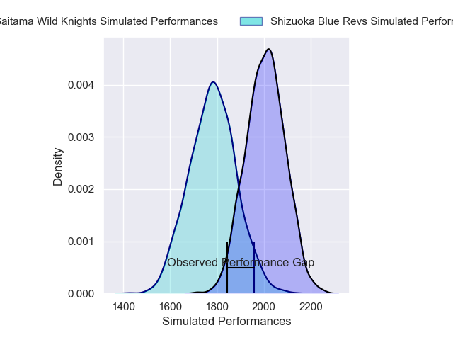
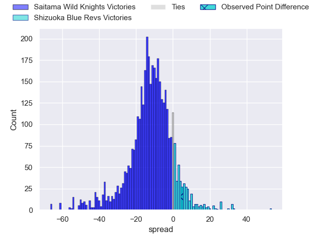
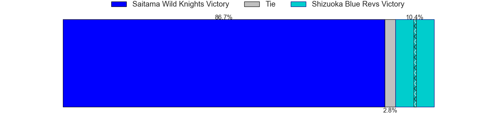
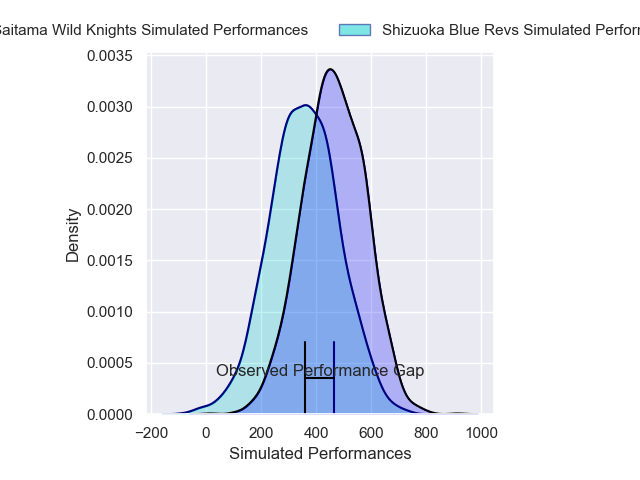
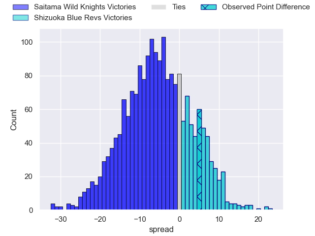
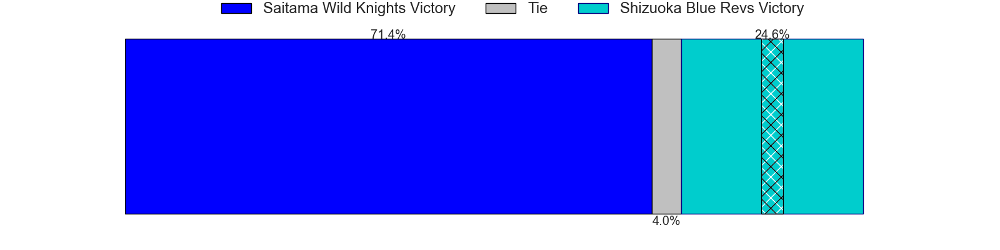

---  
layout: page  
title: Saitama Wild Knights at Shizuoka Blue Revs; 17-22  
date: 2025-03-15 18:00:00 -0500  
categories: "Japan Rugby League One 24/25" match review  
---
# Saitama Wild Knights at Shizuoka Blue Revs; 17-22

# Club Level Predictions

The first set of predictions treats a club as the smallest object, as the club develops its members, organizes a gameplan, and deploys its players as needed for each match. This club model has a prediction of 0.226, which translates to predicting Saitama Wild Knights to win by 11.1.

Our Over/Under is 61.5 - and combined with the spread above, we have a predicted scoreline of 36 to 25

Each club has a rating and a rating deviation (similar to a Glicko rating), and expected performances can be generated. This allows for simulated matches and spreads like the ones below.
## Projected Performances - Club Model

## Projected Spreads - Club Model

## Projected Results - Club Model

# Player Level Predictions

Treating teams instead as an entity made up of the currently active players, I have ratings for each player in an altogether different system. These can be combined to form team ratings once teamsheets are announced, weighting starters a bit higher than the reserves. After the match is played, players can be weighted by their minutes on the field, allowing for an accurate measure of the team's composition. With these compiled team ratings, we can make predictions, measure inaccuracy, and update the individual player ratings.
## Prediction without Player Minutes: Saitama Wild Knights by 8.8

Saitama Wild Knights by 12.9 on a neutral pitch

## Projected Performances - Player Model

## Projected Spreads - Player Model

## Projected Results - Player Model

|   Away Minutes | Away Player       |   Away Percentile |   Number |   Home Percentile | Home Player             |   Home Minutes |
|---------------:|:------------------|------------------:|---------:|------------------:|:------------------------|---------------:|
|             64 | Sho Furuhata      |             57.52 |        1 |             40    | Kazuhiro Kawata         |             20 |
|             80 | Kenji Sato        |             34.59 |        2 |             98.97 | Takeshi Hino            |             70 |
|             73 | Taiki Fujii       |             90.3  |        3 |             56.39 | Bunkei Kaku             |             57 |
|             55 | Esei Ha'angana    |             88.67 |        4 |             97.71 | Yuya Odo                |             60 |
|             60 | Lood de Jager     |             98.1  |        5 |             95.62 | Murray Douglas          |             54 |
|             10 | Ben Gunter        |             97.26 |        6 |             67.55 | Vueti Tupou             |             65 |
|             80 | Shota Fukui       |             71.42 |        7 |             96.51 | Kwagga Smith            |             20 |
|             80 | Jack Cornelsen    |             97    |        8 |             58.8  | Malgene Ilaua           |             80 |
|             22 | Taiki Koyama      |             95.01 |        9 |             74.01 | Shuntaro Kitamura       |             80 |
|             80 | Kyohei Yamasawa   |             85.9  |       10 |              9.62 | Sam Greene              |             80 |
|             80 | Marika Koroibete  |             96.05 |       11 |             92.39 | Malo Tuitama            |             26 |
|             28 | Damian de Allende |            100    |       12 |             88.19 | Viliami Tahitu'a        |             80 |
|             64 | Tomoki Osada      |             63.44 |       13 |             78.72 | Sylvian Mahuza          |             20 |
|             28 | Koki Takeyama     |             98.78 |       14 |             87.59 | Valynce Te Whare-Crosby |             15 |
|             80 | Ryuji Noguchi     |             97.25 |       15 |             93.32 | Charles Piutau          |             16 |
|             12 | Craig Millar      |             64.36 |       16 |             61.8  | Sean Vete               |             26 |
|             22 | Asaeli Ai Valu    |             98.72 |       17 |            nan    | Shunsuke Sakuta         |             80 |
|              0 | Tom Parton        |             90.57 |       18 |             51.64 | Kodai Okazaki           |             60 |
|             13 | Itsuki Onishi     |             95.57 |       19 |             21.58 | Takayoshi Mohara        |             68 |
|             16 | Liam Mitchell     |             86.19 |       20 |            nan    | Richmond Tongatama      |             54 |
|             52 | Vince Aso         |             89.57 |       21 |             61.54 | Kenta Iemura            |             80 |
|            nan | nan               |            nan    |       22 |            nan    | Hironori Yatomi         |             80 |
|            nan | nan               |            nan    |       23 |             62    | Jack Wright             |             80 |

