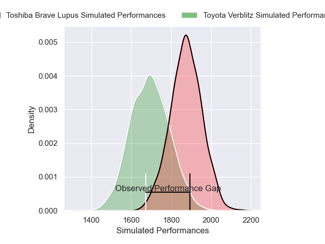
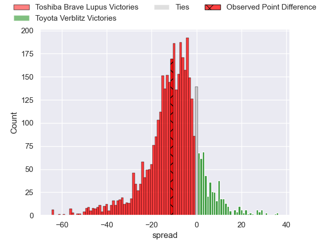
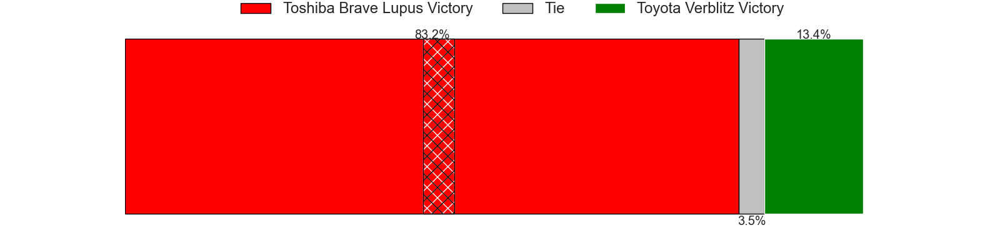
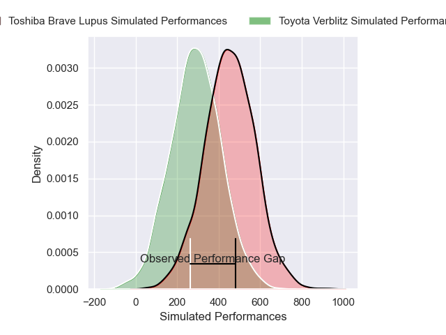
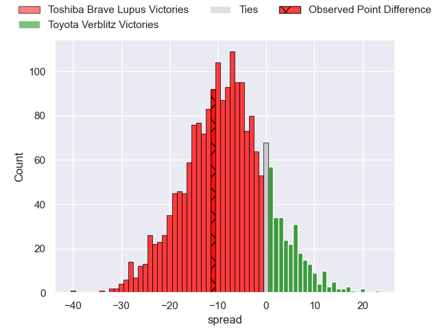
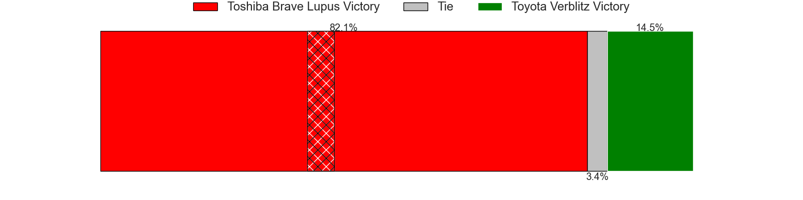

---  
layout: page  
title: Toshiba Brave Lupus at Toyota Verblitz; 33-22  
date: 2025-03-15 18:00:00 -0500  
categories: "Japan Rugby League One 24/25" match review  
---
# Toshiba Brave Lupus at Toyota Verblitz; 33-22

# Club Level Predictions

The first set of predictions treats a club as the smallest object, as the club develops its members, organizes a gameplan, and deploys its players as needed for each match. This club model has a prediction of 0.269, which translates to predicting Toshiba Brave Lupus to win by 8.9.

Our Over/Under is 49.5 - and combined with the spread above, we have a predicted scoreline of 29 to 20

Each club has a rating and a rating deviation (similar to a Glicko rating), and expected performances can be generated. This allows for simulated matches and spreads like the ones below.
## Projected Performances - Club Model

## Projected Spreads - Club Model

## Projected Results - Club Model

# Player Level Predictions

Treating teams instead as an entity made up of the currently active players, I have ratings for each player in an altogether different system. These can be combined to form team ratings once teamsheets are announced, weighting starters a bit higher than the reserves. After the match is played, players can be weighted by their minutes on the field, allowing for an accurate measure of the team's composition. With these compiled team ratings, we can make predictions, measure inaccuracy, and update the individual player ratings.
## Prediction without Player Minutes: Toshiba Brave Lupus by 14.6

Toshiba Brave Lupus by 19.1 on a neutral pitch

## Projected Performances - Player Model

## Projected Spreads - Player Model

## Projected Results - Player Model

|   Away Minutes | Away Player        |   Away Percentile |   Number |   Home Percentile | Home Player         |   Home Minutes |
|---------------:|:-------------------|------------------:|---------:|------------------:|:--------------------|---------------:|
|             80 | Sena Kimura        |             94.06 |        1 |             14.74 | Ryunosuke Momoji    |             67 |
|             80 | Mamoru Harada      |             93.66 |        2 |             87.33 | Yoshikatsu Hikosaka |             80 |
|             80 | Yuta Kokaji        |             94.66 |        3 |             76.62 | Genki Sudo          |             80 |
|             24 | Jacob Pierce       |             98.95 |        4 |             50.29 | Richie Gray         |             80 |
|             80 | Warner Dearns      |             91.9  |        5 |             68.86 | Daichi Akiyama      |             30 |
|             44 | Shannon Frizell    |             97.45 |        6 |             43.49 | Keito Aoki          |             12 |
|             36 | Takeshi Sasaki     |             93.02 |        7 |             99.81 | Michael Hooper      |             28 |
|             23 | Michael Leitch     |             98.2  |        8 |             23.8  | Akito Okui          |             20 |
|             28 | Yuhei Sugiyama     |             88.64 |        9 |             94.84 | Aaron Smith         |             20 |
|             12 | Richie Mo'unga     |            100    |       10 |             68.16 | Matt McGahan        |             68 |
|             23 | Yuto Mori          |             73.59 |       11 |             83.36 | Viliame Tuidraki    |             68 |
|             80 | Rob Thompson       |             50.81 |       12 |             76.07 | Nicholas McCurran   |             56 |
|             60 | Seta Tamanivalu    |             97.15 |       13 |              0.71 | Siosaia Fifita      |              3 |
|              8 | Jone Naikabula     |             81.02 |       14 |             12.78 | Joseph Manu         |             77 |
|             57 | Takuro Matsunaga   |             93.91 |       15 |             85.66 | Taichi Takahashi    |             80 |
|             28 | Shohei Ito         |             54.76 |       16 |             83.53 | Shogo Miura         |             80 |
|             28 | Michael Collins    |             92.93 |       17 |            nan    | Taiga Kawasaki      |             80 |
|             52 | Takahiro Ogawa     |            nan    |       18 |             64.06 | Shunsuke Asaoka     |             80 |
|             80 | Taufa Latu         |            nan    |       19 |            nan    | Shinya Komura       |             50 |
|             52 | Taichi Mano        |             85.44 |       20 |             43.14 | Josh Dickson        |             12 |
|             52 | Daigo Hashimoto    |             77.4  |       21 |             67.17 | Ryusei Koike        |             80 |
|             80 | Masataka Mikami    |            nan    |       22 |            nan    | nan                 |            nan |
|             68 | Yoshitaka Tokunaga |             26.6  |       23 |            nan    | nan                 |            nan |

