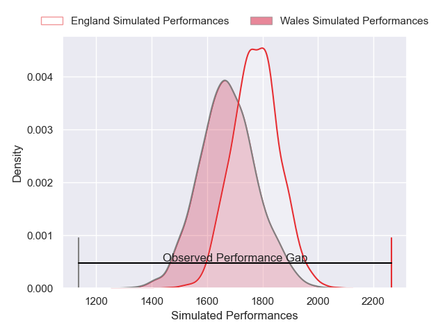
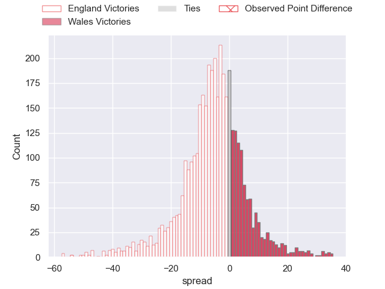
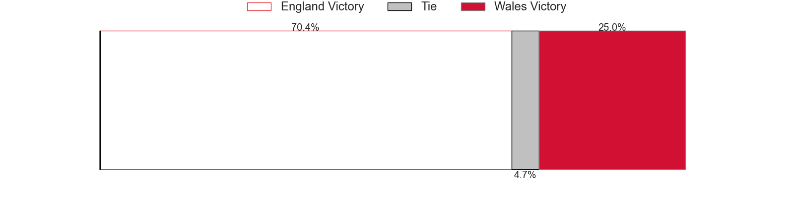
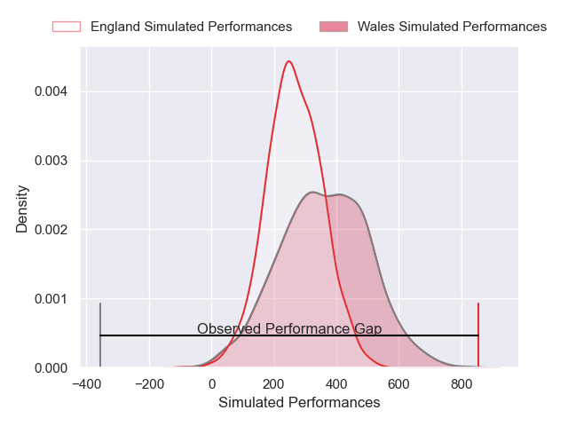
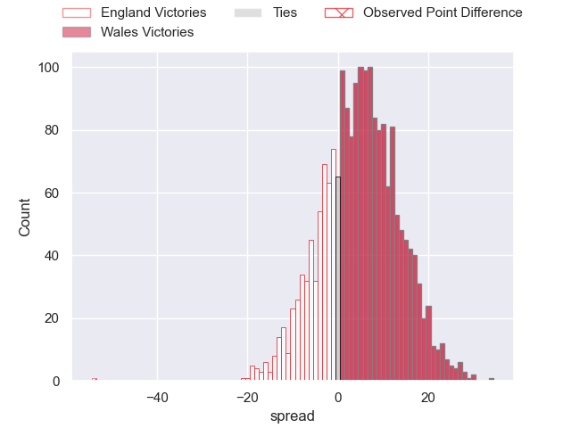

---  
layout: page  
title: England at Wales; 68-14  
date: 2025-03-15 18:00:00 -0500  
categories: "Six Nations Championship 2025" match review  
---
# England at Wales; 68-14

# Club Level Predictions

The first set of predictions treats a club as the smallest object, as the club develops its members, organizes a gameplan, and deploys its players as needed for each match. This club model has a prediction of 0.363, which translates to predicting England to win by 5.1.

Our Over/Under is 51.5 - and combined with the spread above, we have a predicted scoreline of 28 to 23

Each club has a rating and a rating deviation (similar to a Glicko rating), and expected performances can be generated. This allows for simulated matches and spreads like the ones below.
## Projected Performances - Club Model

## Projected Spreads - Club Model

## Projected Results - Club Model

# Player Level Predictions

Treating teams instead as an entity made up of the currently active players, I have ratings for each player in an altogether different system. These can be combined to form team ratings once teamsheets are announced, weighting starters a bit higher than the reserves. After the match is played, players can be weighted by their minutes on the field, allowing for an accurate measure of the team's composition. With these compiled team ratings, we can make predictions, measure inaccuracy, and update the individual player ratings.
## Prediction without Player Minutes: England by 1.8

England by 8.6 on a neutral pitch

## Projected Performances - Player Model

## Projected Spreads - Player Model

## Projected Results - Player Model

|   Away Minutes | Away Player               |   Away Percentile |   Number |   Home Percentile | Home Player      |   Home Minutes |
|---------------:|:--------------------------|------------------:|---------:|------------------:|:-----------------|---------------:|
|        80      | Ellis Genge               |             92.93 |        1 |             67.97 | Nicky Smith      |             80 |
|        80      | Luke Cowan-Dickie         |              0.17 |        2 |             64.9  | Elliot Dee       |             80 |
|        19      | Will Stuart               |             81.2  |        3 |             77.67 | WillGriff John   |             49 |
|        60      | Maro Itoje                |             99.71 |        4 |             20.29 | Will Rowlands    |             22 |
|        23      | Ollie Chessum             |             77.52 |        5 |             78.76 | Dafydd Jenkins   |             50 |
|         0      | Tom Curry                 |             83.87 |        6 |             12.36 | Aaron Wainwright |             80 |
|        27      | Ben Curry                 |             78.77 |        7 |             92.64 | Jac Morgan       |             78 |
|        30      | Ben Earl                  |             99.8  |        8 |             65.4  | Taulupe Faletau  |             80 |
|        20.6667 | Alex Mitchell             |             97.76 |        9 |             75.56 | Tomos Williams   |             67 |
|        19      | Fin Smith                 |             80.98 |       10 |             25.21 | Gareth Anscombe  |             74 |
|        80      | Elliot Daly               |             98.4  |       11 |             30.83 | Joe Roberts      |             22 |
|        34      | Fraser Dingwall           |             88.9  |       12 |             20.37 | Ben Thomas       |             80 |
|        18      | Tommy Freeman             |             92.06 |       13 |             80.24 | Max Llewellyn    |             55 |
|        11      | Tom Roebuck               |             56.2  |       14 |             29.89 | Ellis Mee        |             28 |
|        14      | Marcus Smith              |             81.73 |       15 |             47.15 | Blair Murray     |             58 |
|        58      | Jamie George              |             99.83 |       16 |             72.26 | Dewi Lake        |             80 |
|        15      | Fin Baxter                |              8.12 |       17 |             51.95 | Gareth Thomas    |             22 |
|        20      | Joe Heyes                 |             92.56 |       18 |              7.74 | Keiron Assiratti |             80 |
|        20      | Joe Heyes                 |             92.56 |       18 |              7.74 | Keiron Assiratti |             52 |
|        11      | Chandler Cunningham-South |             68.3  |       19 |             10.38 | Teddy Williams   |             80 |
|         0      | Henry Pollock             |             94.62 |       20 |             82.64 | Tommy Reffell    |              0 |
|        72      | Tom Willis                |             88    |       21 |             77.28 | Rhodri Williams  |             80 |
|        20.6667 | Jack van Poortvliet       |              9.98 |       22 |             69.66 | Jarrod Evans     |             80 |
|        45      | George Ford               |             96.58 |       23 |             99.9  | Nick Tompkins    |             58 |

