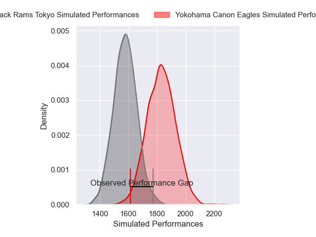
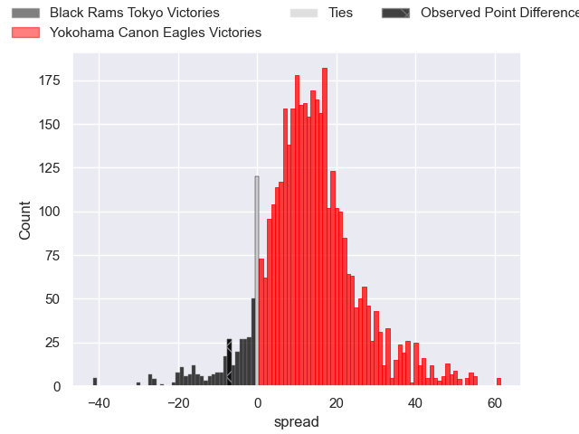
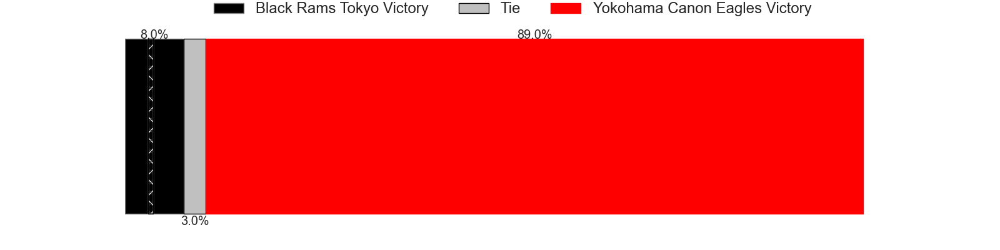
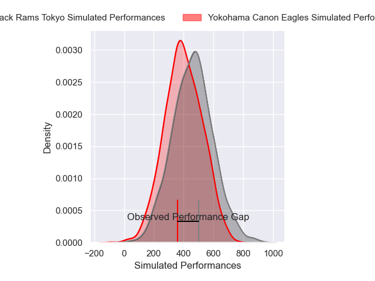
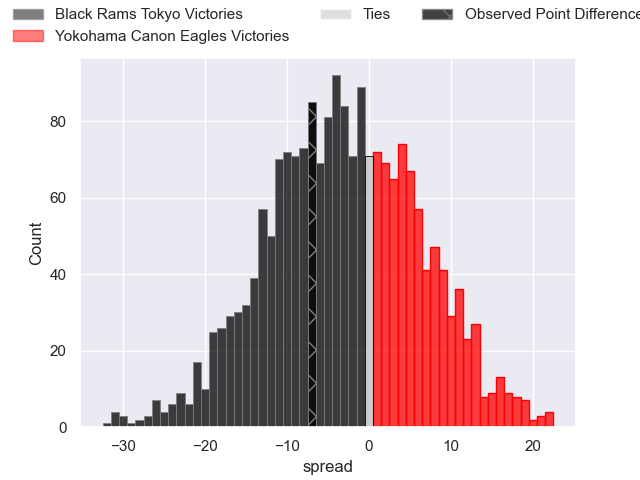
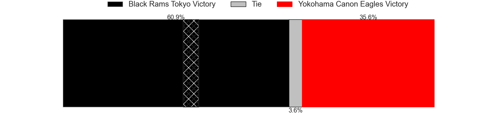

---  
layout: page  
title: Black Rams Tokyo at Yokohama Canon Eagles; 27-20  
date: 2025-03-15 18:00:00 -0500  
categories: "Japan Rugby League One 24/25" match review  
---
# Black Rams Tokyo at Yokohama Canon Eagles; 27-20

# Club Level Predictions

The first set of predictions treats a club as the smallest object, as the club develops its members, organizes a gameplan, and deploys its players as needed for each match. This club model has a prediction of 0.804, which translates to predicting Yokohama Canon Eagles to win by 12.6.

Our Over/Under is 53.5 - and combined with the spread above, we have a predicted scoreline of 21 to 33

Each club has a rating and a rating deviation (similar to a Glicko rating), and expected performances can be generated. This allows for simulated matches and spreads like the ones below.
## Projected Performances - Club Model

## Projected Spreads - Club Model

## Projected Results - Club Model

# Player Level Predictions

Treating teams instead as an entity made up of the currently active players, I have ratings for each player in an altogether different system. These can be combined to form team ratings once teamsheets are announced, weighting starters a bit higher than the reserves. After the match is played, players can be weighted by their minutes on the field, allowing for an accurate measure of the team's composition. With these compiled team ratings, we can make predictions, measure inaccuracy, and update the individual player ratings.
## Prediction without Player Minutes: Yokohama Canon Eagles by 9.1

Yokohama Canon Eagles by 4.8 on a neutral pitch

## Projected Performances - Player Model

## Projected Spreads - Player Model

## Projected Results - Player Model

|   Away Minutes | Away Player        |   Away Percentile |   Number |   Home Percentile | Home Player        |   Home Minutes |
|---------------:|:-------------------|------------------:|---------:|------------------:|:-------------------|---------------:|
|           25   | Taishi Tsumura     |             49.02 |        1 |             96.62 | Takato Okabe       |            2   |
|           62   | Shin Ouchi         |             71.75 |        2 |             89.55 | Shunta Nakamura    |           28   |
|           58   | Paddy Ryan         |             99.4  |        3 |              9.4  | Tatsuro Sugimoto   |           80   |
|           60   | Paddy Ryan         |             99.4  |        3 |              9.4  | Tatsuro Sugimoto   |           80   |
|           63   | Paddy Ryan         |             99.4  |        3 |              9.4  | Tatsuro Sugimoto   |           80   |
|           79   | Pohiva Lotoahea    |             91.05 |        4 |              5.24 | Liaki Moli         |           80   |
|           32   | Harrison Fox       |             61.24 |        5 |             38.86 | Matt Philip        |           58   |
|           80   | Mike Stolberg      |              2.55 |        6 |             33.87 | Billy Harmon       |           19   |
|           80   | Liam Gill          |             87.92 |        7 |             59.81 | Naoto Shimada      |           80   |
|           58   | Amato Fakatava     |             11.2  |        8 |             95.8  | Amanaki Mafi       |           80   |
|           66   | TJ Perenara        |             97.25 |        9 |             92.25 | Faf de Klerk       |           80   |
|           34.5 | Ichigo Nakakusu    |             54.49 |       10 |             80.77 | Yu Tamura          |           80   |
|           48   | Netani Vakayalia   |             70.02 |       11 |             95.39 | Viliame Takayawa   |            8   |
|           80   | Yuki Ikeda         |             61.61 |       12 |             96.33 | Yusuke Kajimura    |           80   |
|           55   | Penieli Jr Latu    |             50.51 |       13 |             98.88 | Jesse Kriel        |           30.5 |
|           31   | Semisi Tupou       |             42.58 |       14 |             35.24 | Kippei Ishida      |           63   |
|           80   | Taira Main         |             60.9  |       15 |             97.05 | Jumpei Ogura       |           80   |
|           75   | Reijiro Yamamoto   |             30.29 |       16 |             71.43 | Kafazumi Yamasuga  |           80   |
|            5   | Yuichiro Taniguchi |            nan    |       17 |             86.05 | Brendan Owen       |           80   |
|           25   | Masaaki Onishi     |             61.82 |       18 |             68.84 | Yusuke Niwai       |           80   |
|            5   | Daigo Sasagawa     |            nan    |       19 |             79.32 | Ryosuke Iwaihara   |           38   |
|           48   | Brodi McCurran     |             64.72 |       20 |            nan    | Tom Jeffries       |           34.5 |
|           30.5 | Ryohei Isoda       |             72.61 |       21 |             59.12 | Masayoshi Takezawa |           32   |
|          nan   | nan                |            nan    |       22 |            nan    | Tomoki Minami      |           22   |
|          nan   | nan                |            nan    |       23 |             64.53 | Masato Furukawa    |           42   |

