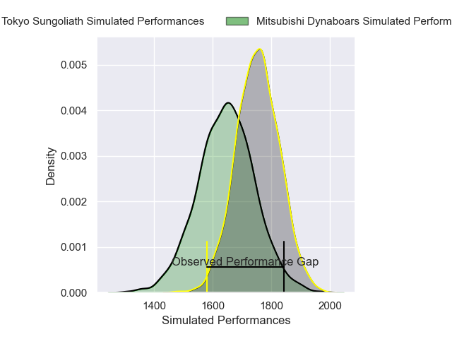
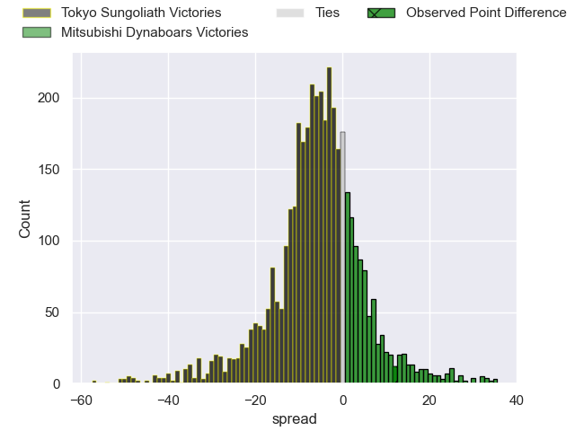
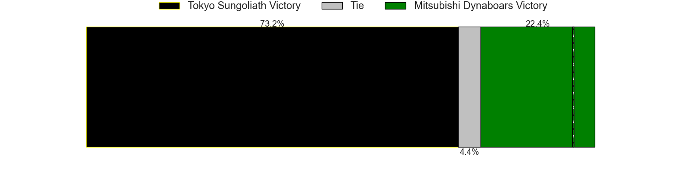
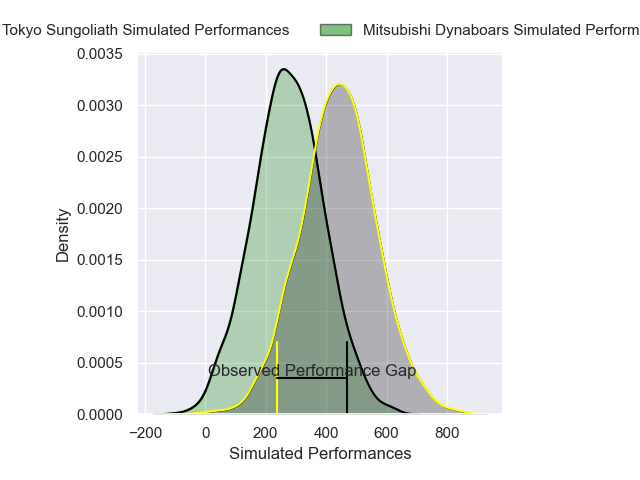
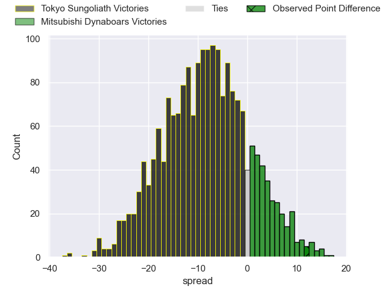
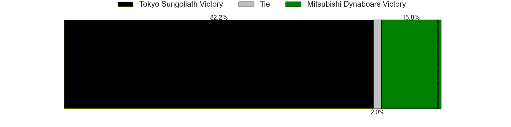

---  
layout: page  
title: Tokyo Sungoliath at Mitsubishi Dynaboars; 22-34  
date: 2025-03-16 18:00:00 -0500  
categories: "Japan Rugby League One 24/25" match review  
---
# Tokyo Sungoliath at Mitsubishi Dynaboars; 22-34

# Club Level Predictions

The first set of predictions treats a club as the smallest object, as the club develops its members, organizes a gameplan, and deploys its players as needed for each match. This club model has a prediction of 0.357, which translates to predicting Tokyo Sungoliath to win by 5.2.

Our Over/Under is 54.5 - and combined with the spread above, we have a predicted scoreline of 30 to 25

Each club has a rating and a rating deviation (similar to a Glicko rating), and expected performances can be generated. This allows for simulated matches and spreads like the ones below.
## Projected Performances - Club Model

## Projected Spreads - Club Model

## Projected Results - Club Model

# Player Level Predictions

Treating teams instead as an entity made up of the currently active players, I have ratings for each player in an altogether different system. These can be combined to form team ratings once teamsheets are announced, weighting starters a bit higher than the reserves. After the match is played, players can be weighted by their minutes on the field, allowing for an accurate measure of the team's composition. With these compiled team ratings, we can make predictions, measure inaccuracy, and update the individual player ratings.
## Prediction without Player Minutes: Tokyo Sungoliath by 6.5

Tokyo Sungoliath by 9.8 on a neutral pitch

## Projected Performances - Player Model

## Projected Spreads - Player Model

## Projected Results - Player Model

|   Away Minutes | Away Player         |   Away Percentile |   Number |   Home Percentile | Home Player               |   Home Minutes |
|---------------:|:--------------------|------------------:|---------:|------------------:|:--------------------------|---------------:|
|             80 | Kenta Kobayashi     |             32.24 |        1 |             79.84 | Jun Morimoto              |           80   |
|             80 | Kienori Go          |             34.01 |        2 |             81.31 | Yoshimitsu Yasue          |           80   |
|              5 | Shinnosuke Kakinaga |             85.1  |        3 |             53.8  | Khuthuzani Kingdom Mchunu |           20   |
|             80 | Ryuga Hashimoto     |             47.91 |        4 |             82.88 | Walt Steenkamp            |           80   |
|             49 | Sam Jeffries        |             94.33 |        5 |             62.88 | Lewis Chessum             |           80   |
|             17 | Kanji Shimokawa     |             80.04 |        6 |              6.25 | Epineri Uluiviti          |           58   |
|             80 | Sam Cane            |             98.41 |        7 |             95.71 | Masataka Tsuruya          |           80   |
|             75 | Sean McMahon        |             97.08 |        8 |             73.54 | Kyo Yoshida               |           30.5 |
|             80 | Yutaka Nagare       |             65.17 |        9 |             76.38 | Kota Iwamura              |           28   |
|             22 | Mikiya Takamoto     |             73.4  |       10 |             93.62 | Jack Stratton             |           80   |
|             80 | Cheslin Kolbe       |             99.91 |       11 |             76.4  | Honeti Taumoha'apai       |           18   |
|             80 | Shogo Nakano        |             18.5  |       12 |             92.6  | Charlie Lawrence          |           38   |
|             61 | Taiga Ozaki         |             61.8  |       13 |             29.6  | Matt Vaega                |            2   |
|             49 | Ryosuke Kawase      |             54.59 |       14 |             66.48 | Naco Joape                |           75   |
|             54 | Kotaro Matsushima   |             92.89 |       15 |             98.37 | Kurt-Lee Arendse          |           48   |
|             40 | Trevor Hosea        |             20.74 |       16 |            nan    | Yuji Chae                 |           76   |
|             69 | Ryoto Nakamura      |             90.7  |       17 |             46.13 | Seung Hyok Lee            |            5   |
|             26 | Kan Nakano          |             13.49 |       18 |            nan    | Haniteli Vailea           |           63   |
|             31 | Seiya Ozaki         |             93.63 |       19 |             13.71 | Timote Tavalea            |           40   |
|             31 | Sione Lavemai       |            nan    |       20 |             77.06 | Satoshi Koizumi           |           30.5 |
|             19 | Kenta Fukuda        |             72.24 |       21 |             24.39 | Kanzo Schinckel           |           80   |
|             80 | Tatsuya Miyazaki    |             19.36 |       22 |             48.09 | James Grayson             |           35   |
|              8 | Atsuki Yamamoto     |            nan    |       23 |            nan    | nan                       |          nan   |

