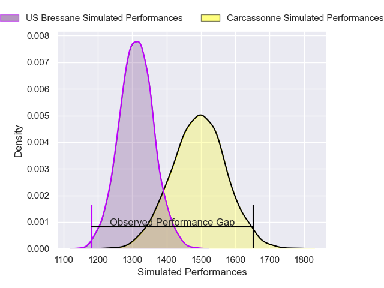
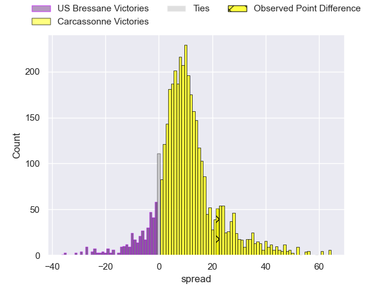
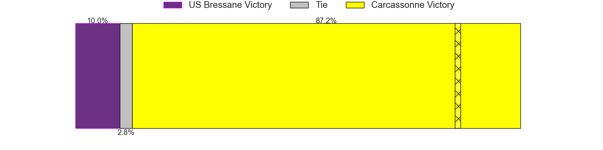
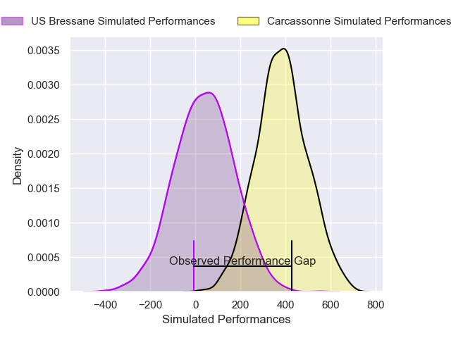
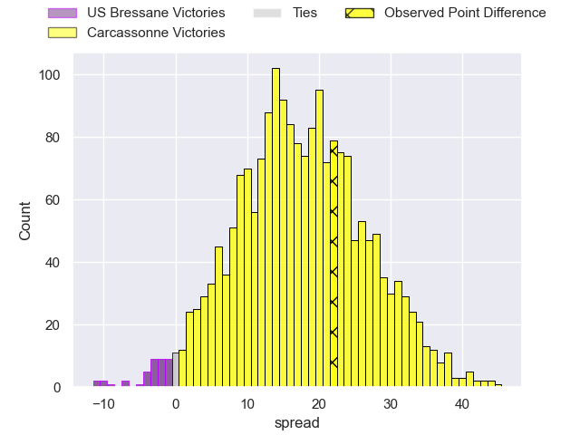
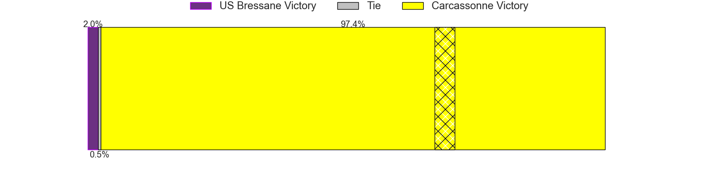

---  
layout: page  
title: US Bressane at Carcassonne; 14-36  
date: 2025-03-21 18:00:00 -0500  
categories: "Nationale 24/25" match review  
---
# US Bressane at Carcassonne; 14-36

# Club Level Predictions

The first set of predictions treats a club as the smallest object, as the club develops its members, organizes a gameplan, and deploys its players as needed for each match. This club model has a prediction of 0.737, which translates to predicting Carcassonne to win by 9.0.

Our Over/Under is 48.5 - and combined with the spread above, we have a predicted scoreline of 20 to 29

Each club has a rating and a rating deviation (similar to a Glicko rating), and expected performances can be generated. This allows for simulated matches and spreads like the ones below.
## Projected Performances - Club Model

## Projected Spreads - Club Model

## Projected Results - Club Model

# Player Level Predictions

Treating teams instead as an entity made up of the currently active players, I have ratings for each player in an altogether different system. These can be combined to form team ratings once teamsheets are announced, weighting starters a bit higher than the reserves. After the match is played, players can be weighted by their minutes on the field, allowing for an accurate measure of the team's composition. With these compiled team ratings, we can make predictions, measure inaccuracy, and update the individual player ratings.
## Prediction without Player Minutes: Carcassonne by 20.0

Carcassonne by 10.7 on a neutral pitch

## Projected Performances - Player Model

## Projected Spreads - Player Model

## Projected Results - Player Model

|   Away Minutes | Away Player          |   Away Percentile |   Number |   Home Percentile | Home Player       |   Home Minutes |
|---------------:|:---------------------|------------------:|---------:|------------------:|:------------------|---------------:|
|             75 | Erich de Jager       |             59.91 |        1 |             84.42 | Yan Arnold        |             60 |
|             81 | Arnaud Feltrin       |              9.44 |        2 |             63.91 | Raphael Carbou    |             60 |
|             81 | Atonio Ulutuipalelei |             11.04 |        3 |             78.94 | Siua Halanukonuka |             14 |
|             21 | Grégoire Demangel    |             68.22 |        4 |             19.98 | Romain Manchia    |              3 |
|             81 | Victor Fromenteze    |              4.18 |        5 |             67.66 | Clément Fontaine  |             81 |
|             67 | Quentin Witt         |              6    |        6 |             64.95 | Maxime Millan     |             26 |
|             61 | Pierre Reynaud       |             77.13 |        7 |             92.22 | Etienne Herjean   |             17 |
|             19 | Loic Baradel         |             86.1  |        8 |             55.21 | Ferdinand Dreno   |             81 |
|             28 | Jeremy Valencot      |             73.92 |        9 |             33.33 | Gaetan Pichon     |             31 |
|             15 | Nathan Azais         |             31.48 |       10 |             68.72 | Johnny McPhillips |             40 |
|             31 | Élie De Fleurian     |             17.41 |       11 |             92.25 | Clement Egiziano  |             28 |
|             60 | Maxime Vacquier      |             45.42 |       12 |             99.41 | Sefa Naivalu      |             41 |
|             49 | Joe Margetts         |             55.07 |       13 |             83.15 | Lukas Doyhenard   |             64 |
|             68 | Alexandre Badet      |             20.15 |       14 |             67.27 | Paul Gadea        |             81 |
|             80 | Jules Margarit       |             25.61 |       15 |             29.47 | Naim Ben Alla     |             81 |
|             80 | Teo Bordenave        |             39.86 |       16 |             84.73 | Fabien Lorenzon   |             55 |
|             81 | Clement Jullien      |             89.57 |       17 |             44.24 | Florent Lorenzon  |             81 |
|             15 | Nicolas Lemaire      |             57.95 |       18 |             13.29 | Marius Iftimiciuc |             50 |
|             65 | Nicolas Tachat       |             23.34 |       19 |             30.65 | Noe Bedou         |             81 |
|             49 | Thomas Déliance      |             26.52 |       20 |             56.48 | Yvan David        |             78 |
|             49 | Nail Ait Naceur      |             70.48 |       21 |             38.41 | Nils Chalies      |             53 |
|             80 | Jeremie Martin       |             43.7  |       22 |            nan    | Baptiste Moreno   |             31 |
|             65 | Aaron Stafford       |             37.34 |       23 |             68.42 | Bilal Fadli       |             70 |

