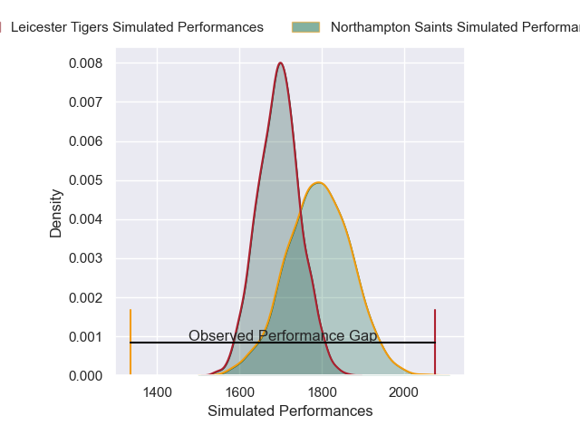
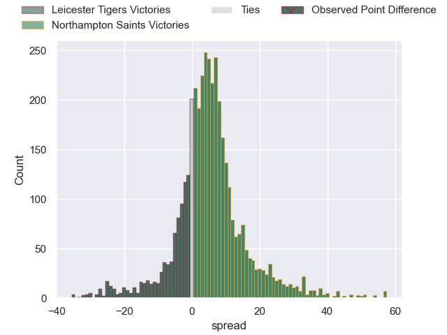
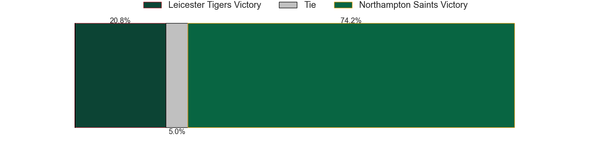
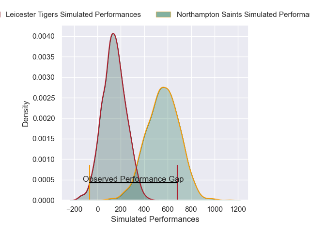
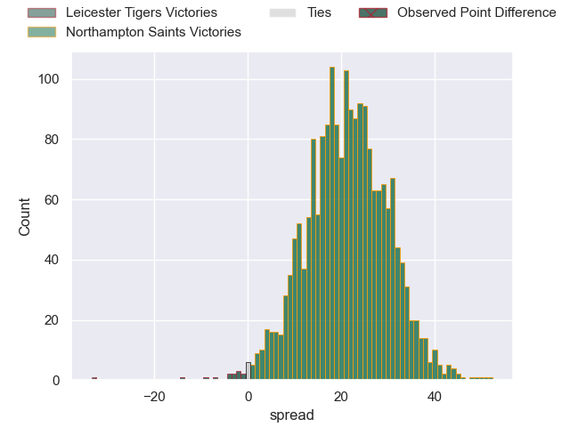
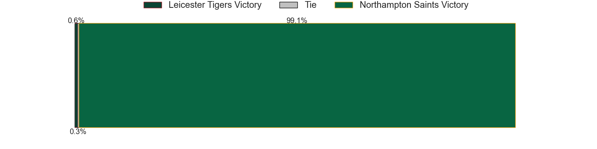

---  
layout: page  
title: Leicester Tigers at Northampton Saints; 33-0  
date: 2025-03-21 18:00:00 -0500  
categories: "Gallagher Premiership 24/25" match review  
---
# Leicester Tigers at Northampton Saints; 33-0

# Club Level Predictions

The first set of predictions treats a club as the smallest object, as the club develops its members, organizes a gameplan, and deploys its players as needed for each match. This club model has a prediction of 0.635, which translates to predicting Northampton Saints to win by 4.9.

Our Over/Under is 64.5 - and combined with the spread above, we have a predicted scoreline of 30 to 35

Each club has a rating and a rating deviation (similar to a Glicko rating), and expected performances can be generated. This allows for simulated matches and spreads like the ones below.
## Projected Performances - Club Model

## Projected Spreads - Club Model

## Projected Results - Club Model

# Player Level Predictions

Treating teams instead as an entity made up of the currently active players, I have ratings for each player in an altogether different system. These can be combined to form team ratings once teamsheets are announced, weighting starters a bit higher than the reserves. After the match is played, players can be weighted by their minutes on the field, allowing for an accurate measure of the team's composition. With these compiled team ratings, we can make predictions, measure inaccuracy, and update the individual player ratings.
## Prediction without Player Minutes: Northampton Saints by 17.7

Northampton Saints by 2.6 on a neutral pitch

## Projected Performances - Player Model

## Projected Spreads - Player Model

## Projected Results - Player Model

|   Away Minutes | Away Player           |   Away Percentile |   Number |   Home Percentile | Home Player      |   Home Minutes |
|---------------:|:----------------------|------------------:|---------:|------------------:|:-----------------|---------------:|
|             13 | Nicky Smith           |             82.85 |        1 |             45.65 | Emmanuel Iyogun  |             13 |
|             30 | Julian Montoya        |             92.72 |        2 |             27.98 | Curtis Langdon   |             57 |
|             30 | Julian Montoya        |             92.72 |        2 |             27.98 | Curtis Langdon   |             80 |
|             30 | Julian Montoya        |             92.72 |        2 |             27.98 | Curtis Langdon   |             32 |
|             30 | Joe Heyes             |             94.28 |        3 |              0.08 | Trevor Davison   |             80 |
|             23 | Cameron Henderson     |             78.16 |        4 |             94.89 | Temo Mayanavanua |             32 |
|             81 | Harry Wells           |             96.1  |        5 |              8.36 | Tom Lockett      |             23 |
|             61 | Hanro Liebenberg      |             94.94 |        6 |              1.5  | Josh Kemeny      |             80 |
|             81 | Tommy Reffell         |             93.35 |        7 |             97.47 | Tom Pearson      |             48 |
|             13 | Olly Cracknell        |             72.2  |        8 |             18.53 | Juarno Augustus  |             48 |
|             52 | Jack van Poortvliet   |             31.26 |        9 |             34.37 | Tom James        |             67 |
|             57 | Handre Pollard        |             90.33 |       10 |             73.25 | Fin Smith        |             23 |
|             28 | Ollie Hassell-Collins |             76.94 |       11 |              0.73 | Tom Seabrook     |             80 |
|             57 | Joseph Woodward       |             62.56 |       12 |             81.38 | Rory Hutchinson  |             80 |
|             64 | Solomone Kata         |             49.66 |       13 |             75.47 | Fraser Dingwall  |             61 |
|             81 | Adam Radwan           |             65.54 |       14 |             51.5  | James Ramm       |             57 |
|             57 | Freddie Steward       |              2.03 |       15 |             61.18 | George Hendy     |             68 |
|             60 | Charlie Clare         |             22.19 |       16 |             42.38 | Henry Walker     |             48 |
|             17 | James Whitcombe       |             26.39 |       17 |             85.83 | Tarek Haffar     |             48 |
|             11 | Dan Cole              |             16.29 |       18 |            nan    | Luke Green       |             12 |
|             21 | Come Joussain         |            nan    |       19 |             23.14 | Alex Coles       |             80 |
|             19 | Emeka Ilione          |             87.82 |       20 |             77.88 | Chunya Munga     |             80 |
|             24 | Ben Youngs            |             66.49 |       21 |             94.47 | Henry Pollock    |             80 |
|             27 | Ben Volavola          |             51.85 |       22 |            nan    | Jonny Weimann    |             32 |
|             23 | Izaia Perese          |             55.37 |       23 |             82.96 | Burger Odendaal  |             62 |

