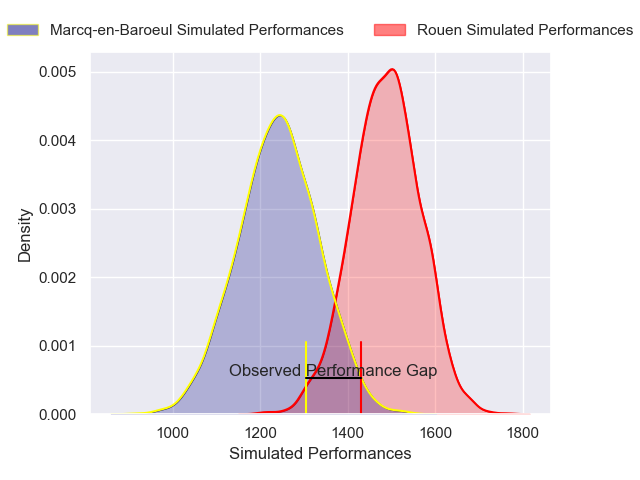
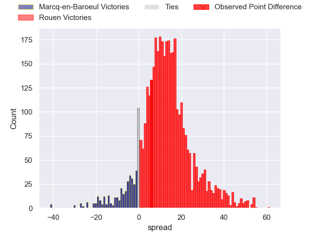
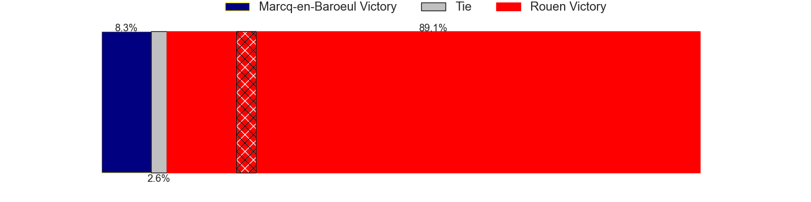
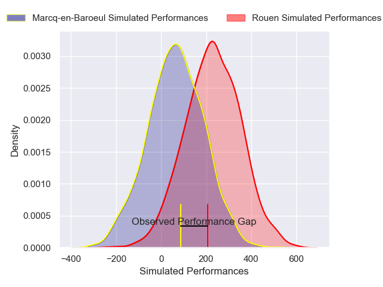
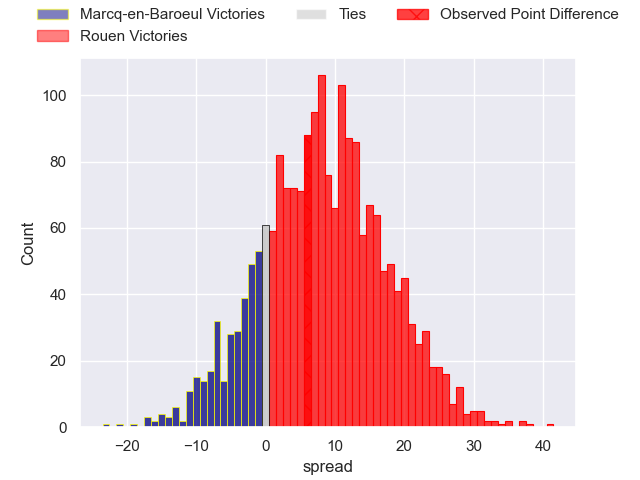
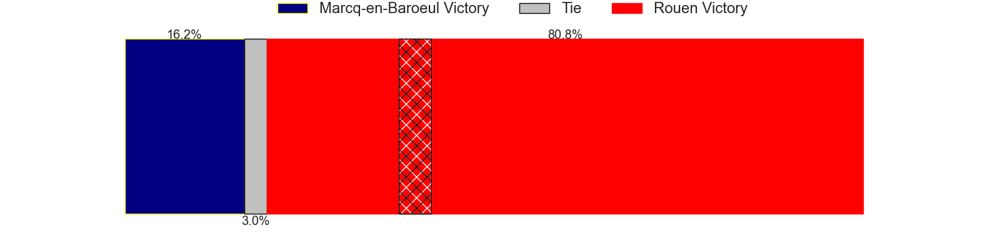

---  
layout: page  
title: Marcq-en-Baroeul at Rouen; 29-35  
date: 2025-03-21 18:00:00 -0500  
categories: "Nationale 24/25" match review  
---
# Marcq-en-Baroeul at Rouen; 29-35

# Club Level Predictions

The first set of predictions treats a club as the smallest object, as the club develops its members, organizes a gameplan, and deploys its players as needed for each match. This club model has a prediction of 0.797, which translates to predicting Rouen to win by 12.4.

Our Over/Under is 51.5 - and combined with the spread above, we have a predicted scoreline of 20 to 32

Each club has a rating and a rating deviation (similar to a Glicko rating), and expected performances can be generated. This allows for simulated matches and spreads like the ones below.
## Projected Performances - Club Model

## Projected Spreads - Club Model

## Projected Results - Club Model

# Player Level Predictions

Treating teams instead as an entity made up of the currently active players, I have ratings for each player in an altogether different system. These can be combined to form team ratings once teamsheets are announced, weighting starters a bit higher than the reserves. After the match is played, players can be weighted by their minutes on the field, allowing for an accurate measure of the team's composition. With these compiled team ratings, we can make predictions, measure inaccuracy, and update the individual player ratings.
## Prediction without Player Minutes: Rouen by 9.2

Rouen by 5.1 on a neutral pitch

## Projected Performances - Player Model

## Projected Spreads - Player Model

## Projected Results - Player Model

|   Away Minutes | Away Player              |   Away Percentile |   Number |   Home Percentile | Home Player           |   Home Minutes |
|---------------:|:-------------------------|------------------:|---------:|------------------:|:----------------------|---------------:|
|             61 | Eli Serra-Miglietti      |             33.36 |        1 |             45.42 | Ewan Clément          |             51 |
|             54 | Mateo Saint-Germain      |             40.23 |        2 |             69.21 | Mathieu Bonnot        |             28 |
|             66 | Sive Mazosiwe            |             82.15 |        3 |             33.2  | Khvicha Tsopurashvili |             80 |
|             80 | Lucio Anconetani         |             42.29 |        4 |             44.42 | Jean Leleu            |             80 |
|             13 | Jean-Baptiste Rende      |             57.53 |        5 |             60.59 | John-Charles Astle    |             59 |
|             52 | Aurélien Carvalho        |             42.08 |        6 |             71.42 | Manolo Laffond        |             51 |
|             12 | Joachim Beaumont         |             38.05 |        7 |             70.2  | Lucas Costa           |             58 |
|             80 | Maxime Danton            |             72.01 |        8 |             79.54 | Abdelkarim Fofana     |             80 |
|             45 | Geoffrey Cazanave        |             58.2  |        9 |             72.71 | Florent Campeggia     |             80 |
|             80 | Serafin Bordoli          |             19.55 |       10 |             52.88 | Maxime Javaux         |             80 |
|             20 | Ervin Muric              |              7.38 |       11 |             38.65 | Nicolas Nieto         |             80 |
|             80 | Mark Erasmus             |             55.96 |       12 |              5.62 | Theo Dachary          |             17 |
|             61 | Hugo Detre               |             12.32 |       13 |             53.79 | Marin Boulier         |             80 |
|             68 | Dany Antunes             |              9.94 |       14 |             64.08 | Sakiusa Bureitakiyaca |             14 |
|             45 | Patrick Fleming Dewhirst |             47.56 |       15 |             45.33 | Aloïs Chayla          |             76 |
|             72 | Lewys Jones              |             54.11 |       16 |             65    | Sidi-Mohammed Diallo  |             26 |
|             80 | Victor-Fy Balas Burel    |             62.41 |       17 |             35.82 | Benjamin Debetz       |             14 |
|             63 | Cedric Yonkeu            |             38.71 |       18 |             13.31 | Willy N'Diaye         |             54 |
|             66 | Louis Decavel            |             53    |       19 |            nan    | Noe Khier             |             80 |
|             80 | Dylan Nocete             |             66.32 |       20 |            nan    | Remi Devis            |             80 |
|             10 | Antoine Delaporte        |             55.58 |       21 |            nan    | nan                   |            nan |
|             19 | Mathias Ortiz            |             73.47 |       22 |            nan    | nan                   |            nan |

