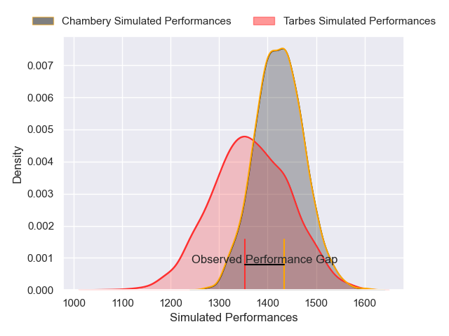
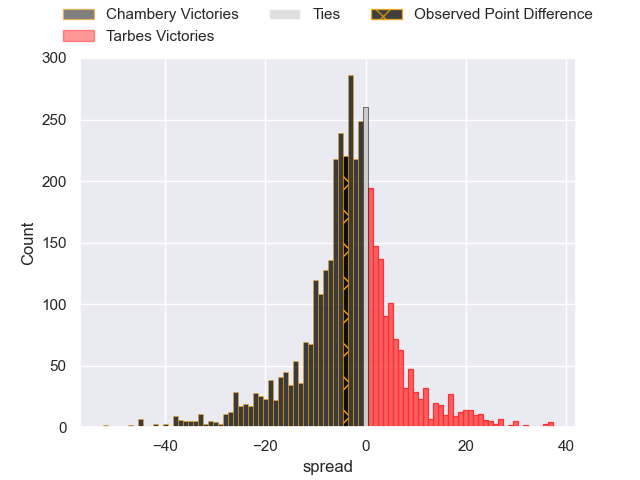
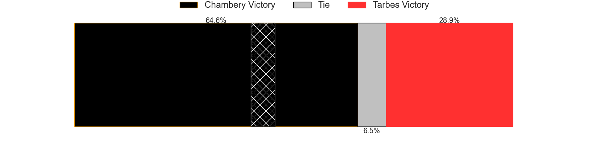
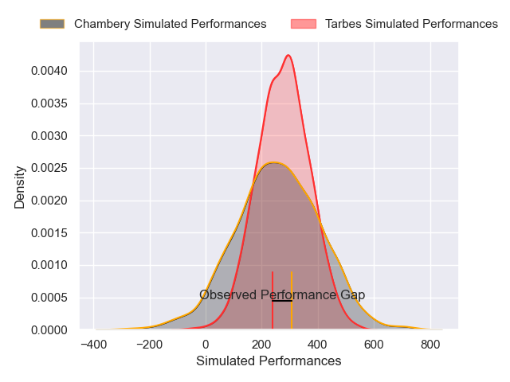
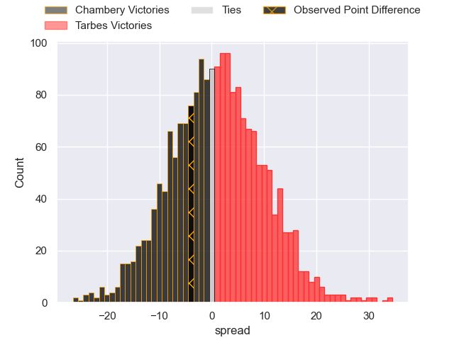

---  
layout: page  
title: Chambery at Tarbes; 20-16  
date: 2025-03-21 18:00:00 -0500  
categories: "Nationale 24/25" match review  
---
# Chambery at Tarbes; 20-16

# Club Level Predictions

The first set of predictions treats a club as the smallest object, as the club develops its members, organizes a gameplan, and deploys its players as needed for each match. This club model has a prediction of 0.419, which translates to predicting Chambery to win by 2.9.

Our Over/Under is 47.5 - and combined with the spread above, we have a predicted scoreline of 25 to 22

Each club has a rating and a rating deviation (similar to a Glicko rating), and expected performances can be generated. This allows for simulated matches and spreads like the ones below.
## Projected Performances - Club Model

## Projected Spreads - Club Model

## Projected Results - Club Model

# Player Level Predictions

Treating teams instead as an entity made up of the currently active players, I have ratings for each player in an altogether different system. These can be combined to form team ratings once teamsheets are announced, weighting starters a bit higher than the reserves. After the match is played, players can be weighted by their minutes on the field, allowing for an accurate measure of the team's composition. With these compiled team ratings, we can make predictions, measure inaccuracy, and update the individual player ratings.
## Prediction without Player Minutes: Tarbes by 1.7

Chambery by 9.1 on a neutral pitch

## Projected Performances - Player Model

## Projected Spreads - Player Model

## Projected Results - Player Model

|   Away Minutes | Away Player              |   Away Percentile |   Number |   Home Percentile | Home Player         |   Home Minutes |
|---------------:|:-------------------------|------------------:|---------:|------------------:|:--------------------|---------------:|
|             80 | Nugzar Somkhishvili      |             86.22 |        1 |              8.54 | Ximun Bessonart     |             35 |
|             26 | Quentin Beaudaux         |             64.57 |        2 |             14.57 | Florian Lamothe     |             61 |
|             70 | Lasha Tabidze            |             84.26 |        3 |             38.21 | Luka Vea            |             19 |
|             29 | Jean-Baptiste Grenod     |             94.14 |        4 |             53.25 | Léo Saint-Guilhem   |              8 |
|             31 | Corentin Astier          |             77.42 |        5 |             59.94 | Mathieu Soufflet    |             70 |
|             65 | Pierre-Nicolas Dance     |             80.32 |        6 |             94.19 | Alexis Armary       |             35 |
|             80 | Colin Lebian             |             79.48 |        7 |             59.23 | Jean Guicherd       |             20 |
|             49 | Taniela Matakaiongo      |             67.18 |        8 |             38.42 | Joeli Matalaweru    |             51 |
|             80 | Sonatane Takulua         |              3.28 |        9 |             75.47 | Mickael Thébault    |             20 |
|             80 | Thibault Moreno          |             80.25 |       10 |             13.17 | Joris Pialot        |             21 |
|             80 | Arthur Nennig            |             92.71 |       11 |             29.63 | Clement Latorre     |             10 |
|             29 | Bastien Reymond          |             76.06 |       12 |             11.92 | Savenaca Rawaca     |             26 |
|             61 | Joseph Exshaw            |             72.41 |       13 |             42.07 | Hugo Cellier        |              4 |
|             80 | Va'aufauese Apelu Maliko |             75.11 |       14 |              9.57 | Jonathan Duffau     |             26 |
|             61 | Thomas Hecquet           |             70.53 |       15 |             22.56 | Pierre Descoubet    |             51 |
|             80 | Julien Pierdomenico      |             60.43 |       16 |             39.78 | Enzo Baggiani       |             48 |
|             26 | Gela Murusidze           |             39.08 |       17 |            nan    | Hadrien Monfort     |             31 |
|             80 | Baptiste Collet          |            nan    |       18 |             80.34 | Irakli Mirtskhulava |             80 |
|             54 | Antoine Ferreira         |             56.89 |       19 |             32.43 | Baptiste Peytavi    |             80 |
|             80 | Aubin Eymeri             |             50.09 |       20 |             38.89 | Spike Salman        |             80 |
|             16 | Emmanuel Vaitulukina     |             85.12 |       21 |             40.24 | Matias Brocal       |             13 |
|             60 | Paul Altier              |             55.52 |       22 |             32.09 | Amona Artaud        |             52 |
|             80 | Paul Altier              |             55.52 |       22 |             32.09 | Amona Artaud        |             52 |
|            nan | nan                      |            nan    |       23 |              7.68 | Maile Mamao         |              0 |

