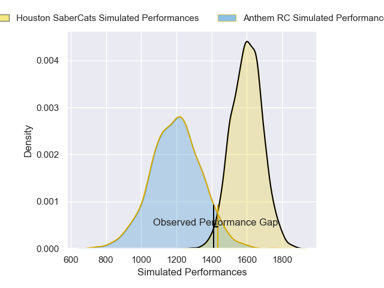
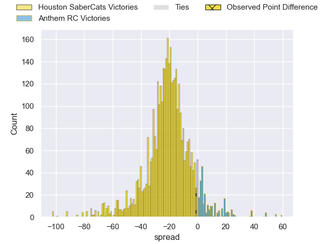
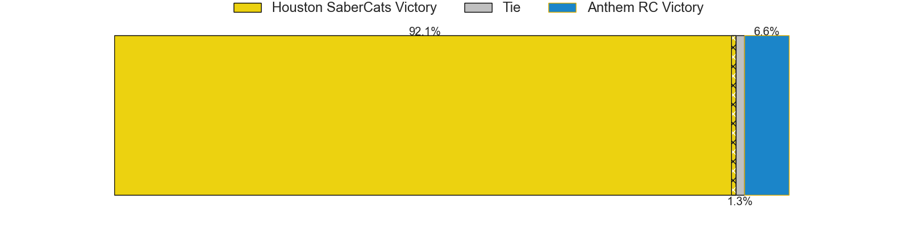
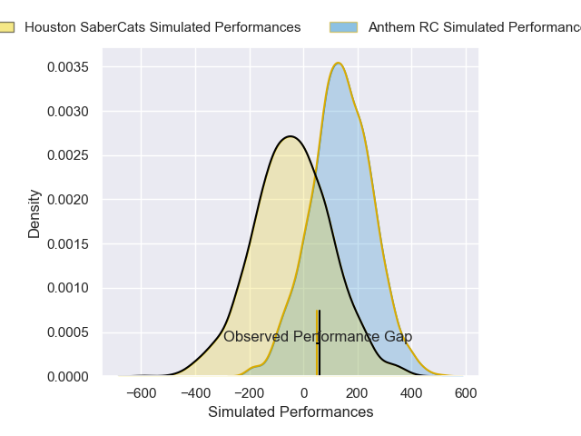
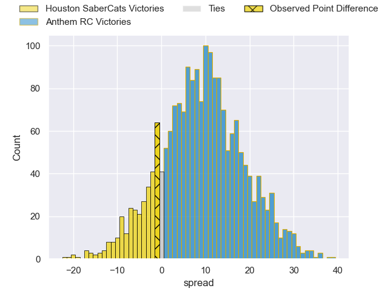
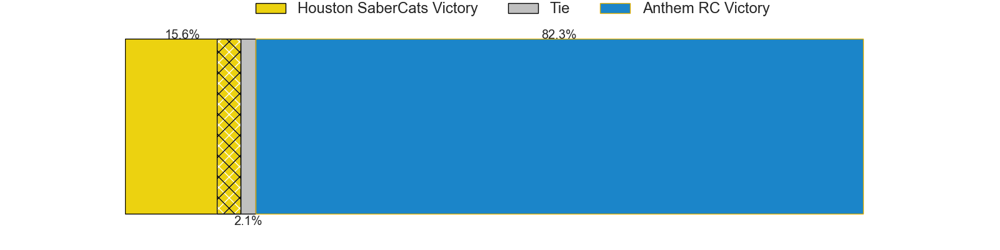

---  
layout: page  
title: Houston SaberCats at Anthem RC; 46-45  
date: 2025-03-22 18:00:00 -0500  
categories: "Major League Rugby 2025" match review  
---
# Houston SaberCats at Anthem RC; 46-45

# Club Level Predictions

The first set of predictions treats a club as the smallest object, as the club develops its members, organizes a gameplan, and deploys its players as needed for each match. This club model has a prediction of 0.094, which translates to predicting Houston SaberCats to win by 20.3.

Our Over/Under is 69.5 - and combined with the spread above, we have a predicted scoreline of 45 to 25

Each club has a rating and a rating deviation (similar to a Glicko rating), and expected performances can be generated. This allows for simulated matches and spreads like the ones below.
## Projected Performances - Club Model

## Projected Spreads - Club Model

## Projected Results - Club Model

# Player Level Predictions

Treating teams instead as an entity made up of the currently active players, I have ratings for each player in an altogether different system. These can be combined to form team ratings once teamsheets are announced, weighting starters a bit higher than the reserves. After the match is played, players can be weighted by their minutes on the field, allowing for an accurate measure of the team's composition. With these compiled team ratings, we can make predictions, measure inaccuracy, and update the individual player ratings.
## Prediction without Player Minutes: Anthem RC by 2.3

Anthem RC by 0.0 on a neutral pitch

## Projected Performances - Player Model

## Projected Spreads - Player Model

## Projected Results - Player Model

|   Away Minutes | Away Player            |   Away Percentile |   Number |   Home Percentile | Home Player              |   Home Minutes |
|---------------:|:-----------------------|------------------:|---------:|------------------:|:-------------------------|---------------:|
|             80 | Ezekiel Lindenmuth     |             87.86 |        1 |             11.35 | Dan Hanson               |             54 |
|             63 | Seth Smith             |             50.99 |        2 |             43.21 | Alex Maughan             |             54 |
|             40 | Pono Davis             |              4.31 |        3 |             52.08 | Joe Apikotoa             |             80 |
|             16 | Pono Davis             |              4.31 |        3 |             52.08 | Joe Apikotoa             |             80 |
|             80 | Pono Davis             |              4.31 |        3 |             52.08 | Joe Apikotoa             |             80 |
|             40 | Javon Camp-Villalovos  |             55.11 |        4 |             28.07 | Viliami Vuli             |              0 |
|             18 | Justin Basson          |             92.1  |        5 |             57.99 | Sam Golla                |             80 |
|             40 | Emmanuel Albert        |             35.71 |        6 |             28.68 | Albert O'Shannessey      |             21 |
|             18 | Keni Nasoqeqe          |             31.3  |        7 |             25.49 | Makeen Alikhan           |             26 |
|             80 | Ronan Murphy           |             43.44 |        8 |             16.02 | Dylan Fortune            |              0 |
|             40 | Juan Oliver            |             50.43 |        9 |             11.23 | Karl Keane               |             80 |
|             76 | AJ Alatimu             |             89.92 |       10 |             27.16 | Cliven Loubser           |             71 |
|             80 | Seimou Smith           |             35.46 |       11 |             18.78 | Jason Tidwell            |             80 |
|             80 | Sam Hill               |             94.78 |       12 |             21.28 | Junior Gafa              |             59 |
|             40 | Louritz van der Schyff |             54.68 |       13 |             25.02 | Erich Storti             |             80 |
|             66 | Jeremy Misailegalu     |             57.52 |       14 |             30.63 | Ernest Freeman           |             40 |
|             80 | Max Schumacher         |             55.49 |       15 |             86.38 | Mitch Wilson             |             80 |
|             25 | Pita Anae Ah-Sue       |             96.85 |       16 |             25.66 | Ethan Howard             |              0 |
|              8 | LaRome White           |            nan    |       17 |              8.93 | Jake Turnbull            |             66 |
|             16 | Michael Scott          |            nan    |       18 |            nan    | Stephan Bernal-Wendt     |             80 |
|             64 | Johan Momsen           |             34.67 |       19 |            nan    | Alejandro Martinez Tapia |             40 |
|             21 | Tinashe Muchena        |            nan    |       20 |            nan    | Colin Turner             |             19 |
|             62 | Marno Redelinghuys     |             22.4  |       21 |            nan    | Ishma-Eel Safodien       |             21 |
|             80 | Jay Renton             |              2.25 |       22 |            nan    | Mateo Gadsden            |             40 |
|             80 | Davy Coetzer           |             28.19 |       23 |             30.25 | Line Latu                |             53 |

