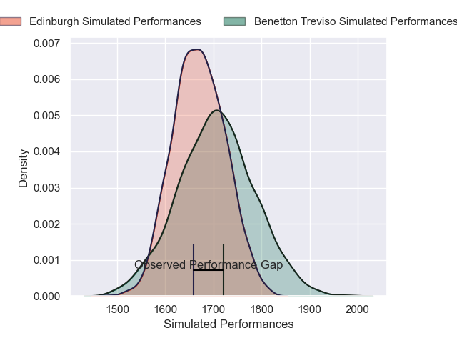
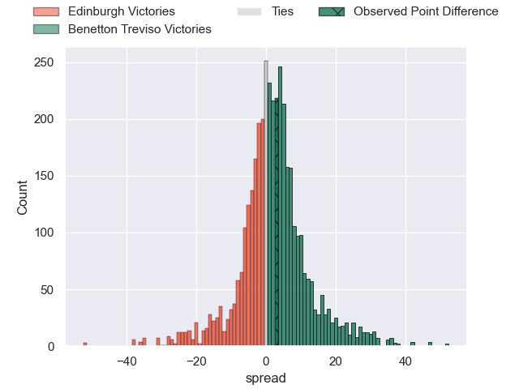
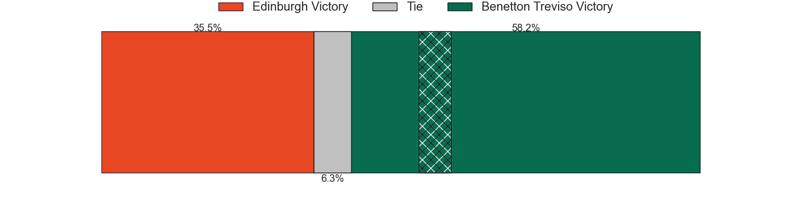
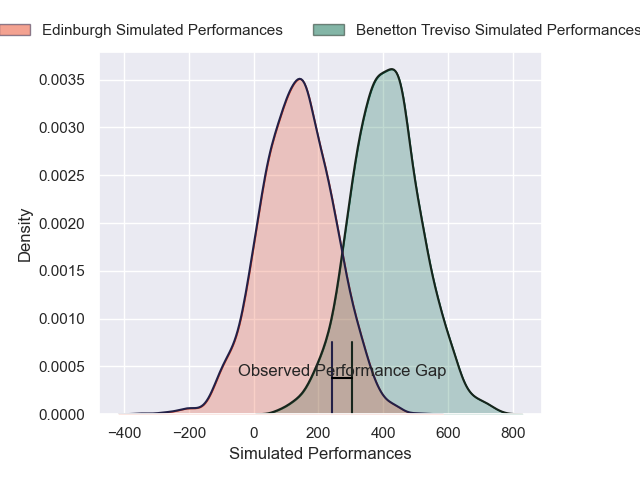
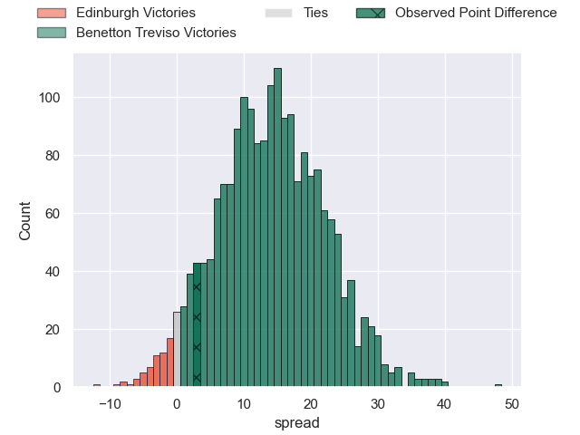
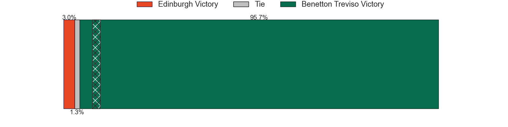

---  
layout: page  
title: Edinburgh at Benetton Treviso; 18-21  
date: 2025-03-22 18:00:00 -0500  
categories: "United Rugby Championship 24/25" match review  
---
# Edinburgh at Benetton Treviso; 18-21

# Club Level Predictions

The first set of predictions treats a club as the smallest object, as the club develops its members, organizes a gameplan, and deploys its players as needed for each match. This club model has a prediction of 0.55, which translates to predicting Benetton Treviso to win by 1.8.

Our Over/Under is 51.5 - and combined with the spread above, we have a predicted scoreline of 25 to 27

Each club has a rating and a rating deviation (similar to a Glicko rating), and expected performances can be generated. This allows for simulated matches and spreads like the ones below.
## Projected Performances - Club Model

## Projected Spreads - Club Model

## Projected Results - Club Model

# Player Level Predictions

Treating teams instead as an entity made up of the currently active players, I have ratings for each player in an altogether different system. These can be combined to form team ratings once teamsheets are announced, weighting starters a bit higher than the reserves. After the match is played, players can be weighted by their minutes on the field, allowing for an accurate measure of the team's composition. With these compiled team ratings, we can make predictions, measure inaccuracy, and update the individual player ratings.
## Prediction without Player Minutes: Benetton Treviso by 9.3

Benetton Treviso by 1.5 on a neutral pitch

## Projected Performances - Player Model

## Projected Spreads - Player Model

## Projected Results - Player Model

|   Away Minutes | Away Player      |   Away Percentile |   Number |   Home Percentile | Home Player         |   Home Minutes |
|---------------:|:-----------------|------------------:|---------:|------------------:|:--------------------|---------------:|
|           40   | Boan Venter      |             72.46 |        1 |             91.63 | Thomas Gallo        |              0 |
|           33   | Ewan Ashman      |             70.73 |        2 |             15.16 | Bautista Bernasconi |              6 |
|           17.5 | Paul Hill        |             99.6  |        3 |             95.41 | Simone Ferrari      |             80 |
|           24   | Marshall Sykes   |             58.89 |        4 |             35.16 | Scott Scrafton      |             46 |
|           25   | Sam Skinner      |             93.85 |        5 |             73.2  | Eli Snyman          |             80 |
|           80   | Ben Muncaster    |             59.16 |        6 |             16.51 | Alessandro Izekor   |             58 |
|           22   | Hamish Watson    |             76.24 |        7 |             64.31 | Manuel Zuliani      |             80 |
|           80   | Magnus Bradbury  |             79.72 |        8 |             78.9  | Toa Halafihi        |             12 |
|            7   | Ben Vellacott    |             54.66 |        9 |              5.45 | Andy Uren           |             40 |
|           40   | Ross Thompson    |             83.69 |       10 |             37.98 | Jacob Umaga         |              0 |
|           55   | Ross McCann      |             13.68 |       11 |             84.11 | Paolo Odogwu        |             25 |
|            0   | Mosese Tuipulotu |             29.33 |       12 |             91.14 | Juan Ignacio Brex   |             25 |
|           40   | James Lang       |             75.66 |       13 |             93.28 | Tommaso Menoncello  |             53 |
|           25   | Matt Currie      |             85.84 |       14 |             21.24 | Ignacio Mendy       |             23 |
|           40   | Wes Goosen       |             86.65 |       15 |             86.85 | Rhyno Smith         |             80 |
|           80   | Patrick Harrison |             17.42 |       16 |             92.16 | Agustin Creevy      |             80 |
|           80   | Robin Hislop     |            nan    |       17 |             55.31 | Mirco Spagnolo      |             34 |
|           80   | D'Arcy Rae       |             31.56 |       18 |             47.67 | Giosue Zilocchi     |             67 |
|           71   | Glen Young       |              3.94 |       19 |             96.25 | Federico Ruzza      |             80 |
|           29   | Freddy Douglas   |              5.73 |       20 |             20.69 | Riccardo Favretto   |             80 |
|           49   | Ali Price        |             91.21 |       21 |             96.18 | Michele Lamaro      |              9 |
|           80   | Cameron Scott    |            nan    |       22 |             55.54 | Alessandro Garbisi  |             29 |
|           50   | Jack Brown       |            nan    |       23 |             82.4  | Tomas Albornoz      |             24 |

