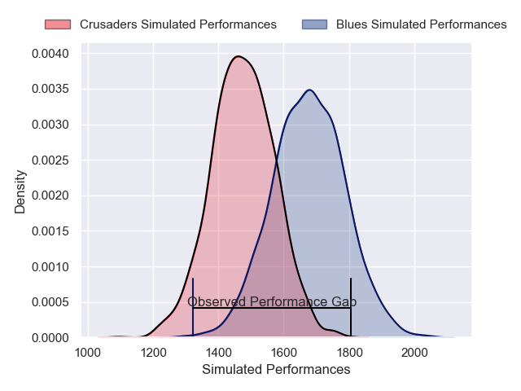
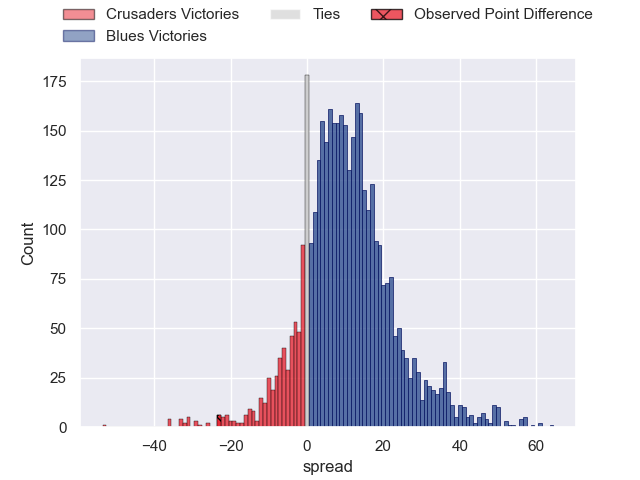
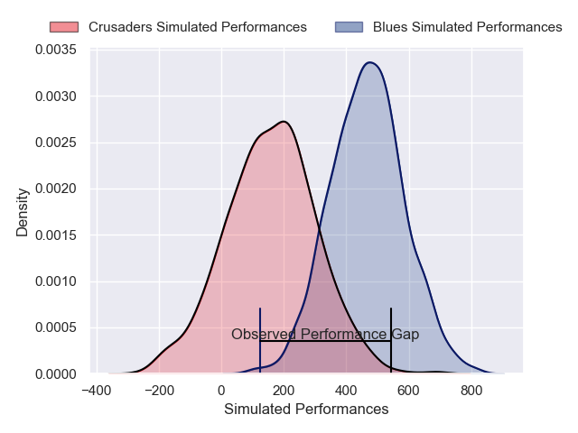
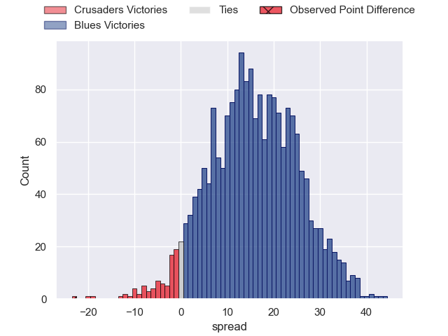

---  
layout: page  
title: Crusaders at Blues; 42-19  
date: 2025-03-22 18:00:00 -0500  
categories: "Super Rugby Pacific 2025" match review  
---
# Crusaders at Blues; 42-19

# Club Level Predictions

The first set of predictions treats a club as the smallest object, as the club develops its members, organizes a gameplan, and deploys its players as needed for each match. This club model has a prediction of 0.755, which translates to predicting Blues to win by 10.2.

Our Over/Under is 61.5 - and combined with the spread above, we have a predicted scoreline of 26 to 36

Each club has a rating and a rating deviation (similar to a Glicko rating), and expected performances can be generated. This allows for simulated matches and spreads like the ones below.
## Projected Performances - Club Model

## Projected Spreads - Club Model

## Projected Results - Club Model

# Player Level Predictions

Treating teams instead as an entity made up of the currently active players, I have ratings for each player in an altogether different system. These can be combined to form team ratings once teamsheets are announced, weighting starters a bit higher than the reserves. After the match is played, players can be weighted by their minutes on the field, allowing for an accurate measure of the team's composition. With these compiled team ratings, we can make predictions, measure inaccuracy, and update the individual player ratings.
## Prediction without Player Minutes: Blues by 19.2

Blues by 11.3 on a neutral pitch

## Projected Performances - Player Model

## Projected Spreads - Player Model

## Projected Results - Player Model

|   Away Minutes | Away Player          |   Away Percentile |   Number |   Home Percentile | Home Player        |   Home Minutes |
|---------------:|:---------------------|------------------:|---------:|------------------:|:-------------------|---------------:|
|             10 | Tamaiti Williams     |             92.4  |        1 |             15.27 | Josh Fusitu'a      |             80 |
|             80 | Ioane Moananu        |             82.95 |        2 |              9.93 | James Mullan       |             65 |
|             61 | Fletcher Newell      |              2.58 |        3 |             83.16 | Angus Ta'avao      |             80 |
|             25 | Scott Barrett        |             95.91 |        4 |             62.08 | Josh Beehre        |             31 |
|             80 | Antonio Shalfoon     |             48.7  |        5 |             94.52 | Laghlan McWhannell |             70 |
|             62 | Cullen Grace         |             86.6  |        6 |             53.14 | Cam Christie       |             18 |
|             80 | Tom Christie         |             83.41 |        7 |             99.44 | Dalton Papalii     |             18 |
|             80 | Christian Lio-Willie |             87.84 |        8 |             97.1  | Hoskins Sotutu     |             15 |
|             80 | Kyle Preston         |             72.54 |        9 |             79.27 | Sam Nock           |             80 |
|             80 | Taha Kemara          |             24.07 |       10 |             97.12 | Stephen Perofeta   |              5 |
|             49 | Sevu Reece           |             90.98 |       11 |             79.58 | Caleb Clarke       |              5 |
|             62 | David Havili         |             97.54 |       12 |             10.05 | Xavi Taele         |             26 |
|             80 | Dallas McLeod        |             67.59 |       13 |             76.65 | Rieko Ioane        |             26 |
|              4 | Chay Fihaki          |              6.84 |       14 |             76.85 | Mark Tele'a        |             31 |
|              4 | Chay Fihaki          |              6.84 |       14 |             76.85 | Mark Tele'a        |             40 |
|              4 | Will Jordan          |             97.15 |       15 |             67.89 | Corey Evans        |             80 |
|             75 | Matt Moulds          |              5.96 |       16 |             50.66 | Bryn Gordon        |             49 |
|             80 | George Bower         |              6.66 |       17 |             12.61 | Jordan Lay         |             53 |
|             80 | Seb Calder           |            nan    |       18 |             84.03 | Marcel Renata      |             54 |
|             80 | Quinten Strange      |             93.59 |       19 |             52.01 | Tristyn Cook       |             54 |
|             76 | Corey Kellow         |             31.12 |       20 |             80.69 | Cameron Suafoa     |             80 |
|             22 | Noah Hotham          |             83.25 |       21 |             74.09 | Finlay Christie    |             40 |
|             31 | James O'Connor       |            nan    |       22 |             93.62 | Harry Plummer      |             27 |
|             80 | Macca Springer       |             62.26 |       23 |             85.77 | Cole Forbes        |             80 |

