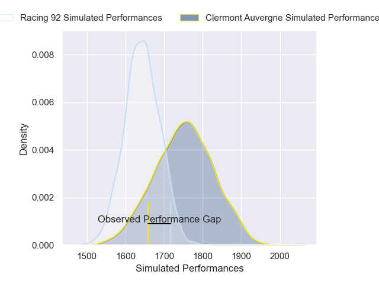
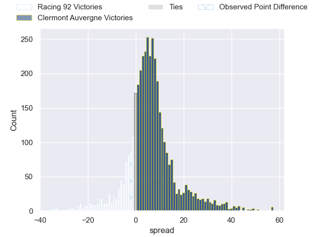
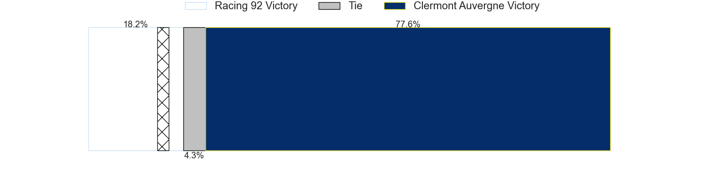
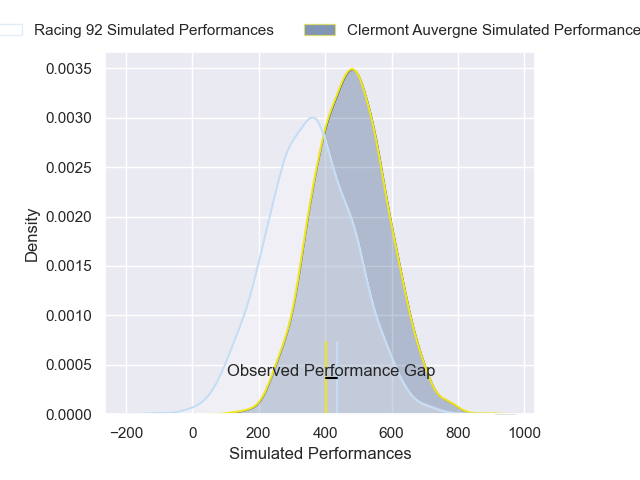
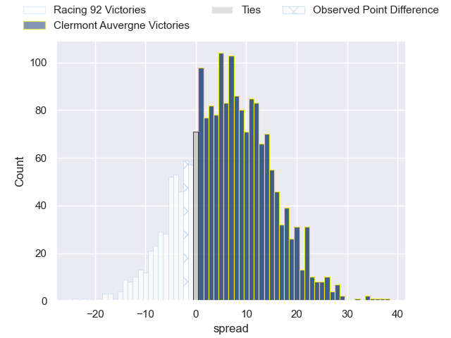
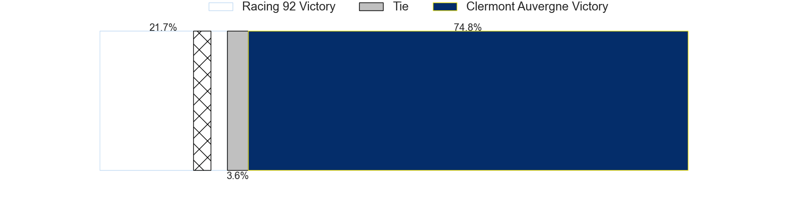

---  
layout: page  
title: Racing 92 at Clermont Auvergne; 23-21  
date: 2025-03-22 18:00:00 -0500  
categories: "Top 14 Orange 24/25" match review  
---
# Racing 92 at Clermont Auvergne; 23-21

# Club Level Predictions

The first set of predictions treats a club as the smallest object, as the club develops its members, organizes a gameplan, and deploys its players as needed for each match. This club model has a prediction of 0.655, which translates to predicting Clermont Auvergne to win by 5.6.

Our Over/Under is 54.5 - and combined with the spread above, we have a predicted scoreline of 24 to 30

Each club has a rating and a rating deviation (similar to a Glicko rating), and expected performances can be generated. This allows for simulated matches and spreads like the ones below.
## Projected Performances - Club Model

## Projected Spreads - Club Model

## Projected Results - Club Model

# Player Level Predictions

Treating teams instead as an entity made up of the currently active players, I have ratings for each player in an altogether different system. These can be combined to form team ratings once teamsheets are announced, weighting starters a bit higher than the reserves. After the match is played, players can be weighted by their minutes on the field, allowing for an accurate measure of the team's composition. With these compiled team ratings, we can make predictions, measure inaccuracy, and update the individual player ratings.
## Prediction without Player Minutes: Clermont Auvergne by 10.3

Racing 92 by 2.8 on a neutral pitch

## Projected Performances - Player Model

## Projected Spreads - Player Model

## Projected Results - Player Model

|   Away Minutes | Away Player         |   Away Percentile |   Number |   Home Percentile | Home Player          |   Home Minutes |
|---------------:|:--------------------|------------------:|---------:|------------------:|:---------------------|---------------:|
|             75 | Hassane Kolingar    |             21.66 |        1 |             79.95 | Etienne Falgoux      |             80 |
|             80 | Feleti Kaitu'u      |             15.85 |        2 |             36.59 | Barnabe Massa        |             80 |
|             63 | Thomas Laclayat     |             51.77 |        3 |             68.68 | Regis Montagne       |             80 |
|             80 | Boris Palu          |             89.43 |        4 |             76.85 | Anthime Hemery       |             80 |
|             80 | Jordan Joseph       |             90.01 |        5 |             90.49 | Rob Simmons          |             19 |
|             80 | Ibrahim Diallo      |             14.69 |        6 |             79.48 | Alexandre Fischer    |             15 |
|              0 | Fabien Sanconnie    |             25.19 |        7 |             88.26 | Marcos Kremer        |              9 |
|             17 | Maxime Baudonne     |             58.82 |        8 |             83.98 | Fritz Lee            |             29 |
|             66 | Antoine Gibert      |             96.66 |        9 |             84.53 | Sebastien Bezy       |             67 |
|             66 | Dan Lancaster       |              4.72 |       10 |             87.12 | Benjamin Urdapilleta |             80 |
|             80 | Donovan Taofifenua  |             83.44 |       11 |              3.16 | Alivereti Raka       |             61 |
|             80 | Josua Tuisova       |             91.65 |       12 |             36.66 | Irae Simone          |             12 |
|             20 | Henry Chavancy      |             99.9  |       13 |             12.42 | Pierre Fouyssac      |             13 |
|              0 | Max Spring          |              4.78 |       14 |             58.95 | Bautista Delguy      |             57 |
|             61 | Sam James           |             93.43 |       15 |             38.05 | Kylan Hamdaoui       |             80 |
|             40 | Janick Tarrit       |             29.44 |       16 |             79.27 | Folau Fainga'a       |             80 |
|              7 | Guram Gogichashvili |             62.88 |       17 |             10.14 | Giorgi Akhaladze     |             15 |
|             40 | Cameron Woki        |             96.15 |       18 |             61.58 | Thomas Ceyte         |             15 |
|             40 | Romain Taofifenua   |             27.28 |       19 |             72.9  | Killian Tixeront     |             29 |
|             80 | Nolann Le Garrec    |             80.32 |       20 |            nan    | Jules Bousquet       |             12 |
|             22 | Owen Farrell        |             98.93 |       21 |             93.56 | Anthony Belleau      |             65 |
|             80 | Gael Fickou         |             98.68 |       22 |             74.75 | Mathys Belaubre      |             80 |
|             68 | Demba Bamba         |             85.59 |       23 |             11.67 | Cristian Ojovan      |             13 |

