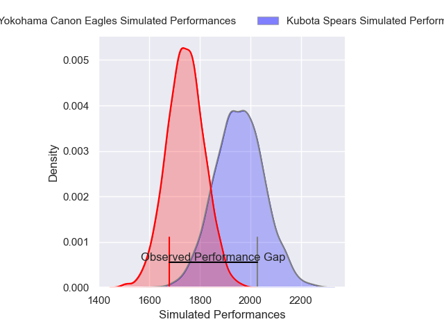
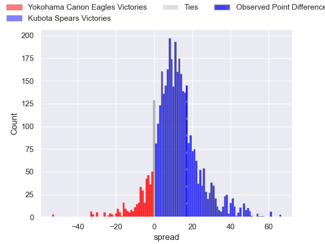
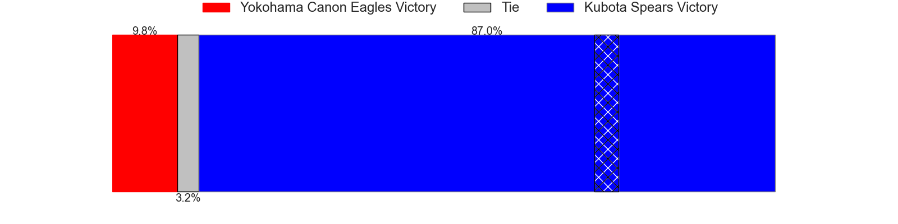
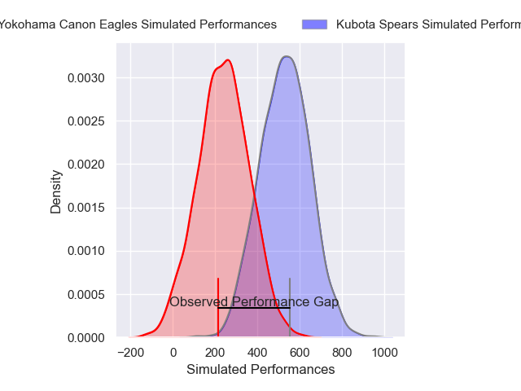
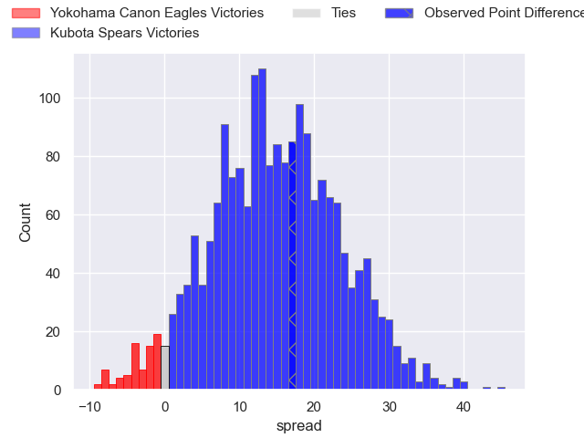
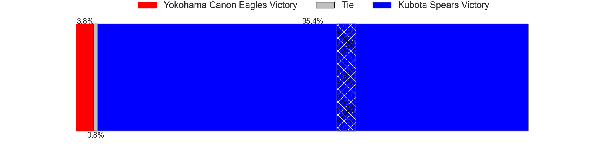

---  
layout: page  
title: Yokohama Canon Eagles at Kubota Spears; 24-41  
date: 2025-03-22 18:00:00 -0500  
categories: "Japan Rugby League One 24/25" match review  
---
# Yokohama Canon Eagles at Kubota Spears; 24-41

# Club Level Predictions

The first set of predictions treats a club as the smallest object, as the club develops its members, organizes a gameplan, and deploys its players as needed for each match. This club model has a prediction of 0.774, which translates to predicting Kubota Spears to win by 11.0.

Our Over/Under is 59.5 - and combined with the spread above, we have a predicted scoreline of 24 to 35

Each club has a rating and a rating deviation (similar to a Glicko rating), and expected performances can be generated. This allows for simulated matches and spreads like the ones below.
## Projected Performances - Club Model

## Projected Spreads - Club Model

## Projected Results - Club Model

# Player Level Predictions

Treating teams instead as an entity made up of the currently active players, I have ratings for each player in an altogether different system. These can be combined to form team ratings once teamsheets are announced, weighting starters a bit higher than the reserves. After the match is played, players can be weighted by their minutes on the field, allowing for an accurate measure of the team's composition. With these compiled team ratings, we can make predictions, measure inaccuracy, and update the individual player ratings.
## Prediction without Player Minutes: Kubota Spears by 15.7

Kubota Spears by 11.6 on a neutral pitch

## Projected Performances - Player Model

## Projected Spreads - Player Model

## Projected Results - Player Model

|   Away Minutes | Away Player        |   Away Percentile |   Number |   Home Percentile | Home Player            |   Home Minutes |
|---------------:|:-------------------|------------------:|---------:|------------------:|:-----------------------|---------------:|
|             21 | Takato Okabe       |             94.52 |        1 |             93.5  | Kota Kaishi            |             21 |
|              6 | Shunta Nakamura    |             88.25 |        2 |            100    | Malcolm Marx           |             59 |
|             67 | Ryosuke Iwaihara   |             67.03 |        3 |             89.58 | Opeti Helu             |             80 |
|             80 | Tom Jeffries       |             34.2  |        4 |             99.63 | Ruan Botha             |             77 |
|             80 | Matt Philip        |             38.38 |        5 |             87.27 | David Bulbring         |             61 |
|             80 | Billy Harmon       |             34.11 |        6 |             88.1  | Finau Tupa             |             59 |
|             80 | Masato Furukawa    |             51.83 |        7 |             90.63 | Takeo Suenaga          |             46 |
|             59 | Amanaki Mafi       |             94.21 |        8 |             90.93 | Faulua Makisi          |             21 |
|             57 | Kouki Arai         |             71.85 |        9 |             63.73 | Shinobu Fujiwara       |             21 |
|             57 | Yu Tamura          |             86.01 |       10 |             99.59 | Bernard Foley          |             21 |
|             59 | Masayoshi Takezawa |             47.86 |       11 |             90.61 | Koga Nezuka            |             80 |
|             66 | Ryo Tabata         |             25.62 |       12 |             64.73 | Yuya Hirose            |             21 |
|             80 | Jesse Kriel        |             98.72 |       13 |             50.54 | Rikus Pretorius        |             80 |
|             59 | Viliame Takayawa   |             95.53 |       14 |             85.69 | Halatoa Vailea         |             80 |
|             27 | Jumpei Ogura       |             97.56 |       15 |             67.07 | Atsushi Oshikawa       |             21 |
|             53 | Kafazumi Yamasuga  |             69.6  |       16 |             60.45 | Yota Kamimori          |             80 |
|             14 | Yusuke Niwai       |             67.05 |       17 |             86.63 | Harumichi Tatekawa     |             80 |
|             74 | Liaki Moli         |              4.09 |       18 |             98.31 | Tyler Paul             |              9 |
|              8 | Brendan Owen       |             87.4  |       19 |             71.69 | Hayate Era             |             80 |
|             14 | Tomoki Minami      |            nan    |       20 |             75.41 | Keijiro Tamefusa       |             15 |
|             14 | Tatsuro Sugimoto   |              3.29 |       21 |             80.22 | Merwe Olivier          |             59 |
|              6 | Naoto Shimada      |             57.36 |       22 |             96.72 | Bryn Hall              |             59 |
|             55 | Aminiasi Shaw      |            nan    |       23 |             95.81 | Gerhard van den Heever |              9 |

