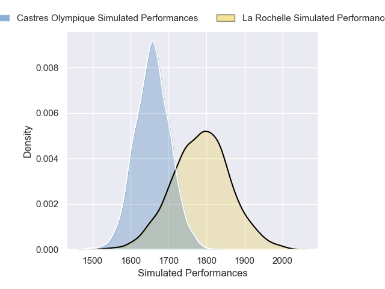
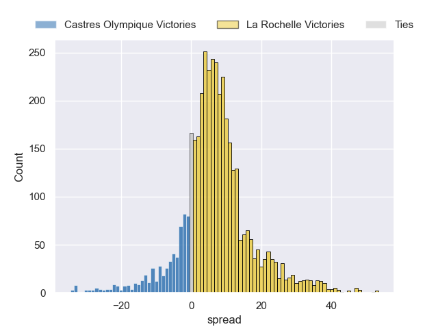
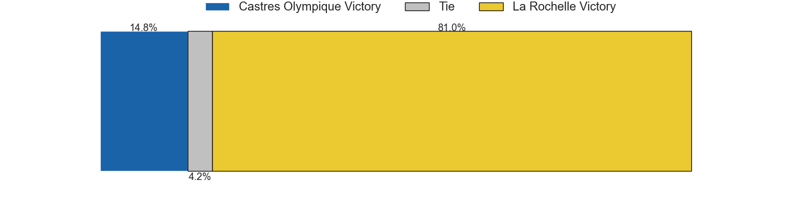
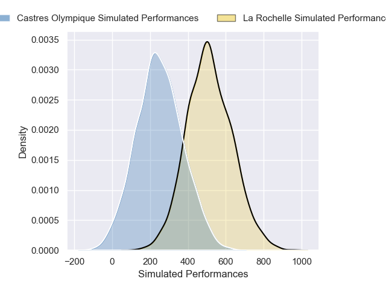
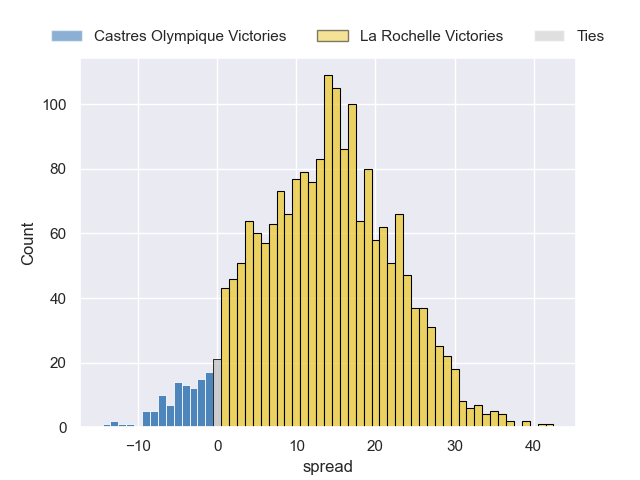
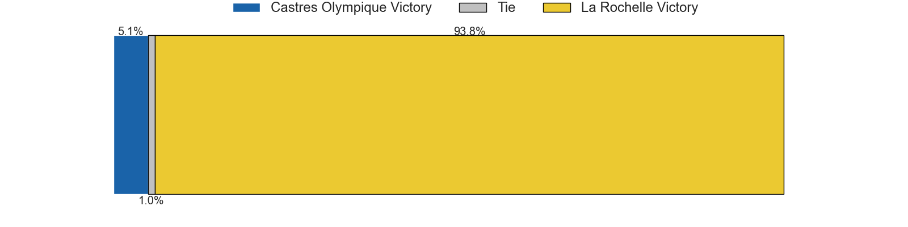

---  
layout: page  
title: Castres Olympique at La Rochelle; 12-12  
date: 2025-03-22 18:00:00 -0500  
categories: "Top 14 Orange 24/25" match review  
---
# Castres Olympique at La Rochelle; 12-12

# Club Level Predictions

The first set of predictions treats a club as the smallest object, as the club develops its members, organizes a gameplan, and deploys its players as needed for each match. This club model has a prediction of 0.677, which translates to predicting La Rochelle to win by 6.5.

Our Over/Under is 55.5 - and combined with the spread above, we have a predicted scoreline of 25 to 31

Each club has a rating and a rating deviation (similar to a Glicko rating), and expected performances can be generated. This allows for simulated matches and spreads like the ones below.
## Projected Performances - Club Model

## Projected Spreads - Club Model

## Projected Results - Club Model

# Player Level Predictions

Treating teams instead as an entity made up of the currently active players, I have ratings for each player in an altogether different system. These can be combined to form team ratings once teamsheets are announced, weighting starters a bit higher than the reserves. After the match is played, players can be weighted by their minutes on the field, allowing for an accurate measure of the team's composition. With these compiled team ratings, we can make predictions, measure inaccuracy, and update the individual player ratings.
## Prediction without Player Minutes: La Rochelle by 16.7

La Rochelle by 5.1 on a neutral pitch

## Projected Performances - Player Model

## Projected Spreads - Player Model

## Projected Results - Player Model

|   Away Minutes | Away Player           |   Away Percentile |   Number |   Home Percentile | Home Player            |   Home Minutes |
|---------------:|:----------------------|------------------:|---------:|------------------:|:-----------------------|---------------:|
|            5   | Quentin Walcker       |             46.78 |        1 |             92.91 | Reda Wardi             |             68 |
|           25   | Gaetan Barlot         |             82.75 |        2 |             76.13 | Tolu Latu              |             80 |
|           22   | Will Collier          |             79.63 |        3 |             20.13 | Aleksandre Kuntelia    |             80 |
|           42   | Paul Jedrasiak        |             50.43 |        4 |             86.74 | Thomas Lavault         |             56 |
|           66   | Florent Vanverberghe  |             87.7  |        5 |             67.34 | Kane Douglas           |             80 |
|           80   | Tyler Ardron          |             84.83 |        6 |              5.92 | Paul Boudehent         |             80 |
|           80   | Baptiste Delaporte    |             91.98 |        7 |             56.87 | Oscar Jegou            |             80 |
|           55   | Abraham Papali'i      |             25.76 |        8 |             98.58 | Gregory Alldritt       |             58 |
|           80   | Jeremy Fernandez      |             90.86 |        9 |             27.42 | Mathis Brunet          |             63 |
|           34.5 | Louis Le Brun         |             81.33 |       10 |             23.18 | Ihaia West             |             80 |
|           32   | Remy Baget            |             94.26 |       11 |             97.61 | Dillyn Leyds           |             45 |
|           80   | Adrea Cocagi          |             84.32 |       12 |             85.64 | Jules Favre            |             45 |
|           34.5 | Adrien Seguret        |             17.92 |       13 |             74.64 | Ulupano Seuteni        |              2 |
|           11   | Christian Ambadiang   |             58.85 |       14 |             94.74 | Jack Nowell            |             22 |
|           58   | Julien Dumora         |             70.92 |       15 |             29.68 | Antoine Hastoy         |             80 |
|           80   | Pierre Colonna        |             71.95 |       16 |             81.01 | Pierre Bourgarit       |             56 |
|           22   | Lois Guerois-Galisson |             36.31 |       17 |             41.79 | Alexandre Kaddouri     |             71 |
|           48   | Lois Guerois-Galisson |             36.31 |       17 |             41.79 | Alexandre Kaddouri     |             71 |
|           80   | Gauthier Maravat      |              2.29 |       18 |             20.04 | Lucas Andjisseramatchi |             78 |
|           38   | Feibyan Tukino        |             57.4  |       19 |             16.79 | Judicael Cancoriet     |             22 |
|           58   | Santiago Arata        |             88.75 |       20 |             95.99 | Levani Botia           |             33 |
|           75   | Jack Goodhue          |             92.77 |       21 |             21.05 | Hoani Bosmorin         |             45 |
|           32   | Nathanael Hulleu      |             84.4  |       22 |             45.01 | Teddy Thomas           |             48 |
|           14   | Nicolas Corato        |             44.44 |       23 |             98.79 | Uini Atonio            |             45 |

