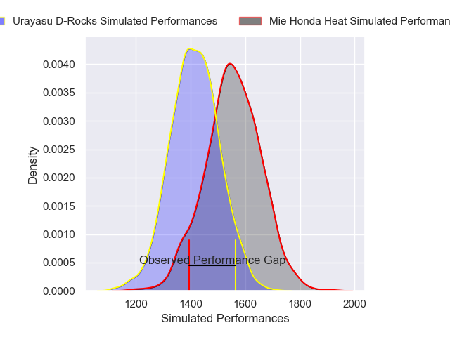
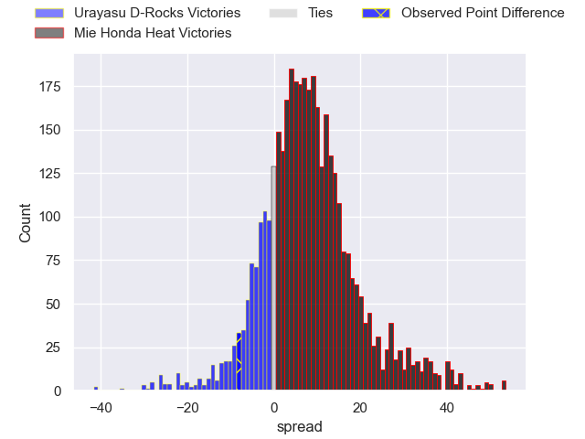
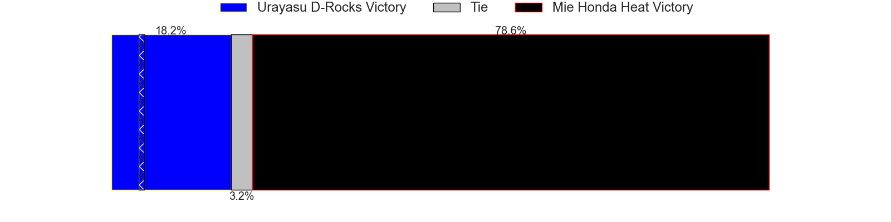
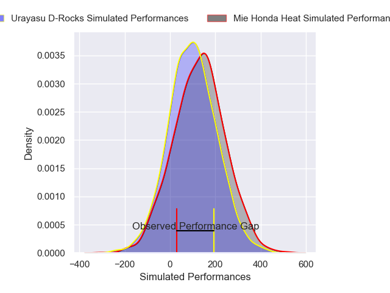
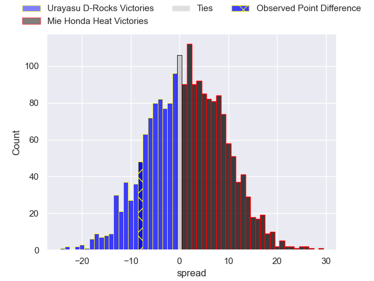
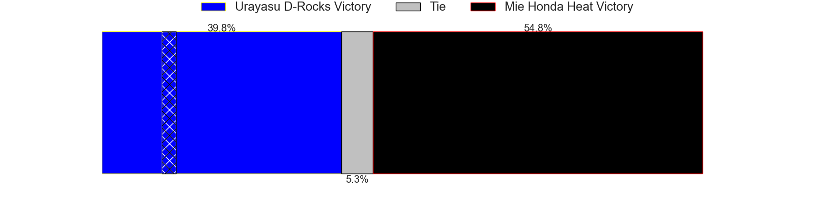

---  
layout: page  
title: Urayasu D-Rocks at Mie Honda Heat; 39-31  
date: 2025-03-22 18:00:00 -0500  
categories: "Japan Rugby League One 24/25" match review  
---
# Urayasu D-Rocks at Mie Honda Heat; 39-31

# Club Level Predictions

The first set of predictions treats a club as the smallest object, as the club develops its members, organizes a gameplan, and deploys its players as needed for each match. This club model has a prediction of 0.681, which translates to predicting Mie Honda Heat to win by 6.9.

Our Over/Under is 61.5 - and combined with the spread above, we have a predicted scoreline of 27 to 34

Each club has a rating and a rating deviation (similar to a Glicko rating), and expected performances can be generated. This allows for simulated matches and spreads like the ones below.
## Projected Performances - Club Model

## Projected Spreads - Club Model

## Projected Results - Club Model

# Player Level Predictions

Treating teams instead as an entity made up of the currently active players, I have ratings for each player in an altogether different system. These can be combined to form team ratings once teamsheets are announced, weighting starters a bit higher than the reserves. After the match is played, players can be weighted by their minutes on the field, allowing for an accurate measure of the team's composition. With these compiled team ratings, we can make predictions, measure inaccuracy, and update the individual player ratings.
## Prediction without Player Minutes: Mie Honda Heat by 1.4

Urayasu D-Rocks by 2.3 on a neutral pitch

## Projected Performances - Player Model

## Projected Spreads - Player Model

## Projected Results - Player Model

|   Away Minutes | Away Player        |   Away Percentile |   Number |   Home Percentile | Home Player            |   Home Minutes |
|---------------:|:-------------------|------------------:|---------:|------------------:|:-----------------------|---------------:|
|             22 | Hidetomo Nabeshima |              7.05 |        1 |              1.64 | Tatsuhiko Tsurukawa    |             58 |
|             24 | Ryuji Fujimura     |             12.91 |        2 |             31.13 | Koki Hida              |             58 |
|             32 | Kim Ryom           |             77.29 |        3 |              3.52 | Feinga Kihe Lotu Fakai |             17 |
|             24 | Tom Parsons        |             74.26 |        4 |             40.71 | Mark Abbott            |             22 |
|             56 | Lourens Erasmus    |             77.04 |        5 |             88.94 | Franco Mostert         |             45 |
|              6 | Shinya Osugi       |             27.46 |        6 |             99.06 | Pablo Matera           |             10 |
|             24 | Tetta Shigemitsu   |             26.62 |        7 |              3.56 | Ryota Kobayashi        |             58 |
|             32 | Tone Tukufuka      |             92.66 |        8 |             16.41 | Talifolofola Tangipa   |             68 |
|             19 | Ren Iinuma         |             77.55 |        9 |             10.19 | Taichi Takenaka        |             63 |
|             58 | Otere Black        |             63.99 |       10 |             14.4  | Gwangtee Oh            |             39 |
|             19 | Takuhei Yasuda     |             89.33 |       11 |             95.17 | Tevita Li              |             80 |
|             30 | Samu Kerevi        |             94.19 |       12 |              3.35 | Fraser Quirk           |             80 |
|             80 | Shane Gates        |             23.25 |       13 |             38.52 | Kyogo Okano            |             19 |
|             74 | Soma Matsumoto     |             64.45 |       14 |             75.02 | Lomano Lemeki          |             32 |
|             80 | Chris Cosgrave     |             76.63 |       15 |             77.44 | Tom Banks              |              6 |
|              5 | Shin Takeuchi      |             67.2  |       16 |             75.65 | Janko Swanepoel        |             46 |
|             76 | Hendrik Tui        |             29.99 |       17 |              2.91 | Ryo Furuta             |             34 |
|             22 | James Moore        |              0.19 |       18 |             55.96 | Azuma Doei             |             80 |
|             35 | Brody MacAskill    |             93.53 |       19 |             20.2  | Matthys Basson         |             61 |
|             41 | Sekonaia Pole      |            nan    |       20 |             62.58 | Ikuma Yamada           |             80 |
|             50 | Shokei Kin         |            nan    |       21 |             15.19 | Taiki Yoshioka         |             70 |
|             80 | Yu Tamura          |             86.01 |       22 |              5.9  | Tony Ray Hunt          |             80 |
|             80 | Norifumi Hashimoto |              1.9  |       23 |             72.43 | Hayata Nakao           |             12 |

