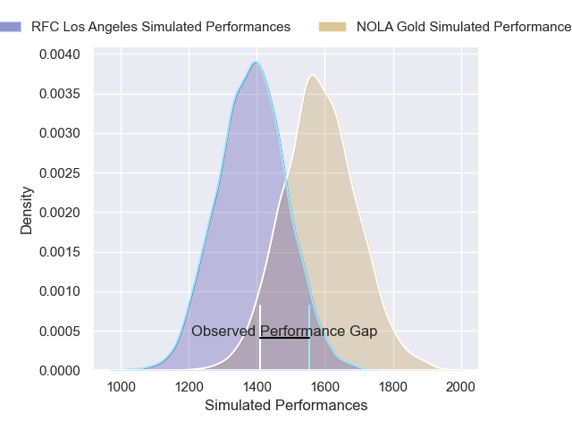
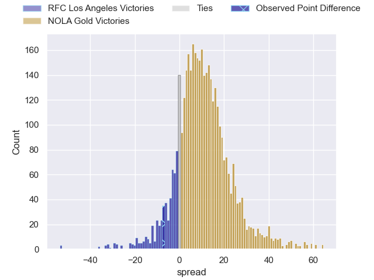
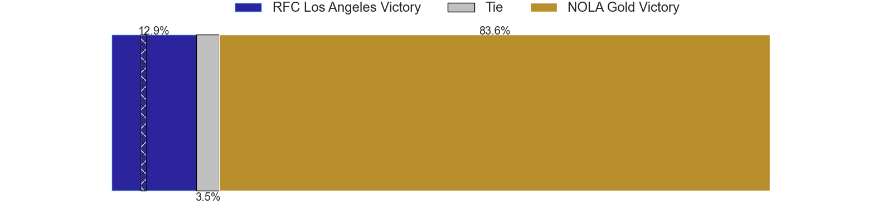
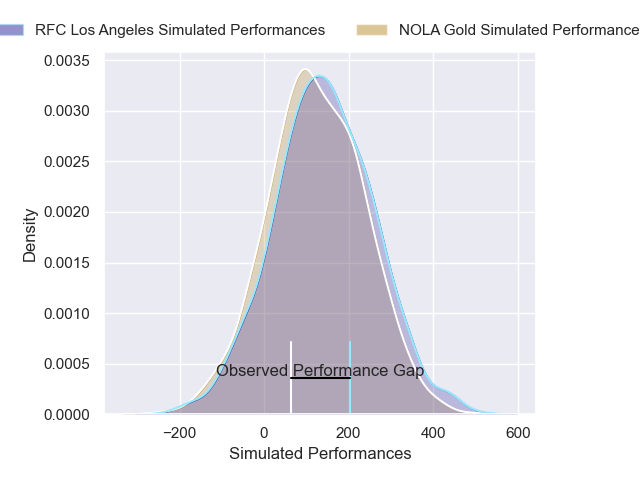
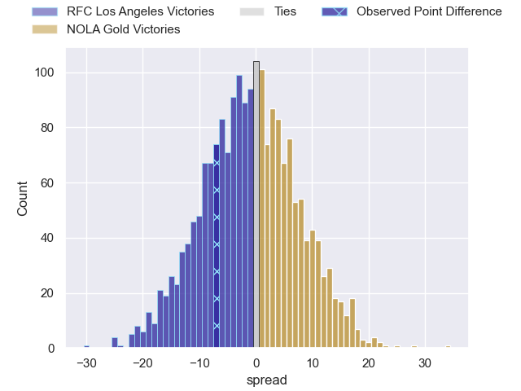

---  
layout: page  
title: RFC Los Angeles at NOLA Gold; 31-24  
date: 2025-03-22 18:00:00 -0500  
categories: "Major League Rugby 2025" match review  
---
# RFC Los Angeles at NOLA Gold; 31-24

# Club Level Predictions

The first set of predictions treats a club as the smallest object, as the club develops its members, organizes a gameplan, and deploys its players as needed for each match. This club model has a prediction of 0.753, which translates to predicting NOLA Gold to win by 10.1.

Our Over/Under is 67.5 - and combined with the spread above, we have a predicted scoreline of 29 to 39

Each club has a rating and a rating deviation (similar to a Glicko rating), and expected performances can be generated. This allows for simulated matches and spreads like the ones below.
## Projected Performances - Club Model

## Projected Spreads - Club Model

## Projected Results - Club Model

# Player Level Predictions

Treating teams instead as an entity made up of the currently active players, I have ratings for each player in an altogether different system. These can be combined to form team ratings once teamsheets are announced, weighting starters a bit higher than the reserves. After the match is played, players can be weighted by their minutes on the field, allowing for an accurate measure of the team's composition. With these compiled team ratings, we can make predictions, measure inaccuracy, and update the individual player ratings.
## Prediction without Player Minutes: RFC Los Angeles by 0.9

RFC Los Angeles by 4.3 on a neutral pitch

## Projected Performances - Player Model

## Projected Spreads - Player Model

## Projected Results - Player Model

|   Away Minutes | Away Player           |   Away Percentile |   Number |   Home Percentile | Home Player          |   Home Minutes |
|---------------:|:----------------------|------------------:|---------:|------------------:|:---------------------|---------------:|
|             80 | Alessandro Heaney     |             58.38 |        1 |             18.17 | Matthew Harmon       |           27   |
|             80 | Mike Sosene-Feagai    |             51.49 |        2 |             58.61 | Alex Lopeti          |           80   |
|             80 | Maliu Niuafe          |             58.38 |        3 |             10.49 | Paul Mullen          |           50   |
|             29 | Jason Damm            |             62.73 |        4 |             37.45 | Chase Jones          |           80   |
|             15 | Jurie van Vuuren      |             89.13 |        5 |             19.61 | Cam Dolan            |           80   |
|             18 | Tim Anstee            |              3.94 |        6 |             65.23 | Aidan King           |           40   |
|             64 | Edward Timpson        |             55.11 |        7 |             69.82 | Jonah Mau'u          |           30   |
|              9 | Ben Houston           |             41.12 |        8 |             22.39 | Tupou Ma'afu-Afungia |           30   |
|             80 | Gonzalo Bertranou     |             80.48 |        9 |              7.08 | Luke Campbell        |           72   |
|             80 | Christian Leali'ifano |             85.8  |       10 |             46.3  | Reece Botha          |           59   |
|             68 | Andrew Coe            |             84.78 |       11 |             70.56 | Ed Fidow             |           30.5 |
|             18 | Billy Meakes          |             46.9  |       12 |              3.25 | Nikolai Foliaki      |           80   |
|              9 | Matias Jensen         |             44.93 |       13 |              4.04 | Isaac Te Tamaki      |           61   |
|             12 | Seth Purdey           |             47.95 |       14 |             79.49 | Xavier Mignot        |           80   |
|             80 | Rory van Vugt         |              3.25 |       15 |              9.76 | Cooper Coats         |           80   |
|             65 | Ben Sugars            |            nan    |       16 |             87.09 | Joe Taufete'e        |           19   |
|             53 | Dec Leaney            |            nan    |       17 |             88.88 | Jarred Adams         |           40   |
|             68 | Franco van den Berg   |            nan    |       18 |            nan    | Tyler Matchem        |           13   |
|             62 | Semi Kunatani         |             96.33 |       19 |             23.61 | Kaden Duguid         |           80   |
|             16 | Ben Strang            |            nan    |       20 |            nan    | Osaiasi Tongauiha    |           22   |
|             12 | Tas Smith             |            nan    |       21 |             67.01 | Ruben de Haas        |           59   |
|              0 | William Leonard       |            nan    |       22 |             32.51 | Luke Carty           |           30.5 |
|             27 | Jack Shaw             |            nan    |       23 |             50.05 | JP du Plessis        |           41   |

