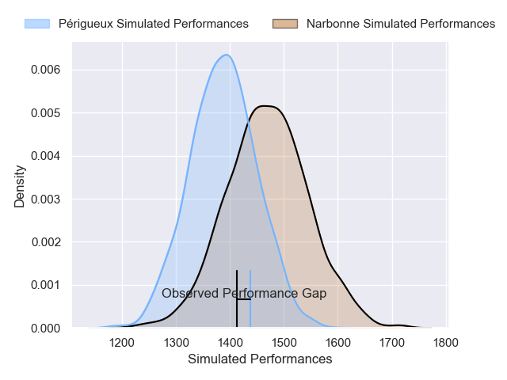
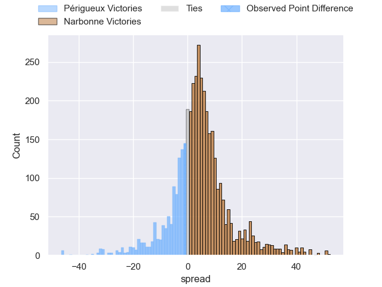
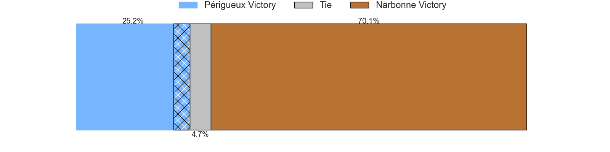
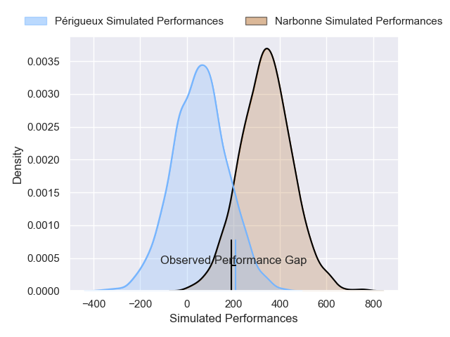
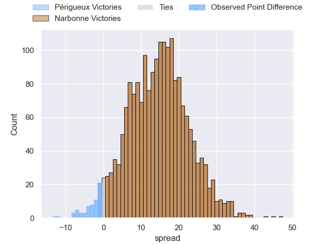
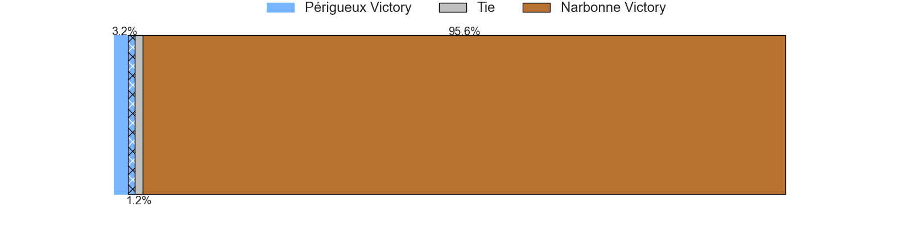

---  
layout: page  
title: Perigueux at Narbonne; 13-12  
date: 2025-03-22 18:00:00 -0500  
categories: "Nationale 24/25" match review  
---
# Perigueux at Narbonne; 13-12

# Club Level Predictions

The first set of predictions treats a club as the smallest object, as the club develops its members, organizes a gameplan, and deploys its players as needed for each match. This club model has a prediction of 0.613, which translates to predicting Narbonne to win by 4.1.

Our Over/Under is 46.5 - and combined with the spread above, we have a predicted scoreline of 21 to 25

Each club has a rating and a rating deviation (similar to a Glicko rating), and expected performances can be generated. This allows for simulated matches and spreads like the ones below.
## Projected Performances - Club Model

## Projected Spreads - Club Model

## Projected Results - Club Model

# Player Level Predictions

Treating teams instead as an entity made up of the currently active players, I have ratings for each player in an altogether different system. These can be combined to form team ratings once teamsheets are announced, weighting starters a bit higher than the reserves. After the match is played, players can be weighted by their minutes on the field, allowing for an accurate measure of the team's composition. With these compiled team ratings, we can make predictions, measure inaccuracy, and update the individual player ratings.
## Prediction without Player Minutes: Narbonne by 13.5

Narbonne by 0.4 on a neutral pitch

## Projected Performances - Player Model

## Projected Spreads - Player Model

## Projected Results - Player Model

|   Away Minutes | Away Player       |   Away Percentile |   Number |   Home Percentile | Home Player               |   Home Minutes |
|---------------:|:------------------|------------------:|---------:|------------------:|:--------------------------|---------------:|
|             80 | Jason Tindiliere  |             43.3  |        1 |             21.77 | Gregory Fichten           |           80   |
|             80 | Manu Leiataua     |              2.98 |        2 |             19.04 | Clément Esteriola         |           33   |
|             19 | Kalaveti Tawake   |             51.21 |        3 |             26.47 | Mohammed Loukia           |           56   |
|             80 | Richard Fourcade  |             44.8  |        4 |             92.84 | Darrell Dyer              |           24   |
|              0 | Damien Lavergne   |             31.41 |        5 |              1.86 | Leva Fifita               |           27   |
|             80 | Karl Lambert      |             71.13 |        6 |             70.95 | Arthur Christienne        |           15.5 |
|             61 | Hendri Storm      |             63.45 |        7 |              9.47 | Paul Belzons              |           80   |
|             53 | Masivesi Dakuwaqa |             64.29 |        8 |             43.05 | Thibault Clauzade         |           58   |
|             18 | Max Green         |             39.9  |        9 |              7.25 | Pierrick Nova             |           64   |
|             46 | Greg Hutley       |             66.05 |       10 |              9.26 | Gilles Bosch              |           68   |
|             20 | Vincent Fouillade |             86.24 |       11 |             83.14 | Clément Clavières         |           51   |
|              6 | Cyril Couturier   |             85.22 |       12 |             51.33 | Parataiso Silafai-Lea'ana |           51   |
|             60 | Dorian Lavernhe   |             77.93 |       13 |             98.82 | Peter Betham              |           15.5 |
|             16 | Fred Hickes       |             88.42 |       14 |             11.39 | Pierre-Hugo Ducom         |           80   |
|             20 | Yon Camou         |             45.93 |       15 |             49.59 | Thibault Santoro          |           64   |
|             16 | Thomas Vidal      |             75.96 |       16 |             48.47 | Théo Castinel             |           62   |
|             27 | Lucas Marijon     |             40.73 |       17 |             84.27 | Mehdi Boundjema           |           12   |
|             25 | Anthony Pelmard   |             76.74 |       18 |             35.94 | Chris Talakai             |           16   |
|             80 | Jaco Willemse     |             15.43 |       19 |             76.95 | Marius Antonescu          |           16   |
|             80 | Clement Lanen     |             52.39 |       20 |             14.5  | Dennis Visser             |           63   |
|             25 | Nicolas Faltrept  |             24.01 |       21 |             82.9  | Pablo Barbaste            |           53   |
|             60 | Nicolas Piaton    |             13.1  |       22 |             39.51 | Tom Chauvet               |           64   |
|             53 | Anderson Neisen   |             32.3  |       23 |            nan    | Hugo Clauzel              |           80   |

