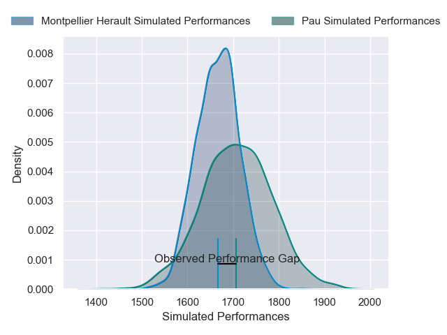
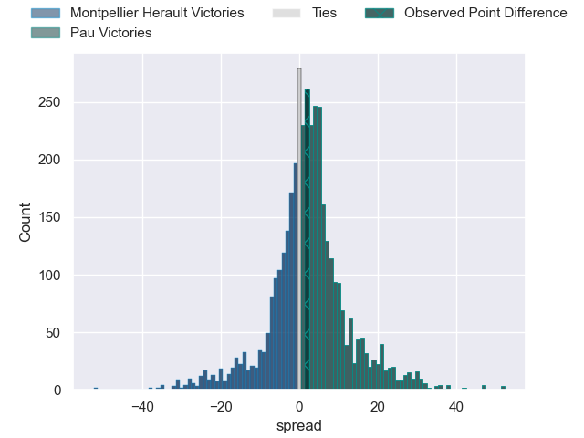
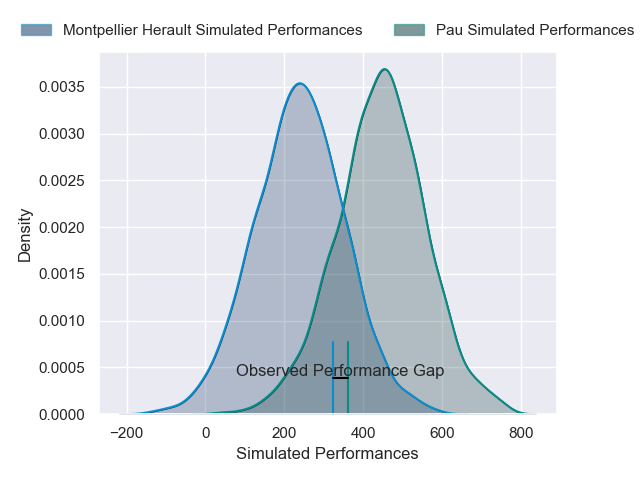
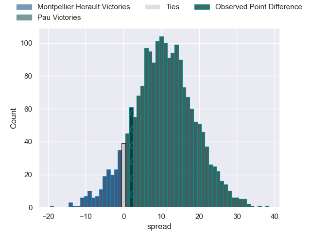
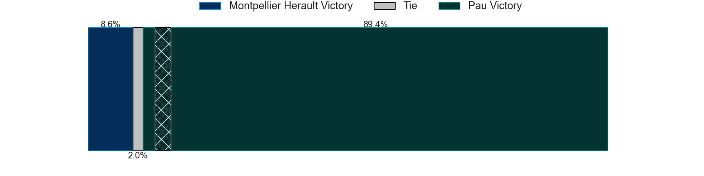

---  
layout: page  
title: Montpellier Herault at Pau; 38-40  
date: 2025-03-22 18:00:00 -0500  
categories: "Top 14 Orange 24/25" match review  
---
# Montpellier Herault at Pau; 38-40

# Club Level Predictions

The first set of predictions treats a club as the smallest object, as the club develops its members, organizes a gameplan, and deploys its players as needed for each match. This club model has a prediction of 0.56, which translates to predicting Pau to win by 2.1.

Our Over/Under is 59.5 - and combined with the spread above, we have a predicted scoreline of 28 to 31

Each club has a rating and a rating deviation (similar to a Glicko rating), and expected performances can be generated. This allows for simulated matches and spreads like the ones below.
## Projected Performances - Club Model

## Projected Spreads - Club Model

## Projected Results - Club Model

# Player Level Predictions

Treating teams instead as an entity made up of the currently active players, I have ratings for each player in an altogether different system. These can be combined to form team ratings once teamsheets are announced, weighting starters a bit higher than the reserves. After the match is played, players can be weighted by their minutes on the field, allowing for an accurate measure of the team's composition. With these compiled team ratings, we can make predictions, measure inaccuracy, and update the individual player ratings.
## Prediction without Player Minutes: Pau by 12.8

Montpellier Herault by 0.7 on a neutral pitch

## Projected Performances - Player Model

## Projected Spreads - Player Model

## Projected Results - Player Model

|   Away Minutes | Away Player         |   Away Percentile |   Number |   Home Percentile | Home Player        |   Home Minutes |
|---------------:|:--------------------|------------------:|---------:|------------------:|:-------------------|---------------:|
|              5 | Baptiste Erdocio    |              2.9  |        1 |              3.78 | Daniel Bibi Biziwu |             58 |
|             47 | Jordan Uelese       |             58.54 |        2 |             65.16 | Youri Delhommel    |             22 |
|             80 | Wilfrid Hounkpatin  |             78.42 |        3 |             17.95 | Jon Zabala         |             40 |
|             57 | Yacouba Camara      |             91.64 |        4 |             42.27 | Hugo Auradou       |             18 |
|             80 | Tyler Duguid        |             70.51 |        5 |             27.47 | Remi Picquette     |             25 |
|             31 | Lenni Nouchi        |             91.89 |        6 |             96.85 | Luke Whitelock     |             51 |
|             57 | Alexandre Becognee  |             78.24 |        7 |              8.87 | Loic Credoz        |             49 |
|             80 | Sam Simmonds        |             76.27 |        8 |             65.11 | Beka Gorgadze      |             49 |
|             31 | Cobus Reinach       |             95.78 |        9 |             98.95 | Dan Robson         |             40 |
|             15 | Hugo Reus           |             73.61 |       10 |             74.89 | Joe Simmonds       |             28 |
|             31 | Mael Moustin        |             21.82 |       11 |             50.24 | Aaron Grandidier   |             40 |
|             29 | Jan Serfontein      |             65.68 |       12 |             69.45 | Fabien Brau Boirie |             31 |
|             19 | Auguste Cadot       |             58.15 |       13 |             89.41 | Tumua Manu         |             50 |
|             59 | Gabriel Ngandebe    |              9.86 |       14 |             21.53 | Eliott Roudil      |             80 |
|             50 | Joshua Moorby       |             75.5  |       15 |             10.76 | Theo Attissogbe    |             67 |
|             50 | Joshua Moorby       |             75.5  |       15 |             10.76 | Theo Attissogbe    |             80 |
|             80 | Christopher Tolofua |             94.77 |       16 |             59.06 | Romain Ruffenach   |             23 |
|             23 | Enzo Forletta       |             81.88 |       17 |             91.38 | Lekso Kaulashvili  |             65 |
|             23 | Florian Verhaeghe   |             78.58 |       18 |             21.52 | Thomas Jolmes      |             80 |
|             23 | Billy Vunipola      |             99.8  |       19 |             57.61 | Carwyn Tuipulotu   |             52 |
|             67 | Leo Coly            |             31.46 |       20 |             88.4  | Thibault Daubagna  |             80 |
|              9 | Anthony Bouthier    |             70.12 |       21 |             90.77 | Axel Desperes      |             49 |
|             80 | Arthur Vincent      |             37.07 |       22 |             71.38 | Nathan Decron      |             23 |
|             80 | Mohamed Haouas      |             76.33 |       23 |             10.31 | Guram Papidze      |             21 |

