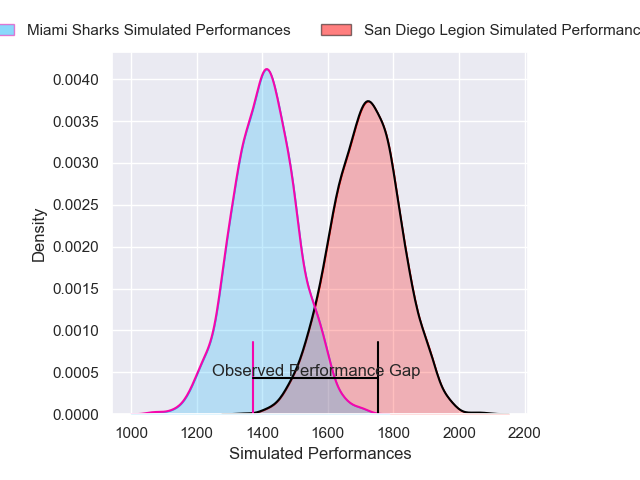
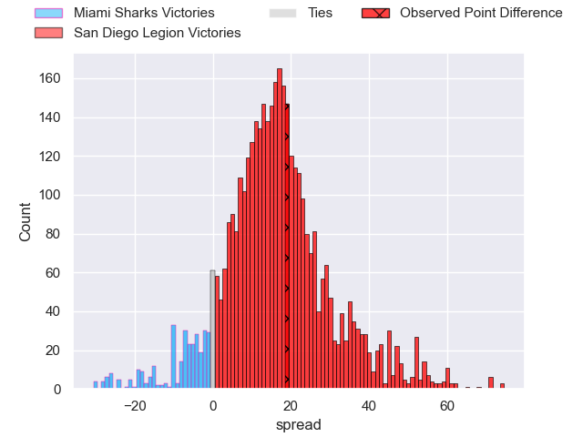
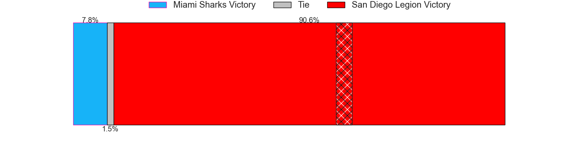
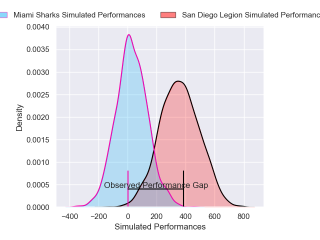
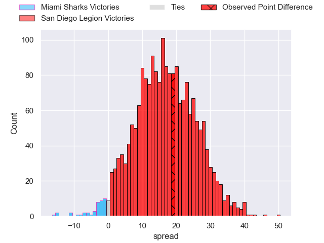
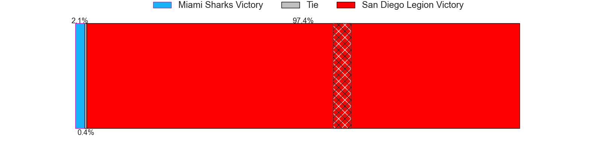

---  
layout: page  
title: Miami Sharks at San Diego Legion; 12-31  
date: 2025-03-22 18:00:00 -0500  
categories: "Major League Rugby 2025" match review  
---
# Miami Sharks at San Diego Legion; 12-31

# Club Level Predictions

The first set of predictions treats a club as the smallest object, as the club develops its members, organizes a gameplan, and deploys its players as needed for each match. This club model has a prediction of 0.844, which translates to predicting San Diego Legion to win by 15.4.

Our Over/Under is 59.5 - and combined with the spread above, we have a predicted scoreline of 22 to 38

Each club has a rating and a rating deviation (similar to a Glicko rating), and expected performances can be generated. This allows for simulated matches and spreads like the ones below.
## Projected Performances - Club Model

## Projected Spreads - Club Model

## Projected Results - Club Model

# Player Level Predictions

Treating teams instead as an entity made up of the currently active players, I have ratings for each player in an altogether different system. These can be combined to form team ratings once teamsheets are announced, weighting starters a bit higher than the reserves. After the match is played, players can be weighted by their minutes on the field, allowing for an accurate measure of the team's composition. With these compiled team ratings, we can make predictions, measure inaccuracy, and update the individual player ratings.
## Prediction without Player Minutes: San Diego Legion by 12.5

San Diego Legion by 9.2 on a neutral pitch

## Projected Performances - Player Model

## Projected Spreads - Player Model

## Projected Results - Player Model

|   Away Minutes | Away Player        |   Away Percentile |   Number |   Home Percentile | Home Player              |   Home Minutes |
|---------------:|:-------------------|------------------:|---------:|------------------:|:-------------------------|---------------:|
|             69 | Alec McDonnell     |             31.01 |        1 |             49.88 | Payton Telea             |           80   |
|             63 | Sean McNulty       |             30.46 |        2 |             66.89 | Hugh Roach               |           62   |
|             14 | Tau Koloamatangi   |              2.19 |        3 |             39.7  | Brook Toomalatai         |           80   |
|             34 | Mauro Rebussone    |             32.71 |        4 |             11.9  | Jed Holloway             |           80   |
|             10 | Federico Gutierrez |             45.91 |        5 |             78.53 | Vili Helu                |           80   |
|             29 | Manuel Ardao       |             47.89 |        6 |             69.07 | Christian Poidevin       |           80   |
|             59 | Tomas Casares      |             41.14 |        7 |             36.08 | Brad Wilkin              |           80   |
|             51 | Ronan Foley        |             39.58 |        8 |             42.08 | Tu'Ihalangingie Hokafonu |           37   |
|             29 | Tomas Cubelli      |             19.86 |        9 |             26.6  | Connor Tupai             |           51   |
|             54 | Shane O'Leary      |              4.73 |       10 |             77.37 | Lincoln McClutchie       |           46   |
|             59 | Marcos Young       |             27.8  |       11 |             20.42 | Ryan James               |           44   |
|             18 | Matias Orlando     |              4.53 |       12 |             94.68 | Tavite Lopeti            |           80   |
|             80 | Tomas Inciarte     |             10.74 |       13 |             78.23 | Ethan Grayson            |           43   |
|             18 | Tomas Malanos      |             29.44 |       14 |             83.41 | Tomas Aoake              |           80   |
|             37 | Marcos Elicagaray  |             63.21 |       15 |             43.5  | Rhian Stowers            |           70   |
|             64 | Tomas Bekerman     |            nan    |       16 |             95.2  | Shilo Klein              |           18   |
|             62 | Ma'ake Muti        |            nan    |       17 |            nan    | Nathan Sylvia            |           10.5 |
|             80 | Alex Tucci         |            nan    |       18 |            nan    | Oliver Kane              |           21   |
|             20 | Marques Fuala'au   |            nan    |       19 |            nan    | Charlie Hewitt           |           80   |
|             29 | Chase Schor Haskin |            nan    |       20 |             98.51 | Paddy Ryan               |           71   |
|             29 | Chase Schor Haskin |            nan    |       20 |             98.51 | Paddy Ryan               |           14   |
|             29 | Chase Schor Haskin |            nan    |       20 |             98.51 | Paddy Ryan               |            9   |
|             18 | Damien Morley      |            nan    |       21 |            nan    | Inoke Waqavesi           |           18   |
|             80 | Guiseppe du Toit   |              2.46 |       22 |             45.02 | Tiaan Loots              |           72   |
|             59 | Lautaro Soto-Ansay |            nan    |       23 |             90.54 | Marcel Brache            |           10.5 |

