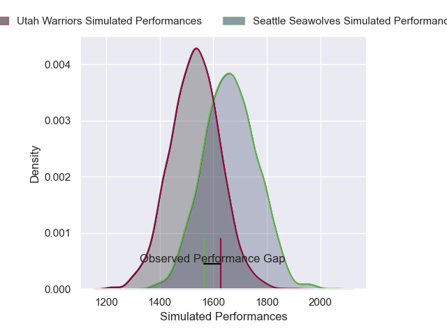
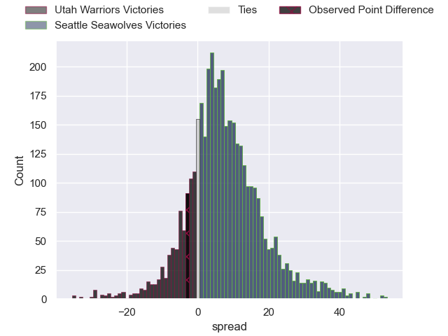
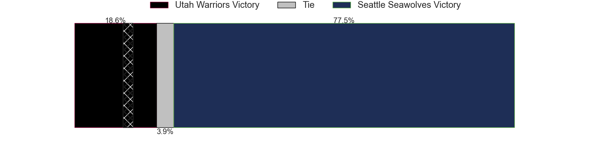
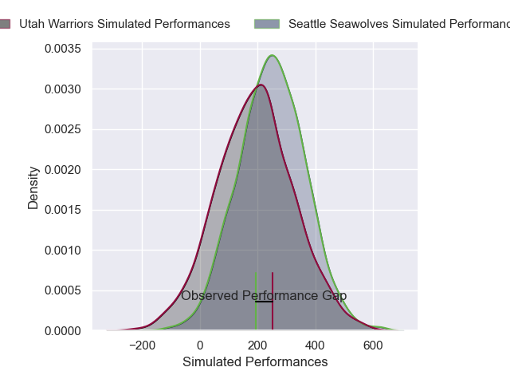
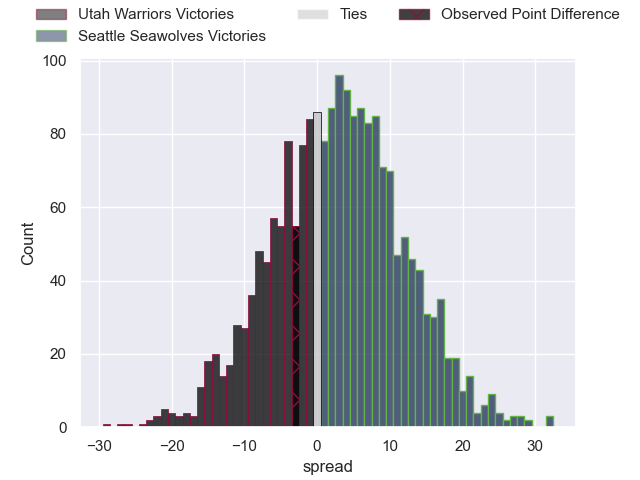

---  
layout: page  
title: Utah Warriors at Seattle Seawolves; 30-27  
date: 2025-03-22 18:00:00 -0500  
categories: "Major League Rugby 2025" match review  
---
# Utah Warriors at Seattle Seawolves; 30-27

# Club Level Predictions

The first set of predictions treats a club as the smallest object, as the club develops its members, organizes a gameplan, and deploys its players as needed for each match. This club model has a prediction of 0.678, which translates to predicting Seattle Seawolves to win by 6.7.

Our Over/Under is 63.5 - and combined with the spread above, we have a predicted scoreline of 28 to 35

Each club has a rating and a rating deviation (similar to a Glicko rating), and expected performances can be generated. This allows for simulated matches and spreads like the ones below.
## Projected Performances - Club Model

## Projected Spreads - Club Model

## Projected Results - Club Model

# Player Level Predictions

Treating teams instead as an entity made up of the currently active players, I have ratings for each player in an altogether different system. These can be combined to form team ratings once teamsheets are announced, weighting starters a bit higher than the reserves. After the match is played, players can be weighted by their minutes on the field, allowing for an accurate measure of the team's composition. With these compiled team ratings, we can make predictions, measure inaccuracy, and update the individual player ratings.
## Prediction without Player Minutes: Seattle Seawolves by 4.0

Seattle Seawolves by 0.5 on a neutral pitch

## Projected Performances - Player Model

## Projected Spreads - Player Model

## Projected Results - Player Model

|   Away Minutes | Away Player     |   Away Percentile |   Number |   Home Percentile | Home Player       |   Home Minutes |
|---------------:|:----------------|------------------:|---------:|------------------:|:------------------|---------------:|
|             72 | Aki Seiuli      |             25.53 |        1 |             59.44 | Cameron Orr       |             21 |
|             60 | Liam Coltman    |             89.9  |        2 |             53.64 | Kerron van Vuuren |             16 |
|             66 | Tonga Kofe      |             67.11 |        3 |             72.59 | Juan Pablo Zeiss  |             18 |
|              0 | Frank Lochore   |             73.79 |        4 |             90.24 | Rhyno Herbst      |             39 |
|             80 | Gavin Thornbury |             91.54 |        5 |             36.34 | Malembe Mpofu     |             80 |
|              8 | Bailey Wilson   |             62.04 |        6 |              1.12 | Huw Taylor        |             28 |
|             80 | Kalisi Moli     |             71.88 |        7 |             35.61 | Devin Short       |             80 |
|             70 | Dylan Nel       |             84.75 |        8 |             84.56 | Riekert Hattingh  |             80 |
|             52 | Zion Going      |             68.39 |        9 |             80.83 | Juan Philip Smith |             29 |
|             62 | Joel Hodgson    |             28.6  |       10 |             36.01 | Rodney Iona       |             59 |
|             21 | Joe Mano        |             69.92 |       11 |             22.15 | Mika Kruse        |             80 |
|             26 | D'Angelo Leuila |             19.31 |       12 |             34.88 | Eddie Fouche      |             80 |
|             38 | Kyle Brown      |             39.11 |       13 |             14.09 | Divan Rossouw     |              8 |
|             51 | Nic Benn        |             62.72 |       14 |             95.72 | Toni Pulu         |             11 |
|             80 | Jordan Trainor  |             86.79 |       15 |             91.46 | Duncan Matthews   |             62 |
|             80 | Tuvere Vugakoto |            nan    |       16 |             47.02 | Dewald Kotze      |             54 |
|             51 | Fred Apulu      |            nan    |       17 |            nan    | Njabulo Gumede    |             51 |
|             80 | Angus MacLellan |            nan    |       18 |            nan    | Mason Pedersen    |             13 |
|             80 | Matt Jensen     |             52.04 |       19 |            nan    | Isaia Lotawa      |             80 |
|             43 | Reid Davis      |            nan    |       20 |             86.87 | OJ Noa            |             80 |
|             80 | Logan Crowley   |             38.51 |       21 |            nan    | Brock Gallagher   |             72 |
|             80 | Paul Lasike     |              4.93 |       22 |            nan    | David Busby       |              8 |
|             30 | Spencer Jones   |             80.99 |       23 |            nan    | Malacchi Esdale   |             54 |

