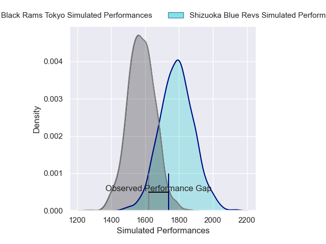
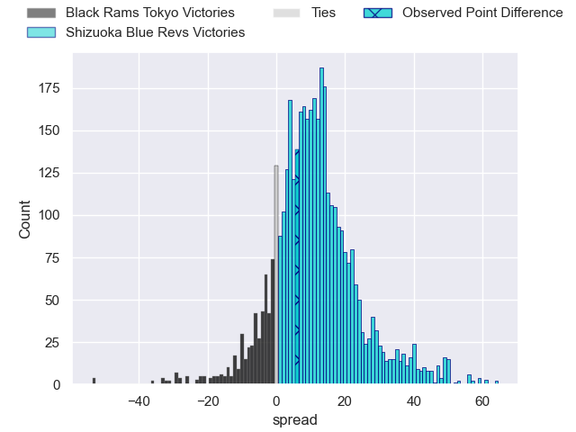
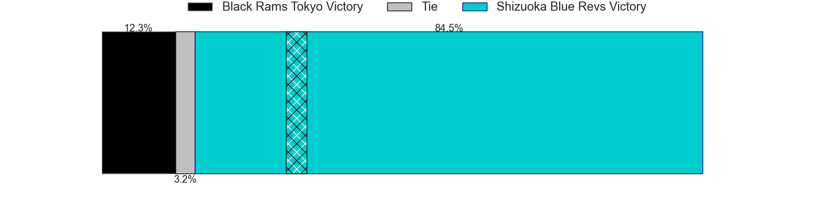
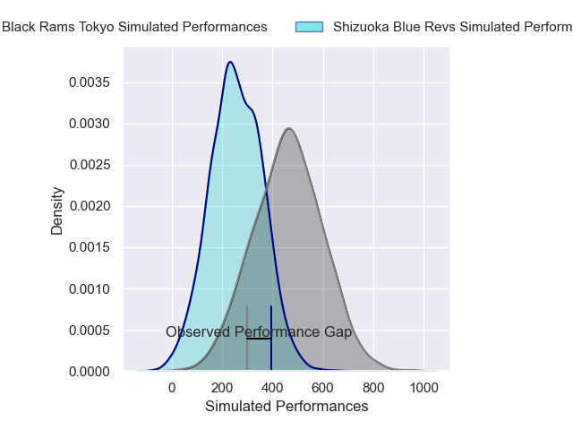
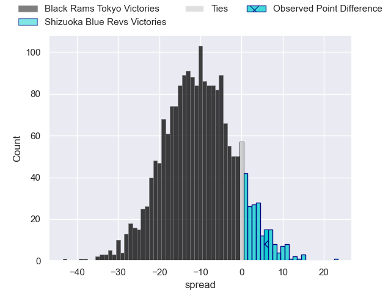
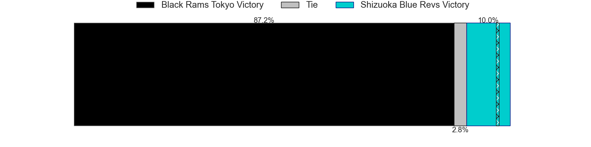

---  
layout: page  
title: Black Rams Tokyo at Shizuoka Blue Revs; 25-31  
date: 2025-03-22 18:00:00 -0500  
categories: "Japan Rugby League One 24/25" match review  
---
# Black Rams Tokyo at Shizuoka Blue Revs; 25-31

# Club Level Predictions

The first set of predictions treats a club as the smallest object, as the club develops its members, organizes a gameplan, and deploys its players as needed for each match. This club model has a prediction of 0.763, which translates to predicting Shizuoka Blue Revs to win by 10.5.

Our Over/Under is 55.5 - and combined with the spread above, we have a predicted scoreline of 22 to 33

Each club has a rating and a rating deviation (similar to a Glicko rating), and expected performances can be generated. This allows for simulated matches and spreads like the ones below.
## Projected Performances - Club Model

## Projected Spreads - Club Model

## Projected Results - Club Model

# Player Level Predictions

Treating teams instead as an entity made up of the currently active players, I have ratings for each player in an altogether different system. These can be combined to form team ratings once teamsheets are announced, weighting starters a bit higher than the reserves. After the match is played, players can be weighted by their minutes on the field, allowing for an accurate measure of the team's composition. With these compiled team ratings, we can make predictions, measure inaccuracy, and update the individual player ratings.
## Prediction without Player Minutes: Shizuoka Blue Revs by 2.9

Black Rams Tokyo by 1.3 on a neutral pitch

## Projected Performances - Player Model

## Projected Spreads - Player Model

## Projected Results - Player Model

|   Away Minutes | Away Player        |   Away Percentile |   Number |   Home Percentile | Home Player             |   Home Minutes |
|---------------:|:-------------------|------------------:|---------:|------------------:|:------------------------|---------------:|
|           43   | Taishi Tsumura     |             22.95 |        1 |             23.43 | Kazuhiro Kawata         |             80 |
|           39   | Shin Ouchi         |             72.65 |        2 |             60.28 | Shunsuke Sakuta         |             59 |
|           80   | Paddy Ryan         |             94.36 |        3 |             75.12 | Sean Vete               |             80 |
|           44   | Paddy Ryan         |             94.36 |        3 |             75.12 | Sean Vete               |             80 |
|           46   | Paddy Ryan         |             94.36 |        3 |             75.12 | Sean Vete               |             80 |
|           62   | Reijiro Yamamoto   |             42.65 |        4 |             96.06 | Yuya Odo                |             69 |
|           80   | Harrison Fox       |             45.44 |        5 |             93.08 | Murray Douglas          |             21 |
|           80   | Mike Stolberg      |              1.81 |        6 |             71.47 | Vueti Tupou             |             11 |
|           80   | Liam Gill          |             76.72 |        7 |             95.52 | Kwagga Smith            |             51 |
|           59   | Brodi McCurran     |             47.46 |        8 |             65.92 | Richmond Tongatama      |             80 |
|           80   | TJ Perenara        |             97.19 |        9 |             72.41 | Shuntaro Kitamura       |             70 |
|           37   | Ichigo Nakakusu    |             40.13 |       10 |             66.74 | Kenta Iemura            |             51 |
|           18   | Netani Vakayalia   |             64.11 |       11 |             92.54 | Malo Tuitama            |             80 |
|           10.5 | Yuki Ikeda         |             61.41 |       12 |             76.17 | Viliami Tahitu'a        |             51 |
|           21   | Penieli Jr Latu    |             39.82 |       13 |             91.04 | Charles Piutau          |             18 |
|           37   | Semisi Tupou       |             25.74 |       14 |             78.47 | Valynce Te Whare-Crosby |             38 |
|           51   | Taira Main         |             49.2  |       15 |             16.14 | Sam Greene              |             59 |
|           43   | Masaaki Onishi     |             61.32 |       16 |             97.04 | Takeshi Hino            |             16 |
|           80   | Yuichiro Taniguchi |            nan    |       17 |             52.02 | Kodai Okazaki           |             26 |
|            8   | Kotaro Ito         |             59.36 |       18 |             93.85 | Sanele Nohamba          |              8 |
|           80   | Shuhei Matsuhashi  |             81.87 |       19 |             16.83 | Takayoshi Mohara        |              0 |
|           80   | Daigo Sasagawa     |            nan    |       20 |            nan    | Sione Vuna              |             17 |
|          nan   | nan                |            nan    |       21 |             37.51 | Kakeru Okamura          |             30 |
|          nan   | nan                |            nan    |       22 |            nan    | Takumi Inaba            |             13 |
|          nan   | nan                |            nan    |       23 |             22.19 | Jack Wright             |             62 |

